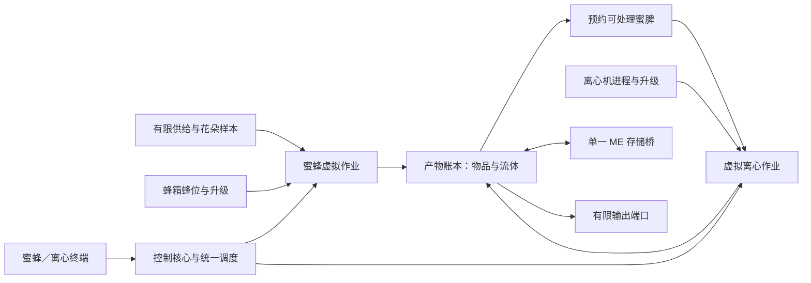

# 蜂箱—离心机处理子网络：大型更新设计方案

状态：D01–D07 已交付；网络生产尚未接入。日期：2026-09-18。D01 独立机测量基线：`f2ae0b8ba586d1a9f8ee6d512d959b4bc2fb1de6`，模组版本 `1.0.8`；开发分支为 `bees-processing-network/1.21.1`，维护分支为 `main-neo/1.21.1`。

本方案针对 Minecraft 1.21.1、NeoForge 21.1.214、Java 21；核心依赖为 Productive Bees 13.13.5、ProductiveLib 0.2.0、Mekanism 10.7.19.85，AE2 19.2.17 为可选集成。以上是开发基线，不代表已经验证所有元数据允许的低版本依赖。

当前代码已合入维护提交 `62d646b`／`1.0.8-hotfix`，D01 的旧 Spark 数据不能当作 hotfix 后测量。网络领域模块尚未接入独立机生产；独立机修复来自同步的 hotfix。第 10.4 起记录证据与验证范围，第 11 节按依赖列出后续每步交付物和验收条件，第 13 节记录参考源码版本与证据。

## 1. 推荐结论与目标

新增“蜂业处理网络”：本模组蜂箱、离心机、控制核心及专用端口六面相邻时构成自由形状的多方块结构。每台蜂箱／工厂贡献蜂位、等量喂食槽以及按本机升级计算的生产能力；每台离心机／工厂贡献按本机进程数、并行和升级独立计算的处理能力。网络汇总这些能力，在统一调度器中完成全部虚拟生产。托管成员不执行实际生产、离心、配方推进或独立物流。

AE2 通过一个桥接端口双向访问产物库存：合法产物可存入、查看和提取，可供合成与外部机器消费。蜜蜂终端和离心管理终端都能管理对应成员的升级；离心终端还管理处理优先级、AE2 主动拉取、分层保留和目标库存。独立机器模式继续存在，只有成功脱离网络后才恢复独立生产。

“无限存储”按无限盘定义：合法产物不设数量容量、种类配额或总存储字节配额，不需要购买磁盘扩容；数量超出 long 后仍精确保存。计算、暂存、网络包和缓存的单次工作预算不属于库存容量。取消第一版提出的固定变体数及总存储字节保护线；硬件、磁盘空间和 Java／AE2 接口仍有实际边界，异常时暂停或隔离，绝不截断数量或清空库存。

已确认准入规则为“合法产物类型”，不追溯来源：若金锭在当前服务器的蜜蜂生产／蜜脾处理链中合法，采矿得到的相同类型金锭也可存入；与蜂业产物无关的物品拒收。这是明确选择的产品行为。

主要收益假设是减少库存搬运、逐机 AE2 节点与接口调用、重复配方检查和界面同步；不是把工作搬到异步线程。已有机器已经进行部分虚拟化和批处理，实际收益必须相对当前版本测量，不能对比一个虚构的完全未优化版本。

### 1.1 方案比较

| 方案 | 实现与兼容成本 | 性能边界 | 取舍 |
| --- | --- | --- | --- |
| 继续优化每台机器的 AE2 IO | 最低，现有路径稳定 | 仍有每机 tick、节点及反复进出库存 | 主分支持续做，不能替代此次更新 |
| 相邻机器共享缓存，仍各自完整 tick | 中等，容易过渡 | 减少物流，重复生产编排仍存在 | 可作为实验，不作为最终架构 |
| 控制核心统一调度，成员贡献能力 | 较高，需所有权和存档协议 | 能减少内部 IO 和重复调度，保留机器价值 | 推荐主线 |
| 把一切装入单个虚拟蜂箱方块 | 开发形态简单，但改变现有玩法 | 方块数少，仍有真实生产计算成本 | 不符合相邻机器构网目标 |

### 1.2 必须成立的不变量

1. 一只蜜蜂、一个处理中输入、一份能量、一个产物数量，在任一时刻只有一个权威所有者。
2. 托管成员不能同时执行独立生产、旧 AE2 推拉、直连弹出和网络作业；断线也不能自动双跑。
3. 原料、能量、已生成结果与进度的变更在内部事务中一致提交；不能先吞输入，再发现输出无法接纳。
4. `SIMULATE` 不改变库存、预约、随机状态、能量、统计或持久化状态；实际执行重新校验。
5. 所有新增库存必须来自已结算生产或实际外部转移，并通过相同的合法产物规则；客户端不能上传数量后凭空增加账本。
6. 不为内部物流、积压或拆网生成海量掉落物实体；满载、异常和未知状态使用暂停与保管。
7. 未加载区块、未加载核心、未知配方、未知蜂种不得继续生产；不进行离线补产。
8. 无 AE2 时核心生产、存储、终端和有限端口仍可用；专用服务端不得解析客户端类。

## 2. 玩家功能与方块职责

| 方块／入口 | 职责 | 默认规则 |
| --- | --- | --- |
| 蜂业控制核心 | 网络身份、权限、形成状态、调度、能源分配 | 每个连通结构一个；本体内置产物账本，不额外要求磁盘 |
| 本模组蜂箱／各级蜂箱工厂 | 提供蜂位、每蜂位一个喂食槽、升级能力及环境位置 | 原蜂位数和基因效果保留；升级只作用于对应成员 |
| 本模组离心机／各级离心工厂 | 提供本机进程数、每进程并行、速度、能耗和升级 | 独立计算后按兼容能力分组汇总，本机不运行配方 |
| 蜜蜂管理终端 | 查询、分配蜂位、逐位喂食、装笼、逐机安装／拆除升级 | 按蜂种或机器查看，批量操作逐机返回真实结果 |
| 离心管理终端 | 能力汇总、逐机升级、优先处理、AE2 拉取、保留及目标库存 | 规则页与机器页分开，显示不能运行的具体原因 |
| 供给端口 | 蜂笼、花朵样本、食物、升级件 | 使用有限槽位；其中本身符合产物规则的物品可另经存储入口入库 |
| 输出端口 | 向普通管道提供被配置的产物 | 仅暴露有限展示槽／罐及有限搬运；无人使用时不轮询全部库存 |
| ME 桥接端口 | 将可提取产物暴露为 AE2 存储 | 首版每个蜂业网络一个活动桥；物品和流体统一挂载 |
| 网络连接框架 | 无生产能力的结构连接件 | 后续加入；首个原型只用直接贴合，避免先做电缆系统 |

推荐流程：把已有机器紧贴摆放 → 放置核心并预览成员和问题 → 点击“接管” → 核对蜂位、能量、升级及旧库存 → 接入供给与终端 → 启动。后续放置的空闲且有权限的相邻机器可在事务边界加入；已有其他网络或所有者的机器不能被自动夺取。

终端可共用一套菜单、权限及分页基础设施，但保留两个主要入口，避免把生产管理和离心排障挤进同一个页面。产物库存是两者可打开的共享页签。

### 2.1 平衡与容量

- 核心作为中后期升级，配方可采用高级蜂箱、离心工厂、Mekanism 控制电路和本模组材料；核心配方不能硬依赖 AE2，ME 桥接配方仅在安装 AE2 时存在。
- 网络不凭空增加蜂位、生产倍率和离心进程。调度效率提升是奖励，产量公式沿用成员等级及升级。
- 核心有基础维护能耗，蜂箱和离心作业按已有公式计费；具体 FE 数值在基准测试和平衡测试后确定，不在设计阶段伪造精确值。
- 蜜蜂“休眠保管位”与“工作蜂位”分离：前者有配置上限，后者只能来自已加载的蜂箱。拆掉蜂箱不能让其蜜蜂继续享受产能。
- 不设 AE2 式逐机通道。计算预算只控制完成工作的速度；不能把达到 CPU 预算伪装成库存满或偷偷减少产量。

### 2.2 每台机器先计算，再汇总能力

蜂箱成员 i 提供 `H_i` 个蜂位和 `F_i = H_i` 个喂食槽；网络在线工作蜂位为 `ΣH_i`，对应在线喂食槽为同样数量。每个槽以 `(memberId, slotIndex)` 标识，空蜂位也保留自己的喂食槽。卸载成员不贡献工作能力，但槽内蜜蜂、喂食物品及升级仍由网络保管。

离心能力描述符保存：`processCount p_i`、`operationsPerCycle q_i(recipe)`、`cycleTicks t_i(recipe)`、逐 tick 能耗、配方适用集合、升级效果、来源成员和 revision。在资源充足且某配方 r 可运行时，理想吞吐为 `C(r)=Σ[p_i × q_i(r) / t_i(r)]`。这是展示和调度的理论上限；实际吞吐还受供电、原料、保留、成员红石状态和调度预算影响。

例如 A 有 3 个进程、每进程每 10 tick 处理 4 份，B 有 5 个进程、每进程每 20 tick 处理 2 份，则该配方理论能力为 1.7 份／tick，即 34 份／秒。不能将进程、倍率分别相加后相乘；更不能让 A 的升级同时加成 B。

网络不将不同能力抹平成一台“平均机器”。按配方适用性、升级效果、计费公式和周期分为能力池，池内使用紧凑的虚拟进程／相位计数，每次资源分配满足全部成员贡献之和。整数工作量、周期余数、各级别并行和进度都保留；增加进程数不会凭空缩短单次处理的时延。移除或升级某成员仅使对应能力版本失效。

每个配方的总能力都是“所有可用进程用于此配方”的条件上限，多个配方展示值不能相加承诺可同时达到。不同配方、配方版本、输入／环境上下文、升级效果和单操作价格必须分别标识；即使满载能耗同样饱和到 long 上限，单操作价格不同也不能合并计费。D15 在真实分配时对 `(memberId, laneIndex)` 做唯一预约。

蜂箱能力先按“完成生产周期／tick”表示，与最终物品数量分开；基因、概率、蜜脾块、动态结果及转化仍由生产计划结算，不能仅用蜂位数乘升级倍率当实际产量。`FactoryTierConfigService` 的堆叠／流体倍率是物理缓存容量，独立记录用于界面和交接，不能再次乘入 p／q／t。能源容器已应用的配置平衡与 SPEED／ENERGY 效果同样不能重复计入。

### 2.3 一蜂位一喂食槽与升级管理

每个蜂位显示一个真实喂食槽，默认仅为该位提供花朵、转化目标或食物。相同物品可以共享只读匹配缓存，但不能复制库存。消耗性配方在提交时准确扣除对应槽或供给账户；多个蜂位争用同一补料库存需统一预约。

支持多花需求时，允许玩家将已经存在的喂食槽组成显式共享组，界面仍为每蜂位一格，组内仅共享真实存在的样本；消耗性物料依然预约扣除。不能增加隐藏无限喂食库存，也不能把一个物品复制填满所有槽。蜂位重新分配默认不搬走槽中食物；提供显式“连同喂食配置迁移”事务。旧蜂箱的共享饲养板接管时只移动真实物品，无法覆盖的蜂位显示缺少喂食，不免费补齐。

升级终端使用 `memberId + expectedRevision` 定位具体机器，显示本机已安装数量、上限、适用类型及预计能力变化。安装扣真实玩家／供给槽物品，拆除预留接收空间；来源不一定是产物库，因为升级件通常不是合法蜜蜂产物。批量安装按确定顺序逐台执行，清楚返回成功、缺料、不兼容、达到上限和离线等结果。

升级变更在调度边界提交：已预约且已开始的有界工作段按旧能力快照结算，新的工作段使用新版本；不能把所有旧作业清零、重抽产物或重新扣费。托管时机器原 GUI 转为同一服务的代理，禁止其继续修改另一份本机升级库存。独立模式保留原逻辑。

## 3. 相邻拓扑、接管和失联

### 3.1 连通规则

同维度、面相邻、连接面允许且注册了网络成员适配器的方块构成图；不接受斜角连接。普通容器、AE2 电缆、PB 原版蜂箱不会因为贴合就变成成员。扳手可关闭连接面，允许两个独立网络紧挨摆放。

首个可玩原型限制在同一已加载区块。正式首版增加跨区块连接，但只计算已加载、可验证的路径，不强制加载区块。完整卸载网络不运行；核心区块加载也不能让卸载成员贡献产能。

使用事件驱动的脏节点队列：放置、移除、旋转、连接面变化、区块加载／卸载标记相关节点及邻居。调度器增量 BFS 重建受影响组件。不能只用并查集，因为移除边后必须识别分裂；不能每 tick 扫描整个范围。

一次完整重建为 O(V+E)，六面连接下 E≤6V；按节点预算跨 tick 执行并合并重复事件。计算期间受影响旧组件进入 `REBUILDING`，冻结生产和外部库存操作；发布新拓扑版本时一次性替换视图。增加低频、有游标的校验，补偿外部模组未正常触发事件的改动。

跨 tick 重建绑定 topologyMutationEpoch；扫描期间再次收到结构变化或区块卸载时，废弃受影响扫描结果并合并重试，发布前重新核对 epoch。不得发布已经过期的连通图；成员失去已加载路径后立即撤销可执行资格，不等待长 BFS 才停止生产。持续抖动的结构保持暂停，并用合并／退避避免全服被重建占满。

### 3.2 组件状态与唯一性

网络状态：`FORMING → RUNNING ↔ PAUSED`；变化时进入 `REBUILDING`，双核心为 `CONFLICT`，数据或所有权不确定为 `RECOVERY`，无在线核心为 `DORMANT`。停电暂停生产和普通 AE2 提取，允许所有者在本地进行恢复和有限取回。

成员状态：`STANDALONE → JOINING → MANAGED → LEAVING → STANDALONE`；非正常断连变为 `ORPHANED`，必须完成交接才回到独立模式。控制身份采用 `networkId + controllerId + generation`；成员身份采用服务端生成的 `memberId + generation`，不能只依赖坐标。

| 事件 | 数据和运行规则 |
| --- | --- |
| 放置第二核心形成直接连接 | 整个冲突组件暂停，标出两个核心；首版不自动合并账本 |
| 拆除中间机器导致分裂 | 含原核心的一侧保留网络身份和账本；其他成员孤立暂停，不复制共享库存 |
| 一部分区块卸载 | 不把它当永久拆机；撤销其产能及已不可验证的路径，蜜蜂与处理中作业保留 |
| 核心卸载／失去供电 | 所有生产暂停；AE2 挂载按状态撤下或拒绝操作，不能转由每台机器偷偷运行 |
| 核心被炸毁 | 账本留在世界数据；所有者通过替换核心认领旧身份，旧 generation 作废 |
| 蜂箱被毁 | 对应蜜蜂转为网络休眠保管，不生成实体；已结算产物不回滚、不再生产 |
| 离心机被毁 | 该成员的在制作业暂停，按保留的进度和计费信息回收或迁移，不重新免费开工 |
| 两个失联部分重新连接 | 校验相同成员身份和版本后恢复；未知／重复身份进入恢复状态 |

正常拆卸提供“安全脱网”：停止接新任务，结算已完成结果，解除预约，将选定蜜蜂和可装入的有限供给交回机器或蜂笼。接收空间不足则保持暂停，明确显示尚未交接数量。结构破坏本身不能把整个无限库存打包成方块 NBT。

绑定身份还需校验权威位置。活塞、移动结构、装箱工具和方块复制不得直接迁移托管数据；首版只支持安全脱网后搬运，发现未知搬运或重复 memberId 时暂停该成员并要求重新绑定。重新认领核心必须校验原所有者与旧核心状态，原代际失效后才能激活替换核心。

将来支持网络合并时，做所有者明确发起的独立操作，并要求双方暂停、权限相同、无未决外部 IO、账本合并与成员重绑定同事务完成；它不是首版必要功能。

## 4. 虚拟生产与内部物料流

蜜脾队列引用账本中的预约数量，不额外拥有同一份蜜脾。先扣互不重复的事务预约与转移锁定量，再由第 6.4 节的保留策略计算某一消费者的可用量；保留线是约束，不是另一份被扣减的库存。队列分别显示待处理量、已预约量、被保留量和实际在制量。

### 4.1 蜜蜂数据与管理

每只蜜蜂有独立 `beeId`，保存完整原始数据、蜂种／实体类型、生产力与行为基因、纯度、进度、归属蜂位、暂停原因和版本。复用现有 `BeeSlot` 对 PB Occupant 数据的理解，不能只存蜂种 ID，也不能直接把现有可变 NBT 引用当作不可变键。

虚拟分组只是调度索引，不删除个体记录。分组键至少包含蜂种、影响产出的基因、升级配置、花朵与世界上下文、配方版本及相关生产状态；基因不同或环境不同的蜜蜂不能为节省时间合成一份相同产量。调换蜂位、喂食改基因或升级变化会拆组并使缓存失效。

花朵样本是否消耗沿用现有蜂箱语义；具有物品／方块转化效果的蜂种按真实配方消耗目标。消耗性食物来自有限供给或网络已有合格产物。基因零食、蜂笼、升级和工具不因“与蜜蜂有关”而自动获得无限存储资格。

日夜、天气、维度、群系与特殊环境按蜂箱成员原位置判断，不能统一替换成核心的位置。组共享可复用检查；环境变化事件和有预算的周期复核共同驱动失效。采蜜表现可虚拟化，生产条件不能省略。

动态战利品、Wanna Bee 琥珀、多花型蜜蜂、基因采样、万象创世随机输出、精华转化、副产物过滤及自动离心升级分别适配。首个原型只接纳已验证的静态蜂种；不支持的成员在接管预览中明确阻止接入，不能少产一部分后声称已支持。原有自动离心升级必须定义其产能来源与计费，禁止网络再离心同一份已转换输出。

### 4.2 调度、概率与能量

- 全部权威变更发生在服务端主线程；一个真实游戏 tick 只执行一次网络调度。成员只保留必要的生命周期／轻量状态适配，不能推进生产、配方、作业能耗或物流。不能简单调用原完整 tick 后再把输出汇总，也不能无条件调用有熔炼／弹出副作用的 Mekanism 父类 tick。
- 到期任务采用时间桶或最小堆，空闲组不逐蜂完整扫描；同上下文的小批次合并成数量增量。生产、离心、拓扑、外部 IO 和 UI 各有独立预算及公平轮转，另设全服务器总预算，防止大量小网络绕过预算。
- 同一配方批次最多处理输入、能量、成员进程和预算共同允许的次数；超出部分保留紧凑进度，不按每个产物建立任务对象。预算耗尽推迟执行，不减少已付费产出。
- 任务积压到保护线后暂停接纳新的工作量并显示“调度积压”；没有正式接受的外部加速信用不能被显示成已完成生产。禁止无界累计欠账，禁止丢弃已扣原料／能量的工作。
- 精确随机路径按逐次事件或经证明等价的联合采样执行。共享抽签、互斥产物、关联战利品不能拆成各产物独立二项分布。现有大批量 Poisson／CLT 近似是独立兼容模式，不能称为严格等价；同种子逐次等价和分布等价也要区分。
- 输出生成后、提交前需要延期时保存这一次的结果或可重放随机状态，重试不能重新抽奖。带世界副作用的脚本／战利品适配器不能假定可重放，未支持时暂停该作业。
- 核心负责统一能量账户和分配，容量由核心等级配置决定，FE 不属于无限产物库存；原机器储能在接管时通过转移协议入账，空间不足则推迟接管并保留原储能。托管后各能量口只是该有限账户的受限入口，不得同时保留独立机器可用储能副本。初期仅核心 FE 口受电；成员 FE 口和 Applied Flux 集中供能在后续阶段接入。
- 总能耗 = 核心维护 + 蜜蜂实际推进所需能量 + 离心实际推进所需能量。周期能耗与逐 tick 能耗沿用对应内核，不能将两者同时扣除；已付费的部分进度需要保存。

JDTE／Time Wand 加速先记到被作用成员的工作信用，再由控制器结算；不能“核心倍率 × 每成员倍率”重复放大整个网络。原型拒绝托管成员上的不受支持加速，完成守卫和等价测试后再开放 64×／256×。

### 4.3 离心作业

每个作业保存配方 ID／版本、精确输入键、源账本、预约数量、能力池及来源贡献、剩余进度、已付能量与输出计划。相同能力的机器组成虚拟处理池，成员来源仅用于容量、升级和失联结算；实际执行始终在网络内。不同等级或升级不能简单平均后改变速度／能耗。

默认先使用本网络可用蜜脾，缺料时按终端规则从外部 AE2 拉取；无论原料最初来自哪里，入库后都是相同的合法键。玩家可设配方优先级、原料保留、启停、目标库存和对外保留；同优先级轮转，低优先级可选择公平模式或明确的严格优先模式。没有适用离心能力时蜜脾原样存储，不会因入库就自动消耗。

第一版处理已审查的 PB 蜜脾／蜜脾块链和明确支持的蜂业升级转换。“优先铁资源”可编译为优先生产铁产物的合法蜜脾配方，不代表把铁锭当离心输入。后续复用现有熔炼兼容时，仅为合法产物及明确的加工适配器开放；无关原矿或任意容器不会仅因存在通用配方而获得无限存储资格。

## 5. 无限产物账本与防滥用

### 5.1 按合法产物类型准入，允许外部双向存取

允许集合来自当前服务器的蜜蜂直接产物、有效蜜脾／蜜脾块及其离心产物，以及已明确支持的蜂业产出升级结果。类型匹配和组件校验同样适用于内部生产、玩家、管道及 AE2，不能靠一种入口绕过规则；记录来源仅用于统计，不作为已入库物品的提取限制。

| 对象 | 无限账本行为 | 条件 |
| --- | --- | --- |
| 本网络自产物品／流体 | 接受 | 已提交真实生产事务，符合当前或已冻结的合法计划 |
| 外部金锭、钻石等 | 接受 | 当前生产链确实能产出该类型；无需证明它来自蜜蜂 |
| 合法蜜脾／蜜脾块 | 接受，可排队处理 | 蜂种、组件和配方校验通过；不是标签命中就放行 |
| AE2 取消合成／玩家退回的产物 | 接受 | 和普通存入采用同一类型规则；没有来源证明要求 |
| 花朵、食物、蜂笼、升级件 | 通常拒绝无限存储 | 进入有限供给；若某一精确类型确为合法产物，则按产物规则接受 |
| 非蜂业物品、非产物流体 | 拒绝 | 即使有普通合成／熔炼配方也不能自动获准 |
| 装着任意物品的容器、含蜜蜂的笼子 | 默认不作为普通产物接受 | 内容组件需专门适配；禁止借一个合法外壳存储任意内部物品 |

金锭准入不意味着忽略全部组件。普通名称等非容器组件可以保留为独立变体；`bee_type`、嵌套库存、实体内容等会改变合法性，必须由具体适配器验证。必须保留完整键身份，不通过删除组件把非法物品“洗成”合法物品。

### 5.2 配方资格、数据重载与动态输出

`ProductPolicyRegistry` 建立 `AllowedProductDescriptor`：基础注册类型、组件谓词、来源蜂种／配方、适配器 ID 和规则版本。根据 PB 生产配方、合法蜜脾处理索引及受支持升级构建；只展开已规定的蜂业链，不能递归扩张所有下游合成配方。标签只作筛选条件，不能独立签发资格。

静态产物在重载后直接建立描述符，玩家不必先生产一次才能存入。动态战利品由受支持适配器提供可验证的结果谓词；确实无法静态证明时，网络实际生成并核验过的精确键可加入该配方版本的发现表。未经证明的外部动态键显示“尚未确认该变体”，通过后所有来源的同键均可存入；这不是持续追溯来源。

客户端不能提交 `isBeeProduct=true`、任意 NBT 白名单或生产结果。服主的数据包／KubeJS 可改变合法生产集合，这是服务器内容的信任边界；如果服主把任意物品定义为真实蜂业产物，它就可以入库。重载原子替换策略快照，不能半数规则更新后继续接受输入。

重载删除资格后，老库存允许提取但停止新增，并在终端标为“历史产物”；AE2 退回同类历史物品也可能被拒收，使用普通外部仓库或有限恢复缓冲，不能销毁。未执行作业解除预约并重建；已付费或已生成的旧计划按保存结果结算一次。缺失模组或不能解码的键以原始记录隔离保存，不当作零数量。

### 5.3 不限种类与字节的数值、索引设计

内部 `ProductKey` 为物品／流体注册 ID 加不可变完整 DataComponents，数量与键分离；重复生产只增加数量。`ProductAmount` 提供非负精确数值，普通量用 long，溢出前转 BigInteger，减回范围内可降级；不得用饱和运算更新真实数量。对外 long 投影不改变原值，禁止使用 `-1` 表示真实无限数量。

候选实现 A 为 EAEP 1.21.1／ECO 当前采用的稀疏大数分层：绝大部分键走原生 long，少量超范围键进入 BigInteger 区。候选 B 借鉴 AE2LT／Thunderbolt：不可变键映射到 entryId，数量、脏标记、序列化键缓存放分段数组，再配稀疏大数区。持有已解析 entryId 的内部作业可减少重复哈希，但外部按键调用仍要查索引，额外间接访问不一定更快。D02 数量实验暂选 A 作为 D04 起点，B 保留到真实作业句柄、内存或保存数据支持时再引入；数据与边界见第 10.5 节，不把原型排名等同于参考模组整体性能排名。

AE2LT 的 `DualLong126` 是有限双 long 表示，不能直接满足本方案任意精度目标。只有基准证明大于 long 的频繁微量增减是热点时，才考虑双 long 中间层或另行验证的可变分肢计数；仍必须支持继续提升为任意精度，并以 BigInteger 作为性质测试参照。ECO 当前维护分支采用 long 可见量加 BigInteger 溢出表，不再将旧参考的 WideAmount 当作当前实现。

不设置 `maxTypes`／`maxStorageBytes`／产物数量容量配置，不将分段大小或 UI 页大小当作库存上限。稳定作业引用与数量后端分开设计：需要 entryId 时采用可扩展身份层，回收空槽时附带 generation，避免旧预约指向复用后的另一物品；不为此强制把数量表改为候选 B。零余额且无预约／历史隔离引用的条目可回收。

需要有界的是缓存、订阅历史、待提交工作段、I/O 队列和单次编码工作。大量合法变体应通过增量索引、延迟查询、分段保存和流控处理；磁盘满、序列化失败、内存压力时停止受影响域的新增事务、保留已经拥有的内容并报告，不把这种故障包装成“达到种类容量”。对畸形客户端组件和包长度的校验属于输入协议验证，不是累计库存字节限制。

生成器必须支持有界工作段或数量型结果；不允许一次创建与产物数量等长的对象列表。动态结果未知时先完成受限生成与校验，再提交消耗；失败保留可恢复计划。不要尝试捕获 OutOfMemoryError 后继续执行已经破坏的事务；应在正常状态就控制临时分配和批次大小。

物品和流体从可玩闭环开始都支持。Mekanism 化学品不是 AEFluidKey，留给后续独立适配。蜜蜂个体、喂食物品和升级有各自的真实容量和身份，不因产物库无限而变成无限蜂位。

### 5.4 参考实现比较与选择

| 参考 | 当前已核实实现 | 借鉴点 | 不直接照搬的部分 |
| --- | --- | --- | --- |
| AE2LT 2.1.0-beta.5 + Thunderbolt beta.3 | `IndexedStorage` 的键 ID、lo／hi 数组、脏队列、序列化键缓存；`DualLong126` | 按键索引、低分配数量更新、结构变化与数量变化分离 | 双 long 数值上界、int 类型数、逐盘字节模型；不是 BigInteger 无限盘 |
| EAEP 1.21.1，提交 `85a50ea5` | `InfinityDataStorage.longAmounts/bigAmounts`，升降级、总数增量缓存、模拟不分配 UUID | long 常见路径、只读模拟、按需物化大数、世界数据与物品引用分离 | 全部盘写入同一个 SavedData 的保存规模和逐盘回调开销 |
| Neo ECO AE `v21.1.2` 分支，提交 `2a7e4375` | `InfiniteStorageAmounts` 的 long 主表和 BigInteger 溢出表；SavedData 快照与逐次操作强制落盘日志；ExactAmountSource | 数量与外部 long 投影分离、独立域、序号重放、增量类型统计、精确数量扩展 | 实际 insert／extract 的 FileChannel.force(true) 成本不可忽略；ExactAmountSource 是 ECO 自有接口，不能冒充 AE2 原生 API |
| 数据能源 3.1.1 Trinity Data Core | UUID→HostState、BigInteger 数量、分类总数、排序视图缓存 | 按宿主隔离、分类统计、只在变更时重建查询视图 | `InfiniteDataCellInventory` 是特定自定义资源的创造供给，并非有限真实物品的无限容量记账 |
| Mekanism QIO 10.7.19.85 | 键索引、脏物品集合、查看者订阅 | 只更新变化和实际查看者、清理失效会话 | 不继承 QIO 磁盘容量和全量客户端列表模型 |

ECO `v21.1.2` 的域管理器创建 `SavedDataInfiniteStorageEngine`，由 `ECOInfiniteStorageData` 持有数量和恢复状态。实际普通存取先写带序号的 `.journal` 并执行 `force(true)`，再变更内存；快照记录 journalSequence，使用临时文件和安全替换，重放忽略已包含的记录。这是明确的耐久性取舍，不能将“SavedData 后端”理解为只有世界保存才进行磁盘 I/O，也不能无条件把它称为最高吞吐实现。

`InfiniteStorageAmounts` 的主表对超 long 键保留 Long.MAX_VALUE 投影，溢出表保存真实大数；枚举从主表逐键读取，不是旧参考的 visibleStacks 缓存。ExactAmountSource 另外提供精确大数观察，且可用性受宿主门控。以上为源码和字节码证据，速度排名仍须比较相同耐久性和查询语义。

## 6. AE2 与普通物流集成

### 6.1 采用本地已核实的 AE2 19.2.17 接口

`compat/ae2` 内提供桥接 `IManagedGridNode`，注册 `IStorageProvider` 服务，通过 `mountInventories(IStorageMounts)` 挂载稳定的 `MEStorage` 对象。核心、账本和公共服务接口不得出现 AE2 类型；继续使用现有可选依赖守卫原则。

| 方法／能力 | 本网络语义 |
| --- | --- |
| `MEStorage.getAvailableStacks(KeyCounter)` | 枚举缓存的可提取产物键和有界可见数量，不能扫描蜜蜂或机器槽位 |
| `MEStorage.extract(AEKey,long,Actionable,IActionSource)` | 校验桥活动、权限、预约及数量；模拟只读，执行按实际可取数量扣账 |
| `MEStorage.insert(...)` | 合法物品／流体按实际接受量入账；模拟只读；非法键返回 0 |
| `IStorageService.invalidateCache()` | 实际库存可见值变化后合并调用，通常每真实 tick 最多一次／桥 |
| `IStorageProvider.requestUpdate(...)` | 只在挂载资格／拓扑变化时请求重挂载，不为每份产物调用 |
| 供给端口的 NeoForge 物品／流体能力 | 接受有限合法输入，可与 ME 输出总线／样板供应器配合 |

本地 AE2 `StorageService` 会通过 `getAvailableStacks` 重建缓存并比较变化；本方案不假设该版本存在可直接调用的“逐键增量库存 API”。内部维护脏键可以减少本模组重算，但 AE2 仍可能 O(K) 枚举可见类型，必须纳入压测。长时间终端打开、多种类库存及多个存储提供者是重点场景。

D02 已验证 global provider 在同一 tick 内卸载后，`getCachedInventory()` 可能继续返回旧缓存。库存执行、挂载／卸载、暂停／恢复及准入视图变化必须显式使缓存失效。普通生产变更可在统一提交边界合并；安全门控和拓扑撤销须在下一次同步库存查询前失效，不能为了“每 tick 一次”拖到仍会被查询的窗口之后。

桥接需要 AE2 正常供电和通道，遵守 AE2 自身状态；本模组另校验所有者授予的自动化权限及可识别的 `IActionSource`。桥接拥有者不能替任意跨权限玩家授权，无法确认来源时按更保守的端口策略执行。

`getAvailableStacks` 没有 IActionSource，不能提供按每个查看玩家过滤的库存名单；挂载代表所有者同意向这个已连接 ME 网格暴露自动化视图。玩家管理操作在本模组终端独立校验；提取时对可识别来源再次校验，不能依赖一个自制 source 字段替代 AE2 网络自己的安全规则。宿主暂停、恢复或离线时，枚举、模拟和执行使用同一门控版本。

第一版一个蜂业网络只准一个活动桥，因此不会将同一库存多次挂载到同一或不同 ME 网络。托管机器原 AE2 节点销毁／休眠，产物账本不再经成员的 `ME_STORAGE`／普通槽位重复暴露。桥本身也不同时提供可被存储总线再次读取的同一份完整账本能力。以后多桥必须实现明确的主桥选举与分区策略，不能单纯多造几个包装对象。

### 6.2 大数量、流体与回流

AE2 数量使用有符号 long，内部 BigInteger 不可窄化后溢出。普通数量按真实可用量报告；超过 long 的数量使用饱和投影，本模组终端显示完整数值，不保留旧设计人为设置的 `10^12` 可见窗口。`getAvailableStacks(out)` 必须累加已有提供者的计数并防溢出，不能用本库存数量直接覆盖调用者已有值；单次存取合法范围仍是 long。

本提供者可以把自己的加法安全饱和，却无法保证随后其他模组仍安全累加。D02 已在 AE2 19.2.17 实测：本桥报告 Long.MAX_VALUE、后挂原生元件报告同键 1 时，网格总数为 Long.MIN_VALUE；反过来挂载，本桥执行饱和累加则为 Long.MAX_VALUE。修复自身加法不等于修复网格，不能依赖不稳定挂载顺序解决它。

D20 将原生大数量兼容列为单独验收项：比较显式可选的全聚合饱和修复与桥接显示投影兼容模式，前者必须覆盖真实 AE2 聚合与自动合成边界并可在缺失／不兼容时关闭。有限显示投影只能降低风险，任意其他提供者本身就可能接近 long 上限，不能宣称它能保证所有组合安全；发现负数或无法验证的聚合状态时报告兼容故障，不把负数当零库存触发补货。两种模式均不能修改真实余额、限制实际存取或削减本模组终端精确显示。在该验收通过前，不宣称原生 ME 终端能正确显示任意多个无限盘的合计大数。

流体以 mB 记账，本地 `AEFluidKey.AMOUNT_BUCKET = 1000`；转换时同时保留流体组件，禁止误用其他平台的流体单位。AEItemKey／AEFluidKey 对象按不可变内部键缓存，有界并随键移除清理。

AE2 自动合成可消费本网络暴露的可用产物，取消合成或玩家存回时按相同合法类型规则接受；非法或重载后失效的类型拒收。首版不将蜂业生产发布为 AE2 请求型合成配方，但离心终端的主动拉取属于正式功能，不能降级为必须手动配置 ME 输出总线；具体实现见第 6.5 节。

### 6.3 外部事务边界

外部 `SIMULATE` 后的 `EXECUTE` 可能返回更少数量。供给和输出采用有界暂存及“实际返回值”记账，失败剩余物留在原拥有方或明确的暂存账户，不能按模拟值删除。主线程串行也需要防回调重入；事务中不调用任意外部库存，账本提交后再分发通知。

第三方能力没有跨模组持久化事务协议。若对方已经修改库存后抛异常，不能盲目重试同一数量；隔离端口、记录有限恢复信息并停止相关传输。内部 exactly-once 不能外推成断电时跨 AE2、玩家背包和所有区块的全局原子性。

### 6.4 库存保留：三个不同作用域

参考本地未入库研究 `docs/2026-09-15-天枢库存保留研究与对齐方案.md`，并以新版 AE2LT 源码及 AE2 19.2.17 API 复核。所需语义在本节完整描述，仓库读者无需依赖该本地文件。本网络使用三种独立、明确命名的保留，防止一个数值承担互相矛盾的职责。

| 作用域 | 生效位置 | 例如保留 1,000 的含义 |
| --- | --- | --- |
| 外部来源库存保留 | 本网络的 AE2 主动拉取服务 | 本服务拉取后，外部可提取蜜脾尽量不低于 1,000；不能约束其他模组的消费者 |
| 本地加工保留 | 内部配方预约 | 离心作业不能消费本地最后 1,000 份该原料；这些原料仍可按对外策略取出 |
| 本地对外保留 | AE2 暴露、实际提取及普通输出端口 | 留下 1,000 份供本网络内部使用；本地加工仍需满足加工保留 |

另设“完全锁定”状态，可分别禁用对应消费者；管理终端取出保留物需有权限并明确解除／覆盖保留，不使用隐含绕过。`ALL` 是独立枚举，不使用负库存或 BigInteger 的特殊值表示。

对于单键、某个消费作用域：令 `A=max(0,S-Q)`，S 为真实库存，Q 为互不重复的已预约／转移锁定量。全局保留 G、当前规则保留 R 同时存在时，允许量为 `min(max(0,A-G),max(0,A-R))`，即采用更严格者，而不是把 G 与 R 相加。配置“未设置”与“0”分开；0 不能覆盖更严格的全局规则。现有独立机 `effectiveReserveFloor` 是单项覆盖全局的语义，本次只给新网络采用分层语义，不暗改维护分支的独立机规则。

例如本地蜜脾 1,000、已预约 100、全局加工保留 200、规则加工保留 300，则下一批最多预约 600。保留 300 不是一次实际扣库，重复查询不会再减 300。

匹配分为 `EXACT`、`BEE_TYPE`、`BASE_ITEM`：EXACT 保留完整组件；BEE_TYPE 区分不同蜂种且明确蜜脾／块的计量单位；BASE_ITEM 明确让同物品所有组件变体共用额度。默认蜜脾不使用裸 `dropSecondary()`，否则多个蜂种的可配置蜜脾会被错误合组。蜜脾与蜜脾块默认分别按件计数，只有配方确认的换算规则才能用“等效蜜脾”表示。

组保留需联合分配：A、B 两变体各 100，组保留 150，则它们合计最多消费 50，不能分别得到 50。借鉴天枢，每一层中存在独立 EXACT 规则的变体从该层的组回退约束中排除，其他变体共享剩余组库存；不同层的约束取交集。按稳定键身份排序生成联合配额，真实预约后更新共享额度。排序不能仅用 hashCode，发生碰撞也必须确定且可重放。

本地账本可精确保证以上约束。AE2 来源保留只能保证本网络自己的操作：执行前重探外部可提取量、扣除本次协调器已预约量，并按实际提取值更新缓存；别的模组随后继续消耗并不受本规则控制。缓存仅能跨明确无外部写入的操作段复用，不能把“同一 tick”直接当成永不变化的真实库存。

本地保留及水位使用 ProductAmount，支持超 long 精确比较。外部来源只有原生 AE2 long 查询时，不能证明超 long 保留线：默认允许配置 long 范围的外部保留，ALL 仍可完全禁拉；要求更大精确保留的规则须有经过验证的第三方数量查询适配，否则显示“不支持验证该保留量”并停止该规则。不得把饱和上报的 Long.MAX_VALUE 当作真实任意精度库存。

### 6.5 离心终端的拉取、优先级与供需规则

规则结构建议为 `ruleId, revision, enabled, inputMatcher, recipeConstraint, sourceMode, priority, fairnessMode, batchLimit, localLower, localUpper, processingReserve, sourceReserve, outputGoal`。输入匹配复用现有精确键、bee_type、白／黑名单、标签表达式及按需筛选能力；过滤和“这份输入实际可加工”的能力索引都要通过。规则匹配不改变存储键身份。

执行顺序：规则准入 → 确认所需配方和能力池 → 计算本地加工可用量 → 计算本地待补缺口 → 按优先级选择外部候选 → 在有剩余暂存空间与能源／处理需求时拉取 → 统一入账 → 预约虚拟作业。规则同时命中一个键时，按优先级和 ruleId 决定一次归属，不能重复拉取。配置“无限拉取”表示不设用户批次数上限，仍遵守保留、滞回和每 tick 公平预算。

补料数量为 `min(高水位 - 本地用于补料判定的库存 - 已在途数量, 外部高于保留的可取量, 本轮接纳预算)`。低于低水位开始补料，达到高水位停止；入库但已预约的原料是否计入补料库存由统一口径固定，默认补料关注“未被消费的全部本地该输入”，不能将同一预约同时记作欠料和在途。

UI 示例：优先级 100 的铁蜜脾规则优先喂给可处理它的能力池；优先级 20 的铜蜜脾保持最低公平份额；缺电时显示缺电且不无限囤积；达到目标产物库存时暂停对应加工，其他规则继续。严格优先模式允许低优先级饥饿，必须由玩家明确选择，默认采用带权轮转。

一个蜂业网络只使用一个拉取服务，替代每台机器轮询 AE2。按具体键建立索引，模糊／标签查询增量扫描并有游标，负命中、空库存和慢网络退避；对应库存／配置／网格变化时唤醒。不每 tick 对每规则扫描全网，也不把海量“源库存”复制为本地幽灵 ItemStack。

防止自拉取：桥可通过本服务专用 IActionSource 身份和受控调用上下文识别 `INTERNAL_IMPORT`，自己的 MEStorage 在该调用中拒绝提取；其他提供者仍正常响应。不伪造另一份 ME 网络，也不先抽出自己的产品再灌回。`getCachedInventory()` 仍包含本网络上报值，因此来源保留的最终判断必须在排除自身的真实模拟上进行，不能复用“缓存数够大就跳过探测”的旧捷径。

同一外部网格上的多个本模组处理网络，由会话级协调器串行处理共享来源预算，防止同时补同一缺口；不强行干涉第三方消费者。即使外部提取成功后本地遇到异常，数据也先进入已预留的有限转移暂存账户，不会消失或凭返回重试复制。

### 6.6 目标库存维护与 AE2 自动合成的边界

“补库存”首先通过本网络蜜蜂生产和虚拟离心实现。目标规则使用低／高水位滞回，并统计可用量、已经入库量和在制目标产物的不同口径；概率产物只能给预估在途，不能作为可提取数量。多个输入配方可产同一目标时，遵守玩家优先级和配方选择，不反向展开整个合成宇宙。

启用相互依赖的目标规则前检查当前已支持生产链中的环。对无法确定推进方向的循环或互相禁止的保留条件，暂停相关规则并指出原因；不递归创建补货任务。单次需求按 ruleId／目标键去重，副产物只更新真实库存与后续需求，不立即递归触发另一轮全网规划。

可选的 AE2 自动合成补货单独排在基础网络后：状态机为 `IDLE → CALCULATING → SUBMITTING → RUNNING → COMPLETE/BACKOFF`，保存链接、去重目标并处理 CPU 不可用、取消、重启和计划过期。后台规划只能使用服务端事先捕获的节点、actionSource 与不可变库存／保留快照，不能在 worker 线程访问 Level 或可变账本。

纠正旧研究中一个实施假设：AE2 19.2.17 原生 `ICraftingSimulationRequester` 只提供 actionSource／gridNode，没有自定义 `usablePreexistingStock` 钩子。新版天枢的 requester 同时实现 Thunderbolt 的 `CraftingStockPolicy`，这是额外扩展。仅仅实现原生 requester 无法把任意外部 ME 仓库的保留线注入合成规划。

因此本地对外保留直接通过本网络实际存储可见量和 extract 强制执行；外部来源全网合成保护不能宣称已实现。未来可选接入经过验证的 Thunderbolt 扩展，或另立受控兼容方案；无此支持时，外部自动合成规则必须标明保护范围并默认禁用要求全网强保留的规则。提交前再检查 `plan.usedItems()` 能发现过期计划，但它本身不能证明提交到执行期间的全网原子保留。

## 7. 可实现的代码分层与现有接入点

新增领域包建议为 `com.ayoshiko.productivebeesgenesis.apiculture`，避免与现有网络数据包包 `network` 混淆。

| 子包／关键职责 | 建议类或接口 | 依赖约束 |
| --- | --- | --- |
| `topology` | `NetworkTopologyService`、`MemberBinding` | 只处理成员图、版本、形成状态，不生成产物 |
| `runtime` | `NetworkRuntime`、`NetworkScheduler` | 编排服务、持有预算，不实现所有业务细节 |
| `capacity` | `MemberCapabilitySnapshot`、`CapacityPoolIndex` | 逐机计算后按兼容签名聚合；不执行物理机器 tick |
| `bee` | `BeeRegistry`、`BeeWorkPlanner`、`BeeWorkExecutor` | 个体、工作条件、生产计划分开 |
| `feeding` | `FeedingSlotStore`、`FeedingGroupPolicy` | 一蜂位一槽、补料预约、真实消耗 |
| `upgrade` | `MemberUpgradeService`、`UpgradeChangePlan` | 终端／原 GUI 共用逐机升级事务 |
| `processing` | `CentrifugePlanner`、`ProcessReservation` | 配方与产能匹配、进度、预约，不写 AE2 |
| `storage` | `ProductLedger`、`ProductKey`、`ProductAmount`、`ProductPolicyRegistry` | 权威数量、资格、事务；不依赖 ItemStack 的数量上限 |
| `policy` | `ReservePolicy`、`GroupAllowanceAllocator`、`ProcessingRuleIndex` | 三作用域保留、组额度、优先级与滞回 |
| `energy` | `NetworkEnergyAccount`、`EnergyCostModel` | 有限储能、统一预留与计费 |
| `persistence` | `NetworkSavedData`、`OwnershipTransferService` | 序列化、状态恢复、迁移与异常保管 |
| `port` | `SupplyBuffer`、`OutputPortService` | 有限外部 IO、实际数量确认、退避 |
| `terminal` | `NetworkQueryService`、`TerminalSession` | 授权命令、分页查询、订阅快照 |
| `compat` | PB／Mekanism／AE2／JDTE 适配器 | 外部类型止于对应适配层 |

建议的核心调用契约：`plan(context,budget) → WorkPlan`，`reserve(plan,expectedRevision) → Reservation`，`commit(reservation,generatedOutputs) → CommitResult`。仅提交器能改权威余额；终端和 AE2 调用查询／提取服务。实际签名在抽取纯逻辑阶段确定，这些不是假装已经存在的第三方 API。

最小数据模型应先于 BE 和 GUI 实现：

| 记录 | 必要字段 | 关键关系 |
| --- | --- | --- |
| `NetworkRecord` | networkId、ownerId、controllerId、dimension、generation、topologyRevision、schemaVersion | 一份权威记录对应一个网络 |
| `MemberRecord` | memberId、position、bindingGeneration、mode、capabilityRevision、upgradeInventory | 升级只有一份权威库存；不可变能力快照派生自它 |
| `BeeRecord` | beeId、完整蜜蜂数据、memberId／休眠位、progress、stateRevision | 唯一归属，分组只引用 beeId |
| `FeedingSlotRecord` | memberId、slotIndex、实际物品、共享组、revision | 数量恰等于该成员提供的蜂位数，未加载不删除内容 |
| `ProductEntry` | ProductKey、ProductAmount、reservedAmount、revision | 只有账本保存真实产物数量；保留策略不伪装成扣库 |
| `WorkRecord` | jobId、sourceAccount、recipeVersion、reservationId、progress、paidEnergy、preparedOutputs | 预约引用源账户，不复制原料 |
| `TransferRecord` | transferId、source／target 身份和版本、phase、payload／摘要 | 有限未决交接，完成后压缩为防重放状态 |
| `RuleRecord` | ruleId、scope、matcher、priority、floors、watermarks、revision | 保留／目标规则持久化，运行中共享额度是可重建索引 |

源账户必须区分产物账本、有限供给、外部转移暂存和迁移保管区；合法外部蜜脾确认转移后可以进入产物账本，确认前不能重复计入两个账户。终端列表使用这些记录的只读投影，不另建可写“GUI 库存”。

### 7.1 基于当前源码的拆分顺序

| 现有文件／模块 | 已有能力 | 需要的改动及原因 |
| --- | --- | --- |
| `apiary/BeeSlot.java`、`ApiaryNbtSerializer.java` | 完整蜜蜂状态、序列化 | 抽取可持久化快照与唯一身份，作为接管／交还的数据边界 |
| `apiary/FeederSlotManager.java`、各蜂箱工厂槽位定义 | 现有饲养板匹配与缓存 | 新增一蜂位一槽数据层；迁移时不复制旧喂食物品 |
| `BeeSlotTickProcessor.java`、`BeeWorkConditionEvaluator.java` | 分组、计时、环境、能耗 | 分离规划和应用，避免中央调度再调用每机完整 tick |
| `BeeProduceProcessor.java`、`BeeProduceBatchSampler.java` | 升级、动态产出、批量概率 | 增加数量型输出汇聚接口，避免先生成巨量 ItemStack 再合并 |
| `util/CentrifugeRecipeIndex.java`、`mek/PbRecipeFinder.java` | 蜜脾配方索引和查询缓存 | 复用配方语义；以版本、组件及升级为失效条件 |
| `mek/PbRecipeContext.java` | 现有配方上下文 | 仍绑定物理槽、罐和 MachineEnergyContainer；先抽取更小的计算／输出接口，不能宣称直接套上网络即可 |
| `PbRecipeProcessor.java`、`PbRecipeCompleter.java`、`PbRecipeFlusher.java` | 计时、概率、缓冲、输入输出提交 | 复用公式与测试，拆开物理搬运与纯结果计算，网络使用账本提交 |
| `PbVirtualTickPlan.java`、`BatchEnergyLedger.java` | 合并刻与能量数学 | 验证边界后复用；int／long 批次数由分段器适配，不能静默截断大数量 |
| `ApiaryTickHandler.java`、`MekCentrifugeTickHandler.java`、各工厂路径 | 独立机 tick、AE2、Mekanism 父类处理 | 在统一运行模式入口分流；审计父类 tick 的弹出、熔炼和能量副作用，不能只跳过自定义配方 |
| `mek/ae2/Ae2GridNodeManager.java`、`CentrifugeExternalAeStorage.java` | 节点生命周期、物品／流体视图 | 借鉴契约，另做网络桥；不能直接复用逐槽扫描实现 |
| `Ae2InputFilter.java`、`Ae2InputPuller.java`、`Ae2NetworkInventoryView.java` | 过滤、同刻查询、真实模拟、退避 | 抽取可复用逻辑；中央拉取排除自身、重新验证来源保留，不能直接沿用逐机缓存结论 |
| `Ae2FilterPullPolicy.java`、`Ae2PullAmountMath.java` | 原独立机保留与数量策略 | 新网络使用分层策略，旧调用方语义保持独立测试 |
| `network/ModPayloads.java`、`PayloadRateLimiter.java` | Payload 注册、限流 | 新增终端会话命令，使用同样的服务端校验边界 |
| `config`、`client/screen/ServerConfigScreen.java`、语言资源 | 配置与 GUI | 新配置必须同时接入 NeoForge 配置界面及 `zh_cn`／`en_us` |

单个新类以职责为界，超过约 500 行拆分评估；不把所有逻辑放进控制器 BE。不全库搬家，不借本功能重写无关渲染、材质和现有独立机 UI。

线程策略遵循现有规范：跨线程索引使用 ConcurrentHashMap，低频变更且确需并发遍历的监听集合使用 CopyOnWriteArrayList，跨线程计数使用 AtomicLong；权威账本仍仅主线程操作，多字段提交由专用临界区／重入守卫保护。不能以容器线程安全为由异步访问 Level、AE2 网格、实体、配方或 ItemStack。高频任务不用 CopyOnWriteArrayList 反复复制。

## 8. 事务、存档和恢复

### 8.1 内部提交协议

一次工作提交包括：校验运行／拓扑／配方版本 → 预约输入、能量及本次结果暂存空间 → 生成一次结果 → 再校验预约有效 → 同时应用输入扣除、产物增加、能量／进度结算、事务序号 → 标脏 → 对外通知。暂存预算限制一次工作段，不限制产物库总容量。暂缓完成的计划保存已产生结果，确定失败则解除尚未消费的预约。

已运行一部分的作业可以先记已付能量和进度，但两者必须同次提交；完成时不得再扣一遍。单次结果提交不跨 tick 暴露半成品状态。内部事务不用“每件物品一条日志”；以批次为粒度，用高水位序号和有限未决集合实现幂等。

### 8.2 权威数据归属

采用小型世界网络目录，加“每个 networkId 一份权威状态域”。首个后端可用每网一个 SavedData，域内同时保存成员绑定、蜂群、喂食槽、升级、账本、供给、能量、在制计划、规则、权限及版本。内部事务的多个账户不能任意拆进不同文件；世界目录只索引域，不重复持有产物。比一个维度的所有网络塞进同一份巨大 SavedData 更利于隔离加载与保存。

BE 保存身份、连接面、显示所需最小状态及迁移标记；托管后不保留可独立运转的第二份蜜蜂和库存。核心物品只保存可校验的身份引用，实际账户留在世界，复制物品引用不会复制账户。启动先加载权威数据，再恢复成员，最后开放 tick 与外部能力。

按 NeoForge 1.21.1 `SavedData.Factory`／`DimensionDataStorage` 生命周期接入，每次权威变更调用 `setDirty()`，由正常世界保存处理。`setDirty()` 不等于已经落盘，也不等于数据库事务。正常保存／退出需要完整恢复；强制杀进程可能回到最近一次世界保存，不能承诺跨区块和外部模组零损失、零回滚。

D02 已核实 NeoForge 21.1.214 的补丁细节：`SavedData.save(File, registries)` 在主线程编码并深复制 NBT，排队后台写入后立即清除 dirty；后台 IOException 被日志捕获，不会自动恢复 dirty。因此 D09 必须增加保存完成回执：记录 snapshotRevision／persistedRevision，写成功才更新持久化进度，失败回主线程保留未保存状态并进行有界退避。保存期间新产生的 revision 不能因旧快照完成而被标成已保存；正常退出须等待并检查结果。不能仅把原生 `isDirty()==false` 当作保存成功。

单网巨大库存仍可能成为保存瓶颈，因此持久化接口从开始就分开 `prepareSnapshot`、`writeSnapshot` 和 `publishCheckpoint`。第一阶段使用已验证的 SavedData 后端测量；缓存不可变键的编码，分开数量脏与结构脏，避免每次存取编码 NBT。增量构建快照能减少重复 CPU 工作，但不能声称 Minecraft 最后写出的 SavedData 文件也是只写脏键。

达到实测保存瓶颈后再实施按页的快照后端：主线程冻结本次 revision 的不可变页引用，后续修改采用写时复制；后台只写已编码数据，不触碰 Level／Registry／AE2。所有页完成后发布带校验和及 revision 的 manifest，使用临时文件、原子替换和上一完整 checkpoint 回退；事务涉及的账本、蜂群和进度必须共用 checkpoint 边界。磁盘写失败不把失败页标成已持久化。

若增加事务日志，它必须覆盖整个网络事务，而不只是产物加减。ECO 当前逐操作强制落盘可借鉴序号和恢复协议，但本模组不能将每份虚拟产物直接映射为一次 fsync。先聚合同一内部工作段的输入／输出／进度／能量，再根据明确耐久性合同持久化；同步确认与异步确认的测试数据不能混合比较。未实现日志时采用正常世界保存语义，明确强制断电回滚边界；日志也不能保证外部 AE2、背包和区块的原子保存。

大库存加载期间网络为 `LOADING`，AE2 暂不挂载，进度完成后原子发布完整可用视图；同步 MEStorage 调用不临时读磁盘，也不返回部分库存假装完整。若以后采用冷页换入，必须先解决同步提取和完整库存枚举的契约。数据域不存在、目录与实体引用不一致时隔离，不能自动创建一个同身份空域。内存仅可驱逐可重建缓存，不能通过删权威键来降低内存。

读取已绑定域禁止使用 `computeIfAbsent`：原生读取会将缺文件或解码异常转为 null，而便利方法随后构造新对象。使用显式“首次创建”与“读取既有域”两个入口，后者 null 即 RECOVERY，并保留原文件；失败结果会缓存 null，手动恢复应重新解码并明确替换缓存，不能反复 get 期待自动重试。AE2 的未知键还会解码成 `MISSING_CONTENT`，并在重新编码时原样写回旧字段，单靠非 null 或编码往返相等无法识别。核心 codec 必须校验实际注册项／组件是否解析成功，AE2 适配层另外识别这种占位键。

### 8.3 独立机接管与取回

接管步骤：冻结机器全部生产／能力写入口 → 生成带身份、源版本和数量摘要的交接记录 → 在权威数据建立待接管记录 → 清空或封存源有效内容并写入绑定 → 发布网络可执行所有权。加载时成员必须先查询权威绑定；旧区块 NBT 残留不能再次导入。

只有验证过的蜜蜂转入蜂群；现存物品／流体按合法产物类型校验，符合的可通过交接事务入账，不要求自产来源证明。不合格但玩家真实拥有的内容留在容量固定的迁移保管区供取回。蜂笼、逐位喂食物品、升级和供给分别进入对应账户；空间不足拒绝接管，不丢弃。已有生产进度与待输出结果只有在适配器能证明其计费及所有权时导入，否则要求停机排空后接管。

交还是逆向交接：先冻结并预约目标容量，保存唯一转移意图，再交出实体化数据并撤销网络所有权。重启发现两边标记不一致时进入 `RECOVERY`，根据权威绑定、代际和转移记录完成或回滚；不能以“找不到核心”作为恢复独立生产的充分条件。

世界数据与区块文件不是同一个持久化事务。只要保存代际无法确定，就暂停交接并保留原始记录，而非猜测哪一份应该再发一次。把这种不确定恢复列为测试和发布门槛；极端外部回档仍需恢复一致的整份世界备份，不自动叠加两个快照里的物品。

### 8.4 数据生命周期

- 保存 schemaVersion；本次无需兼容一个不存在的旧网络格式，但开发分支的测试存档也需要可拒绝、可迁移，不能读坏后当空数据。
- 空网络在确认无蜂、无库存、无未决事务、无有效成员引用后才可删除。无核心但有内容的账户显示在所有者恢复列表，不按超时自动清除。
- 卸载维度、关闭服务器、退出终端后清理调度与订阅引用；缓存不能长期持有 ServerLevel、玩家或已卸载 BE。
- 每个网络有数据及数量摘要用于一致性检查，检测负数、孤立预约、重复成员／蜂 ID；检测失败隔离对应网络，其余网络继续运行。

## 9. 终端体验、同步与权限

| 页面 | 必要信息与操作 |
| --- | --- |
| 概览 | 在线蜂箱／离心机、活跃／休眠蜜蜂、产出速率、能耗、积压、故障原因 |
| 蜜蜂终端 | 蜂种／基因／机器筛选；每蜂位一格喂食；个体进度；暂停、分配、装笼；逐机／批量升级安装与拆除 |
| 离心终端 | 总进程与分配方理论／实际能力；逐机升级；规则优先级、AE2 来源、三作用域保留、目标水位、缺料／缺电／退避状态 |
| 产物库存 | 物品／流体、完整精确数量、可提取量、预约量、最近产率及有限数量取出 |
| 结构与恢复 | 缺失成员、冲突核心、卸载区块、异常作业、待交接记录；跳转问题位置 |

全量记录留在服务端。打开页面只发送该页快照和汇总，之后按脏记录增量更新；建议初始每页 100 行、每 10 tick 刷新，菜单操作结果即时返回。详情按需获取，批量命令由服务端游标执行并有预算，不能每个 GUI tick 重新计算全库存排序。

静态名称／蜂种索引与动态数量排序分开维护；高频更新时只重算可见页或有订阅的排序索引，按数量排序可以短暂保持稳定并显示更新时间。分页使用查询 revision 和稳定游标，新增／删除键后不得漏项、重复执行操作。100 行是页面大小，不是库存种类上限。

同步包包含会话 ID、查询版本、视图版本及序号；变更过快或断序时重新请求当前页，不持续保留无限历史。客户端只发查询或命令，不能提交权威库存、蜂 NBT、生产计划或最终产量。数量以有界整数编码／十进制字符串传输，显示缩写不影响精确值。

命令校验实际打开的菜单、世界与距离、网络身份和 generation、所有者／被授权玩家、记录版本、数量范围及速率。首版只提供本地终端；无线访问后续再做。权限分为查看、管理蜜蜂、提取产物、自动化端口和结构管理；多人同时喂同一只蜂、取同一份物品时只有一次提交成功。

建议每包编码上限 64 KiB、每玩家同步带宽和查询频率另设预算；实际数值以 NeoForge Payload 限制和压测为准。大量请求只影响请求者，不能触发全网络无界扫描。无人查看时不构建 GUI 包；生产统计使用固定时窗与增量计数。

## 10. 验证、性能目标与发布门槛

D01 已增加独立专服现状基线，采样证据见第 10.4 节。拟建网络尚未实现，下述优化假设与公开测试门槛仍待同场景对照验证；当前独立机测量不能证明新网络收益。性能分析使用 SparkMCP 读取原始 profile，保留其完整 tick 指标与夹具事件计时的区别。

### 10.1 可证伪假设

1. 逐机 AE2 插入、提取和节点处理是当前热点之一；单桥账本应减少这些调用。若热点主要在动态战利品，新网络不会自动消除它。
2. 同类蜜蜂可以共享条件／配方查询，减少重复工作；大量不同组件、基因和环境会降低聚合率。
3. 内部数量增减可减少槽位变更回调和对象分配；新账本的键编码、BigInteger、保存和查询可能抵消部分收益。
4. 空闲任务按到期／事件唤醒可降低空转；大量每 tick 完成的高加速任务仍需要批处理和真实 CPU 预算。
5. 单桥挂载减少物流搬运，但 AE2 的全类型枚举和终端订阅仍可能成为热点，必须单独测量。

### 10.2 测试矩阵

| 类别 | 必须验证的案例 | 通过条件 |
| --- | --- | --- |
| 纯逻辑 | 图分裂／重连、双核心、断边、预算公平、预约与幂等、整数提升 | 不重复所有权、不负数、无超额提取、低优先级可推进 |
| 存储准入 | 合法外部金锭、非法物品、错误 bee_type、容器组件、标签伪装、退回路径 | 合法类型可双向存取；非法拒收，组件不串货，拒绝不丢物 |
| 无限语义 | 超 long／超 126 位数量、超过旧固定种类规模、批量新键、计数降级 | 精确守恒，无种类／总字节配额，无饱和截断真实库存 |
| 能力与喂食 | 异构工厂、每位一槽、升级安装／拆除、成员卸载、父类 tick | 逐机计算后汇总；托管成员无生产副作用，不免费复制喂食物品 |
| 保留与拉取 | 三作用域、双层、组额度、完全锁定、自拉取、多个进口、缓存被其他消费者改变 | 内部不越线，来源操作重验，来源保护不冒充全网约束 |
| 生产语义 | 基因、日夜、天气、花朵消耗、升级、蜜脾块、物品与流体 | 确定性结果及能耗一致；随机路径按声明的精确／兼容模式验证 |
| 概率 | 小 N、低概率、高倍率、多结果相关性、取消／重试 | 精确路径分布符合定义；近似误差单独记录，重试不重抽 |
| 所有权 | 接管每个阶段保存退出、交还中断、重复身份、复制核心、机器被毁 | 正常保存可恢复，不重复接管；不确定状态隔离并可查 |
| 外部 IO | 模拟后库存变化、部分接受、回调重入、提交后异常、AE 取消合成 | 按实际返回值结算，未知结果不盲重试，退回空间不足可见 |
| 数据重载 | 配方删除／修改、蜂种缺失、标签更改、组件注册缺失 | 老库存可保留／取回，旧计划不重抽，未知记录不清零 |
| 网络与 UI | 多人同取、重复包、越权、过期页面、请求洪泛、退出菜单 | 服务端权威校验、响应有界、无残留订阅 |
| 可选依赖 | 无 AE2；AE2 断电／缺通道／重连；Applied Flux；各工厂附属；JDTE | 客户端和专用服务端通过支持矩阵；未支持组合明确阻止接管 |
| 运行性能 | 下述四种形态，含拓扑、保存、GUI、卸载重载 | 同吞吐比较，时间和内存均有上限，不能以少生产换取较低 MSPT |

测试使用聚焦 JUnit、必要的 GameTest／专服复现、随机操作序列与故障注入。为账本及所有权建立守恒模型：期末库存 = 期初库存 + 合法生产／转入 - 已完成消费／转出；预约只影响可用量，不改变总量。蜜蜂人数、原料和已付费任务分别核对。

### 10.3 基准设计与量化闸门

对比 A 当前独立机+AE2、B 当前相邻直连、C 新网络无 AE2、D 新网络单桥 AE2。使用同一世界副本、硬件、JVM、依赖、蜂种、升级、花朵、能量和实际工作蜂位／离心进程；机器数只是辅助尺度。分别做 16／64／256 台、同种与混养、1×／常见升级／64×／256×。

每组建议预热 5 分钟、采样 10 分钟、重复 3 次。记录平均／p95／p99／最大 MSPT、服务器线程相关耗时、AE2 调用数、对象分配率、GC、驻留内存、存档字节与保存暂停、终端流量／延迟、实际产量／能耗、任务欠账。无人开 GUI、多人开 GUI、缺料、无电、频繁拆连、持续增加合法变体的场景分别采样。

存储候选基准另测 1千／1万／10万／100万键，均匀访问与 1% 热键，纯模拟、实际存取、99% long／1% 大数、全大数、63／126 位边界反复跨越、脏键编码、枚举、排序和保存。范围是测量尺度，不是支持上限。记录 ns/op、分配 bytes/op、驻留内存、尾延迟及磁盘写放大；比较同样语义的候选算法，不能拿创造元件不记账的速度来比较真实存储。微基准获胜者还要通过实际 AE2 世界测试。

进入公开测试的候选目标：在 IO 密集的 64／256 台场景，相同实际产出下本模组及相关 AE2 热路径耗时下降至少 50%，生产相关外部库存调用下降至少 90%；p99 MSPT、保存暂停和长期内存不出现不可接受回退。它们是研发目标，不是现在的承诺；若没有达到，应定位剩余热点并缩小宣传范围。

拓扑扫描起始预算可为每网 256 节点／tick、UI 更新 2 Hz、无效供给请求退避 20→40→80→最多 200 tick，相关状态变化立即唤醒。调度还需时间预算、操作数预算与全服公平上限；参数通过上述数据调整，不能靠硬截断产量达到目标。内部稳定查改平均 O(1)，到期任务堆调度 O(log G)，动态战利品可能仍与真实抽样次数成正比。

### 10.4 D01 行为冻结与实测记录（2026-09-17）

生产代码仍为 `f2ae0b8`，首个已推送设计提交为 `f76a917`。D01 只增加行为测试、显式启用的 `src/baseline/java` 夹具和构建校验，不改变独立机的运行行为。所有夹具可变状态由服务器线程拥有，不引入后台世界访问；Spark 自行管理其采样线程。

| 已追踪路径 | 当前事实与网络实现必须保留的边界 |
| --- | --- |
| 蜂箱及全部蜂箱工厂 | `TileEntityMekApiaryFactory`、Extras／EMExtras 蜂箱继承同一蜂箱生产入口；`ApiaryTickHandler` 的普通入口与 JDTE flush 共享 gameTick 门控。`runTick` 包含父类、蜂笼、产出、升级、缓冲分发，外层还执行直连／AE2 输出，不能只停止 `BeeSlotTickProcessor` |
| 蜜蜂计时／基因／喂食 | `ApiaryProgressAdvancer` 用基础 occupation period 计算调整周期，保留余数，按实际推进 tick 计费；`BeeSlotTickProcessor` 检查环境与真实饲养板，`BeeProduceProcessor` 使用基因、配方概率及升级快照生成产出。当前饲养板按蜂种共享匹配；网络一蜂位一格是显式新规则，不复制旧共享样本 |
| 升级能力 | 蜂箱 `ApiaryUpgradeHandler` 明确不支持 STACK：升级数为 0、周期产出次数倍率为 1。`BalanceConfig` 决定预设、PB 等级互斥与安装上限，必须读取实际安装数和生效规则，不能按请求安装数计算。蜂箱速度／PB 产量／创造升级各走现有公式；离心机 STACK 与 PB 生产力组合影响单通道并行，JDTE 改变虚拟时间，不能将二者重复乘算 |
| 基础离心机 | `MekCentrifugeTickHandler.runTick` 依次协调父类 SMELTING、PB 独立处理、AE2 拉取／推送和补电；查配方的优先规则与 PB pending 一起核对，接管后不能继续调父类以维持“活跃” |
| 标准离心工厂 | `AbstractMekCentrifugeFactory` → `AbstractMekCentrifugeFactoryJdteSupport` → `FactoryUpgradeStateHelper`；普通入口和 coalesced flush 都会进入 super／SMELTING、各 lane PB、AE2 与能量回填；另有多流体空槽回收 |
| Extras／EMExtras 离心工厂 | 各自 `onUpdateServer`／`productivebeesgenesis$runTick`／`flushAcceleratedTicks` 是独立入口，拥有自己的 Mekanism 附属父类；共享 PB 算法不能替代对这些入口的模式隔离 |
| Mekanism 父类 | `TileEntityMekanism.tickServer` 在子类前执行 frequency、upgrade、chunkloader；`TileEntityConfigurableMachine.onUpdateServer` 执行 ejector，electric machine／factory 父类继续填充能量槽、排序／处理 recipe monitor。D11 必须逐项保留生命周期或代理修改，不能假设子类提前返回覆盖所有副作用 |
| 能耗聚合 | `MekCentrifugeEnergyScaling` 在并行超过 16 后采用阶梯计费：基础成本 100 时，两条 17 并行通道合计 3400，而把它们错误合成一条 34 并行通道只计 1800。先逐 lane 计算再汇总，批处理必须保持此差异 |
| 离心 committed pending | `PbRecipeFlusher` 按实际接受量扣减输出；外部部分插入后只扣一次输入，剩余结果经 `PbRecipeCompleter.saveCommittedPending` 持久化，排空前不开始下一批。接管不能重新抽样或再次扣料；尚未消费输入的临时计划与它分开处理 |
| 蜂箱未生成结果的 pending | `BeeSlotTickProcessor.pendingProductions` 为私有内存数组，按批量 flush 结算；`ApiarySlotSerializer` 保存蜜蜂与进度，`ApiaryNbtSerializer` 保存已生成物品缓冲和 pending 流体，均未保存此数组。当前保存边界存在待核实／修复的产出损失风险；D01 记录该事实，不把它当成新网络可继承的保证。D12 必须排空或显式迁移，并覆盖重启测试 |

新增 `ApiaryProgressBaselineTest`：直接调用真实推进入口，用固定种子覆盖 250×20 批次、基础周期不反馈污染、速度变化、创造模式与默认周期；其中随机 stack 参数测试方法边界，不意味着蜂箱支持安装 STACK。新增 `PbProcessingBaselineTest`：2,000 组固定种子场景对照独立逐 tick 解释器，并检查并行阶梯、通道汇总和缺电暂停。既有基因／工作条件／升级公式／批次账本／虚拟 tick／AE pending 测试继续作为回归集。

专服夹具由 `gradle/d01-baseline.gradle` 管理，显式命令为 `./gradlew.bat -Pd01Baseline=true -Pd01CodeRevision=f76a917 runD01Server --no-daemon --no-configuration-cache`。仅使用已经接受的 `run/eula.txt` 与本地依赖副本，在 `build/d01-server` 建立独立世界；检测到已有世界就拒绝覆盖，重跑前将旧测试目录改名保留。默认构建不创建该源集，发布 JAR 校验禁止出现 baseline 包。启动返回码不足以证明成功，任务还校验两份结果的生产标志及 `D01_COMPLETE`。

场景为固定种子 17092026、超平坦、晴天正午、关闭自然刷怪与随机刻、无玩家／无 GUI、强制加载夹具区块，使用新世界默认 BASIC 平衡预设。普通场景是 16 对基础蜂箱＋相邻基础离心机，共 48 蜂位；IO 场景是 64 对 ultimate 工厂，共 1,280 蜂位，每对独立供电 ME 网、真实 256k 物品／流体元件、直接逻辑连接、蜂箱输出到 AE2、离心机主动拉取。各蜂位填充铁蜂，基础周期 1200，首个真实喂食槽放一个铁块；普通 productivity.normal，IO productivity.very_high。后者两种机器各装 SPEED 8、ENERGY 8，蜂箱调用批量安装请求 TIME 8／TIME_2 8，**实际 NBT 为 TIME 4、TIME_2 0**，符合 BASIC 的上限与互斥，生效 occupation period 为 75 tick。夹具在每 tick 前补满机器 FE，关闭机器 AE 补电以防回填掩盖消耗；ME 自身由创造能量元件供电。磁盘默认配置与运行时 AE 补电覆盖分别记录，不能仅用 TOML 中未选中的自定义参数推断实际能力。

每场景预热 1200 tick（另留 20 tick 初始化），采样 2400 tick，采样间隔 4 ms，切场景前留 200 tick 写盘。JSON 保存逐机完整 NBT、前后元件精确键库存、物品数／流体 mB 分开记账的 IO 计数、FE 消耗、依赖版本及事件计时分位数。`ServerTickEvent.Pre→Post` 计时排除夹具补电／快照，**不是完整 MSPT**；完整 tick 健康指标另由 SparkMCP 读取。启动环境中 EMExtras 缺少未安装的其他工厂附属对应配方，产生加载错误；保留原始日志，已运行的基础／ultimate 铁蜂场景与这些缺失配方分开核验，不据此声称附属组合全兼容。

最终夹具复测于北京时间 17:13–17:20 完成，采样期间未并行构建。Windows 10、i7-10875H、Java HotSpot 21.0.9、最大堆约 4074 MiB；使用 Spark 1.10.124 的 Java 采样器。场景 JSON 位于 `build/d01-server/results/`，原始 profile 位于 `build/d01-server/config/spark/`；SparkMCP 工具返回值与夹具源码／配置 SHA-256 也保存在 results 目录。前一轮夹具联调结果留在 `build/d01-server-pilot-20260917-1706`，不用于下表。

| 指标／证据 | 普通 16 对基础机 | IO 64 对 ultimate 工厂 |
| --- | --- | --- |
| 原始 JSON | `normal-16-base-pairs.json` | `io-64-ultimate-pairs.json` |
| Spark 文件 | `profile-2026-09-17_17.16.54.sparkprofile` | `profile-2026-09-17_17.20.05.sparkprofile` |
| SparkMCP profileId | `347b17ce4af6` | `51b1bfb34db9` |
| 服务器线程采样窗口 | 17:14:54–17:16:54，约 119.924 s | 17:18:05–17:20:05，约 119.972 s |
| 事件计时平均／p95／p99／最大（ms） | 0.367／0.512／1.603／27.733 | 1.416／1.901／2.752／13.984 |
| Spark 最近 1 分钟 TPS | 20 | 20 |
| Spark 最近 1 分钟 MSPT 平均／中位／p95／最大（ms） | 0.34／0.27／0.38／27.72 | 1.49／1.36／1.95／39.68 |
| 采样内机器实际耗能（FE） | 1,440,000 | 322,560,000 |
| 生产核验 | 离心机输出槽总物品从 0 增至 150；逐机 NBT 保存配方、输入、流体及进度 | 64 个元件均有执行存入／提取／流体写入；原铁净增 25,385、蜂蜡净增 46,080、蜂蜜净增 14,848,000 mB |
| 元件 insert／extract／枚举调用 | 未挂载测量元件 | 34,737／2,048／28,672 |
| 元件执行存入物品／取出物品 | 无 | 235,305／163,840（包含蜜脾中间流转，不等于最终产物数） |

两个 profile 均已调用 SparkMCP 的 `get_summary`、`get_health`、`get_sources_breakdown(excludeNative=true)`、`get_top_self_time`、调用树搜索与 `diagnose`。IO 调用树中 PB 处理累计采样约 828 ms、蜜蜂 tick 264 ms、AE2 主动拉取 168 ms；这些是含子调用的采样时间，不能相加当总 CPU。来源 self time 中本模组为 2124 ms、AE2 为 380 ms，但本模组类别还包含测试夹具补电的 576 ms。普通场景分别为 260 ms、372 ms，夹具补电占 180 ms。当前轻负载、4 ms 采样分辨率下不据这些数值宣称某条路径已成为瓶颈。

工具返回的 `excludeNative=true` 结果仍包含 `Unsafe.park`，因此其百分比／activeMs 不能当作排除空闲后的 CPU 占比。GC collector 信息缺失，不能把返回的零值解释为没有 GC。`diagnose` 的普通场景尖峰提示使用了含预热／初始化的 5 分钟最大值 110.47 ms，IO 的 5 分钟值也跨场景；上表明确使用最近 1 分钟统计，不混称为整段 2400 tick 的分位数。自动 JVM 参数建议缺少本次 GC 证据，不据此改服务器参数。

验证结果：新增 8 个行为测试通过；全量测试统计为 636 个，634 通过、2 个既有 Skyhive 条件用例跳过、0 失败／错误。`test build verifyReleaseArtifact` 通过，发布 JAR 未包含 baseline 包；最终 `runD01Server` 完成两个生产校验并正常停止，无遗留测试服务器进程。尚未测试的新网络、客户端与兼容组合仍按后续阶段验收，不能把 D01 完成标记为整个 P0 或网络功能完成。

这些是 D01 的短时现状基线，普通和 IO 两场景数量、升级与拓扑不同，不能互作性能 A/B。它不覆盖共享大型 ME 网络、电缆路由、多人终端、全部特殊蜂种、Extras／EMExtras 每级工厂、JDTE 64×／256×、保存故障或客户端；后续按 10.2–10.3、D26／D29／D30 补齐同吞吐的长时对照。当前没有新网络性能收益结论。

### 10.5 D02 数量、AE2 与 SavedData 原型（2026-09-17）

本轮实现位于 `src/storagePrototype/java/com/ayoshiko/productivebeesgenesis/storageprototype`：`amount` 为无 Minecraft／AE2 依赖的候选数量表，`bench` 为独立 JVM 基准，`compat` 为真实游戏 API 探针。测试位于 `src/storagePrototypeTest`；`gradle/d02-prototype.gradle` 只在 `-Pd02Prototype=true` 时启用。默认构建不包含这些源集，发行包检查禁止 `storageprototype/`，原型不能接管正式世界。

**数量实验。** A `SparseAmountStore` 使用 primitive long 投影表与稀疏 BigInteger 实值表；B `IndexedAmountStore` 使用键→int 索引、4096 元素 long 分段和稀疏大数，零键内部槽位可复用；C `BigAmountStore` 全量使用 BigInteger。均独立编写，统一非负实值、零键删除、long 投影与任意精度语义。B 是数量布局探针，没有生产级稳定作业句柄／generation／编码缓存，不能将结果当成 Thunderbolt 完整索引引擎的测评。三者共用单线程所有权，正常 long 增减的 A／B 不分配 BigInteger。

`testD02` 的两个模型测试对三个后端分别执行 20,000 次固定种子增减／赋值，并与独立 BigInteger 账本核对真实量、投影、键数和最终枚举；另测 63／126／180／1024 位边界、回收复用及负数拒绝。实际 AE2 的纯模拟、物品／流体、组件区分和生命周期由专服断言补充，不以纯数量测试冒充接口验证。

`runD02Benchmarks` 顺序启动三个独立 JVM，轮换候选顺序。每个测 1千／1万／10万／100万键；long、99% long＋1% 180 位、全 180 位、63／126 位跨界；均匀与“90% 请求命中 1% 热键”；只读探测、增加 1 后提取 1、临时新键插入删除、枚举、精确数量快照排序。每个热路径案例预热 3 批、测量 5 批、每批 32,768 次，共 1,440 条记录。原始文件为 `build/reports/d02/amounts-{0,1,2}.json`，记录 ThreadMXBean 分配量、批次计时和 GC 后近似堆差值；`probe` 是纯只读数量查询，实际 MEStorage SIMULATE 另测。

下表为百万键时三个 JVM 的中位数。pair 是一组“增加＋提取”的耗时，不是单个方法；内存只计算数量表增量，排除预构造的合成 Key。最后一列是全 180 位实值场景，其余为 99% long＋1% 180 位。

| 候选 | 均匀 probe（ns） | 均匀 pair（ns） | 热键 pair（ns） | pair 分配（B） | 近似表堆（MiB） | 全大数 pair（ns） |
| --- | --- | --- | --- | --- | --- | --- |
| A 稀疏 long＋BigInteger | 76.5 | 186.8 | 58.2 | 约 1.5 | 28.89 | 389.1 |
| B 分段数组＋稀疏大数 | 141.7 | 290.8 | 97.2 | 约 1.5 | 28.56 | 495.5 |
| C 全 BigInteger | 158.0 | 362.0 | 200.4 | 约 128.3 | 81.33 | 329.5 |

普通 long 的 A／B pair 分配约 0 B；全 180 位三者约 160 B；反复跨越 long 边界的 A／B 约 192 B。全大数时 C 的结构更简单且更快，但 long 占主导时分配和内存代价明显。百万 mixed 键的枚举中位耗时 A／B／C 为 30.92／57.69／48.78 ms，精确快照排序为 730.03／773.46／734.87 ms。D21 必须使用有预算的查询与增量索引，不能在每次打开终端时整表排序。

**暂选 A，保留替换边界。** 当前证据不支持先上更复杂的数组索引；全大数虽显示 BigInteger 分配成本，但尚无真实热账本比例证明有必要实现可变分肢中间层。D04 先实现易审计的稀疏方案，D28 再按真实作业、缓存与保存分布决定。上述是探索性微基准，不是 JMH 置信区间；p95 为五个批次的分位数，非每次操作尾延迟，小规模结果还受 JIT 影响。合成键不能代表完整 DataComponents 的哈希／比较成本，不能据此宣布某参考模组整体最快或宣称 MSPT 改善。

**真实 AE2 19.2.17 验证。** `NetworkProbe` 在独立专服的已供电真实网格挂载 MEStorage，通过网格库存双向执行，验证精确金锭键及其组件变体、拒收石头、蜂蜜流体单位、SIMULATE 不改量／revision／dirty、跨 long 的两次实际存取、暂停／恢复、卸载／重挂、缓存刷新。准入为测试专用的有限精确键集合，完整蜂业资格发现仍是 D05。终端 GUI、合成取消、真实断电与通道重建不在本探针验收范围内。

探针还挂入真实 256k 原生元件，复现 Long.MAX_VALUE＋1 聚合为 Long.MIN_VALUE；交换挂载顺序后，由本桥最后执行安全累加可得到 Long.MAX_VALUE。底层精确库存未受影响。此事实明确了 D20 的兼容阻碍，详见 6.2；D02 没有偷偷更改 AE2 聚合器，也未以显示窗口充当库存容量。

**持久化与故障。** `PrototypeSavedData` 用真实 SavedData 保存 AEKey 的组件编码和 BigInteger 字节数组，再由新建的 DimensionDataStorage 实例读取，避开内存缓存假通过；校验类型数、精确总量与边界抽样。组件键由金锭＋不同 `d02_variant` 构造，1% 数量为 180 位，其余为 long。这是存储规模测试，不表示所有这些人为组件都已通过正式蜂业准入。保存语义是正常世界快照；微基准不包含逐次 fsync，不与 ECO 逐操作强制日志混比。

最终专服复测采用 Java 21.0.9、NeoForge 21.1.214、4 GiB 最大堆，数据见 `build/d02-server/results/d02-api.json`，测试域文件在 `build/d02-server/prototype-data/`。以下为单次最终复测，成本含该环境的 JIT／GC 与文件系统缓存，不能当作稳定 p95；此前成功复测也显示百万键主线程约 4–5 秒的同级成本。

| 精确组件键数 | 主线程编码＋深复制（ms） | 保存并等待后台完成（ms） | 新实例加载（ms） | 压缩文件（bytes） |
| --- | --- | --- | --- | --- |
| 1,000 | 36.71 | 45.17 | 70.65 | 6,234 |
| 10,000 | 145.34 | 188.46 | 188.61 | 68,899 |
| 100,000 | 435.36 | 697.13 | 1,070.59 | 813,194 |
| 1,000,000 | 4,983.00 | 7,437.03 | 9,729.03 | 9,139,158 |

百万键数量＋真实 AEKey 的近似常驻增量为 387 MiB，重新加载后约 495 MiB；它与上表合成 Key 被排除的微基准内存不是同一口径。整体保存的主线程快照、复制和一次性解码均已有明显成本，因此 D09 的分段快照与 LOADING 状态必须先验证，D28 负责进一步优化，而非届时才第一次处理大域保存。文件体积依赖键熵和压缩，不能由本例 9 MB 推断任意一百万组件都只占 9 MB。

故障断言覆盖：已绑定域缺文件、截断压缩流、未知 schema、负数、重复键、缺失注册内容／AE2 占位键、写入父目录被文件阻塞。严格读取拒绝失败域并逐字节验证原文件未被覆盖；另验证同文件第二次保存能恢复更新后的精确大数。原生 `computeIfAbsent` 的空域回退和异步写失败后 dirty 已清除均已实测，故障后原型显式重新标脏。它只是证明 D09 必须实现保存回执与自动重试，尚未实现生产级恢复状态机、并发 checkpoint 或跨模组原子保存。预期故障日志已保留，不能把这些错误日志当作整轮失败。

验证入口为 `./gradlew.bat -Pd02Prototype=true testD02`、`runD02Benchmarks`、`runD02Server`，长任务使用 `--no-daemon --no-configuration-cache`。独立服务器目录存在世界时拒绝覆盖，联调目录改名保留。D02 专服报告 `passed=true`；D02 模型测试、既有全量测试、构建与发行包检查均通过，启用原型构建时 JAR 也未混入原型类；维护 worktree 的独立测试／构建也通过。D02 没有采集机器 MSPT 对照，不复用 D01 的 Spark profile 冒充新网络收益。

### 10.6 D03 能力快照与逐通道数学（2026-09-17）

新增正式领域包 `apiculture/capacity`，只依赖 Java：`MemberCapabilitySnapshot` 保存成员身份、能力版本、机器 ID、原位置、在线状态、蜂位／通道与替代作业能力；`WorkKey` 区分蜂种／配方、配方版本和上下文；`WorkCapacity` 保存 q、t、单操作价格、满载单通道能耗、产量倍率、稳定性及实际升级效果。所有嵌套列表／映射作不可变复制，不持有 Level、ItemStack 或可变升级组件。

`CapacityPoolIndex` 从显式给出的成员快照构建，拒绝重复 memberId；仅 ONLINE 成员计入工作能力，OFFLINE／REDSTONE_PAUSED 仍保留拥有的蜂位与等量喂食槽。索引按完整 WorkCapacity 分组，并保存逐成员的版本和通道贡献，不创建一台平均机器。`ExactRate` 用约分后的非负 BigInteger 分数精确汇总吞吐，能耗总计也使用 BigInteger；不同配方的汇总分开查询，不提供误导性的“所有配方吞吐总和”。构建由后续拓扑／能力变更边界驱动，D03 没有增加每 tick 全网扫描。

`VirtualLaneState` 保存成员、能力版本、通道号、完整能力与周期余数，提供 `advanceFunded` 的纯数学结果。调用前必须已获得此通道满载所需的物料和能量预算；本步仅验证整数周期与计费，不实际预约或扣料。大时间预算用除法／余数处理，不按虚拟 tick 循环。离线不推进、不记录补产信用；能力版本、内容或通道身份不同则拒绝套用。D12／D15 再实现老工作段排空或迁移，不能把旧在制作业直接重算成新速度／电价；部分供料、供电不足、输出受阻的调度仍使用后续独立路径。

`apiculture/compat/MachineCapacityReader` 是显式主线程读取适配器，仅接受本模组已加载且仍位于原位置的真实 BE；拒绝客户端、后台线程、移除成员和外部未适配方块。蜂箱读取实际蜂位、`ApiaryUpgradeHandler` 的时间／产量／创造状态、能源容器以及完整 PB／MEK 升级数；喂食转化开关和实际平衡预设一并进入效果签名，避免不同生产行为误入同池。按原有 occupation 舍入公式得到周期，默认查询用配置周期回退。离心机通过 `PbRecipeContext` 读取真实进程数、operationsPerTick、PB 并行、配方时间、产量与稳定性，先应用既有 maxOps 限制，再乘 PB 并行，最后调用现有 `MekCentrifugeEnergyScaling` 按单通道计费。JDTE 不在此处再次乘并行。

适配器只查询显式请求的蜂周期／普通 PB 配方，不每次枚举全部配方。蜂周期查询表示同一上下文下的潜在能力，尚不证明每个蜂位已放蜂或满足花朵／基因／天气；普通 PB 适配也不冒充 Myriad 动态战利品、SMELTING 或全部特殊路径。新能力版本读取当前配置，旧独立机内部短时缓存可能稍后刷新；网络接管与配置变更必须在统一调度边界协调，不能跨版本混用。缓冲容量通过 `factoryBufferLimits` 从现有不可变配置服务单独读取，不影响吞吐。

新增 8 个 JUnit 行为用例：1.7 份／tick 异构实例、在线／离线蜂位及喂食槽、配方替代用途和版本、重复身份、不可变快照与不同产物效果分池、超 long 汇总、500 组固定种子批次与逐 tick 参考、升级／离线／极大预算。两条 17 并行通道的 3400 FE 计费反例继续保留，未改为一条 34 并行的新优惠。既有 D01／生产测试共同验证被复用的原始公式。

实际专服探针位于独立 `src/capacityProbe`，由 `gradle/d03-capacity.gradle` 显式启用。分别用 `./gradlew.bat -Pd03Probe=true runD03Server --no-daemon --no-configuration-cache` 和追加 `-Pd03WithAe=true` 验证；原始报告分别保存到 `build/d03-server-no-ae/results/d03-capacity.json` 与 `build/d03-server-ae/results/d03-capacity.json`。不接触 run 世界，已有探针世界拒绝覆盖。对基础／ultimate 蜂箱与离心机采集前后的完整保存 NBT 相等，证明快照读取不改机器权威数据；安装升级后旧快照仍保持原值，新快照反映真实安装数。

| 真实机器 | 蜂位／通道 | 升级前周期 | 升级后周期 | 每通道周期操作数 | 满载每通道 FE/t |
| --- | --- | --- | --- | --- | --- |
| 基础蜂箱 | 3 蜂位 | 1200 | 75 | 1 个蜂周期 | 100 |
| ultimate 蜂箱工厂 | 20 蜂位 | 1200 | 75 | 1 个蜂周期 | 60 |
| 基础离心机 | 1 通道 | 300 | 30 | 128 份铁蜜脾 | 1900 |
| ultimate 离心工厂 | 9 通道 | 300 | 30 | 128 份铁蜜脾 | 1900 |

以上为默认 BASIC，四台均安装 SPEED 8／ENERGY 8；蜂箱请求 TIME 8、实际安装 4，离心机额外 STACK 3＋PRODUCTIVITY 4。铁蜂周期查询基数为 1200；离心机使用实际铁蜜脾配方。验证还将 maxOps 临时置 1，确认只约束 MEK 并行分量、保留 PB 并行，并在 finally 恢复；喂食转化开关变化会产生不同的能力签名；移除 BE 后禁止继续读取。两个专服运行仍包含 D01／D02 已记录的可选工厂缺配方／未安装 Generators 的诊断，不将其解释为整个附属矩阵已兼容。

验证结果：D03 8 个新用例通过；全量 644 个用例中 642 通过、2 个既有 Skyhive 条件用例跳过、0 失败／错误。`test build verifyReleaseArtifact` 通过；最终有／无 AE2 专服报告均为 passed=true，正常停止。两份报告和源码摘要保存在 build 中，主要结果固定于本文，临时世界和日志不提交。

领域类与只读适配器进入 main 源集，**没有挂到注册、生产 tick、菜单、网络桥或所有权服务**；独立机仍走现有路径。探针类被发行包校验排除。D03 未测客户端 UI、每级 Extras／EMExtras、所有特殊蜂种、JDTE 时序或游戏性能收益；它们分别留在 D13–D16、D25–D26、D30。下一步 D04 建立不可变产物键和任意精度数量，不能因已有能力数学便提前启用接管。

### 10.7 D04 完整组件键与精确数量（2026-09-18）

前置 D02 已有候选测量与通过的 API／保存报告。D03 在核对 10 份源码和两份专服报告 SHA-256 后提交为 `8d2e4f0`，随后以 `a5c9e96` merge 维护提交 `62d646b`，没有重复 cherry-pick 或改动维护目录。D03 提交前 `test build verifyReleaseArtifact` 通过；644 个测试中 2 个既有条件用例跳过。

D04 实现 `ProductKey`、`ProductKeyCodec`、`ProductAmount` 和 `SparseProductAmounts`。键以物品／流体类型、注册 ID 和完整组件编码组成，对嵌套 NBT 做输入与输出防御复制，哈希只用于分桶；数量不属于身份。恢复时保留默认组件的显式移除。NeoForge 21.1.214 的 `DataComponentMap.CODEC` 会跳过 transient 组件，因此适配器提前拒绝无法无损持久化的组件，不静默删除组件后合并变体。未知注册项解码失败由调用方隔离，不能按空物品处理。

常见数量走 primitive long 表，只有超界键进入稀疏 BigInteger 表；严格减法拒绝负余额，外部提取返回实际可取量，饱和投影从不回写。回落 long 后降级，归零回收，不设置类型／字节配额。D04 不暴露数组槽号；稳定键引用在归零和哈希槽复用后仍区分原产品，D06 预约使用独立事务身份，不能缓存内部哈希槽位。

本轮实际读取本地 EAEP `InfinityDataStorage` 的升降级／模拟路径、AE2 `AEItemKey/AEFluidKey` 的身份实现及本项目 NeoForge 源码。实现独立编写，没有引入 AE2 依赖，也不采用参考代码中坏记录直接跳过的持久化行为。6 个 JUnit 用例包含 30,000 次固定种子随机操作、256／512 位数量、负数／零／long 边界、同哈希不同组件、嵌套数组隔离和归零后引用。D04 专服验证真实金锭组件、改名、移除默认组件、PB 两种蜂型蜜脾及带组件流体的往返；无 AE2，`build/network-probe-d04-v1/results/domain.json` 为 passed=true，正常停服。

D04 提交前全量测试 658 个，失败 0、错误 0、既有条件跳过 2；`test build verifyReleaseArtifact` 通过。

共享开发源集 `domainProbe` 仅由 `-PnetworkDomainProbe=true` 启用；后续步骤复用 `runNetworkDomainServer`，通过新 `-PnetworkProbeRun=<步骤与轮次>` 隔离结果，已有目录拒绝覆盖。发布校验排除探针包。以上是领域守恒和实际 API 验证，不表示网络生产、事务持久化或性能收益已完成。

### 10.8 D05 版本化产物资格（2026-09-18）

前置 D04 `e795381` 已通过完整构建和真实组件往返。新增 `AllowedProductDescriptor`、`ProductPolicySnapshot/Registry`、`DynamicProductRule` 与 `PbProductPolicyCompiler`。静态资格按去除明确外观字段后的完整组件索引，原始库存键仍保留全部组件。只允许 custom_name／item_name／lore 外观变体，蜂型、未知附加组件必须匹配模板；容器、bundle、实体／方块实体内容、弹药及蜂内容默认需要专用适配。正负缓存有界，随 policyRevision 原子清空；动态发现绑定适配器、精确键和版本，纯谓词异常／重入不能修改策略。没有全局静态世界缓存。

本轮核对 PB `AdvancedBeehiveRecipe` 的蜂型注入、ProductiveLib `TagOutputRecipe` 的真实优先输出和 `BeeProduceQueries` 的首配方选择。编译器仅展开有效蜂种的实际直接产物、已支持的蜜脾块转换和一次离心；复用 `CentrifugeRecipeIndex` 的原生／派生蜜脾块语义，不递归普通合成、不把整个输出标签签成资格。没有成功解析的来源返回诊断，未来接管须用诊断决定支持范围；本轮默认探针诊断为空。

4 个新增 JUnit 用例覆盖外部金锭、外观变体、错误蜂型、未知组件与容器、正负缓存重载、精确动态发现与旧版本拒绝、适配器异常／重入。真实专服 `build/network-probe-d05-v1/results/domain.json` 编译 356 个描述符，铁／金／钻石实际蜜脾及离心物品／流体均通过，改名外部产物可存、嵌套命令方块和未知蜂型被拒绝；替换空策略后旧资格失效，passed=true，正常停服，无 AE2。

D05 提交前全量测试 662 个，0 失败／错误、2 个既有条件跳过。

领域策略尚未挂到运行时重载事件或外部存取入口；D06 统一使用它，D27 再接真实重载屏障。特殊动态蜂种只提供适配／发现契约与测试，不宣称 D25 的 WannaBee、万象动态战利品或基因升级全部支持。旧库存提取不受新准入资格约束，由 D06 验证；D09 必须持久化发现表和旧付费计划的资格证据。

### 10.9 D06 预约、提交与外部转移（2026-09-18）

前置 D04／D05 已提交并通过验收。`ProductLedger` 独占精确余额和 `ReservationBook`，绑定创建线程；每个操作及策略／外部回调有重入守卫。`LedgerTransaction` 用不可伪造的所属账本身份和独立 UUID 标识，输入／输出为不可变精确量；提交先算完全部变化再应用。重复提交不重复扣料／出货，终态从活跃表回收，仍持有的句柄保留结果。可同时待办事务数是工作预算，不是产物容量。

SIMULATE／canPrepare 不分配事务身份，不改变账本 revision、数量或预约。预留输入不可再被提取。未付费旧策略计划取消并归还预约；已确认付费的计划保留原核验输出，重载后仍可结算一次。`markPaid` 只记录已确认事实，不代替真实 FE 扣除。历史库存可以提取，普通新存入仍须通过当前准入。

`TransferStaging` 以有限记录数和单次操作量限制未决外部工作。出口先将资产移入暂存，再调用一次目标；按返回的实际量归还剩余。入口只入账实际返回数量，若期间策略改变则保管已取得物品。异常或越界返回进入 UNKNOWN，出口资产不退回、入口不虚构余额，也不自动重试；仅可靠的原调用收据可 resolve。尚未接入实体端口、掉落、AE2 或正式世界。未知状态可能包含已经在外部的物品，隔离量不是可用库存，不能用它宣称跨模组原子性。

D06 提交前全量测试 672 个，0 失败／错误、2 个既有条件跳过。

本轮参考本地 AE2 `MEStorage` 的实际量和非负契约、现有 `PbRecipeFlusher` 的剩余量归属；独立实现不依赖 AE2 类型。10 个新增 JUnit 用例含 5,000 次固定种子账户／预约模型操作及 160 位余额，覆盖双重消费、幂等、纯模拟、旧付费计划、线程、部分接受、未知进出口、策略瞬变、越界返回和有限暂存。D09 必须持久化活跃事务、付费状态、暂存及确认凭证；D12／D23 才能接入真实机器／端口和管理取回流程，不能把本步内存事务当作断电恢复保证。

### 10.10 D07 三作用域和联合保留（2026-09-18）

前置 D06 `6d021a7` 已通过 672 个测试（2 个既有条件跳过）。新增 `ProductMatcher`、`ReserveLimit`、`ReservePolicy` 与 `GroupAllowanceAllocator`。加工、对外、外部来源为不同 scope；全局和规则层分别计算再取交集。每层 EXACT 例外从该层所有组回退中排除；未命中显式 EXACT／组规则的键才用该层 fallback。ALL 为枚举，数量不使用负值哨兵。

分配从 S−Q 出发，在同一快照上联合分配所有变体，组额度只扣一次。BASE_ITEM 包含同类型变体；BEE_TYPE 同时保留基础物品／流体 ID、蜂型和单位，蜜脾与块不会合组。返回 Plan 带 ledgerRevision 和 scope，仅为额度计算，不是实际预约；D08 必须在相同账本 revision 才能使用，不能缓存额度后分别给多位消费者重复花费。

实际读取本地 AE2LT `LayeredReservedStockPolicy`，借鉴分层约束和 EXACT 例外；其 stableKey 最后使用 hashCode，不能直接满足本项目碰撞下可重放的要求。核对本项目 Minecraft 1.21.1 `StringTagVisitor.visitCompound` 会递归排序复合键，本实现用完整类型／ID／带类型组件 SNBT 缓存排序键，不依赖哈希值排序。没有复制参考源码。

D07 提交前全量测试 678 个，0 失败／错误、2 个既有条件跳过。

6 个新增 JUnit 用例验证文档 1000−100−max(200,300)=600、两变体各 100／组保留 150 合计最多 50、同哈希稳定分配、EXACT 跨层例外、不同蜂型／蜜脾单位、ALL、200 位数量、多组交集、重复查询纯读及损坏预约拒绝。外部来源大于 long 的可验证性由 D21 的实际来源适配器决定；纯算法支持大数不意味着原生 AE2 能上报真实大数。

## 11. 阶段路线与可独立评审的提交

以下为开发清单；D01–D07 的交付和验证边界见第 10.4–10.10 节，D08 起尚待实施。生产新类位于第 7 节建议的 `apiculture` 包，测试放入对应 `src/test/java` 包；文件名为实施目标，可以因职责拆分调整。每步先满足前置依赖与验收条件，再进入下一步，不能一次提交所有网络逻辑。

| 阶段 | 步骤 | 玩家／开发者可见交付 | 退出门槛 | 估算 |
| --- | --- | --- | --- | --- |
| P0：风险与基线 | D01–D02 | 当前行为基线、存储候选数据、API／保存可行性 | 选择有证据的核心方案 | 1–2 人周 |
| P1：纯领域核心 | D03–D08 | 能力、键／大数、资格、账本、保留、优先级 | 算法守恒及边界测试通过 | 3–4 人周 |
| P2：结构与所有权 | D09–D12 | 控制核心、持久化、接管、停机／恢复 | 不出现双重生产或双重库存 | 2–3 人周 |
| P3：最小生产闭环 | D13–D16 | 基础蜂箱＋离心机，逐蜂位喂食，全网络虚拟运行 | 无 AE2 可生产、加工、保存、取回 | 2–4 人周 |
| P4：终端与升级 | D17–D19 | 两类终端、逐机升级、分页与权限 | 多人管理不复制、不越权 | 2–3 人周 |
| P5：AE2 与库存策略 | D20–D23 | 双向无限存储、主动拉取、保留、目标库存及普通端口 | 无自拉取、无重复预约、合法退回可用 | 2–4 人周 |
| P6：内容兼容 | D24–D27 | 特殊蜂种、各工厂等级、跨区块、加速与重载 | 支持矩阵逐项通过 | 3–5 人周 |
| P7：性能与发布候选 | D28–D31 | 后端定稿、长稳与故障验证、发布候选 | 行为／恢复／性能门槛全部通过 | 2–4 人周 |

初步约 17–29 人周，按一位熟悉项目的开发者估算，不包含大规模新美术、无限制整合包适配和可选 AE2 合成补货；P0 后根据测量重新估算。估算增加反映一蜂位一槽、终端升级、主动拉取、无限类型和可靠恢复的新增范围，不能用日期替代退出条件。

### 11.1 P0：先证明基础选择

**D01 — 固定行为与参考证据。** 前置：本设计。检查 `BeeSlotTickProcessor`、`BeeProduceProcessor`、`PbRecipeProcessor/Completer/Flusher`、全部工厂入口、AE2 及 Mekanism 父类调用链；列出要保留的基因、喂食、升级、并行和能耗口径。在现有测试包补充缺失的外部行为测试，记录一个普通与一个 IO 密集游戏世界基线。产物是可重跑用例、基线数据和本设计内的核对结果；通过条件为所有独立路径的实际计费、产量及 pending 状态都能被解释，不凭注释推断。

**D02 — 存储和 API 原型。** 前置：D01。用隔离的测试／基准源集比较 `long+BigInteger`、索引数组加稀疏大数、必要时可变分肢方案，执行第 10 节的操作分布；制作不接生产世界的 MEStorage 双向挂载与 SavedData 读写原型。验证超 long 展示、原生 AE2 聚合、缺失文件、保存时长和内存。通过条件为真实语义一致且有测量记录；若差异不足，选更容易审计的实现，原型不混入发布资源。

### 11.2 P1：领域模型与纯逻辑

**D03 — 能力快照与总能力数学（已实现，边界见 10.6）。** 前置：D01。新增 `MemberCapabilitySnapshot`、`CapacityPoolIndex`、`VirtualLaneState`；从实际机器与升级服务读取 p／q／t／能耗及蜂位，`FactoryTierConfigSnapshot/Service` 的缓冲容量单列。测试异构机器、部分在线、升级变化、1.7 份／tick 示例、整数余数和完全不同的配方能力。通过条件为各配方条件上限等于成员贡献、同一进程不因可处理多个配方而复制，绝不叠乘不同机器的升级；此步不接管机器。

**D04 — ProductKey 和任意精度数量（已实现，见 10.7）。** 前置：D02。以稀疏 long＋BigInteger 后端实现不可变组件键、数量升降级、零键回收；预约需要稳定身份时另加 entryId／generation，不提前固定分段数组后端。普通计数路径不创建 BigInteger。以 BigInteger 参考模型跑随机增减序列，覆盖 0、Long.MAX_VALUE、126 位以上、哈希碰撞、同 ID 不同组件及槽复用。通过条件为所有正负边界有明确行为，不存在截断，存储实现不含类型／总字节容量条件。

**D05 — 合法产物策略（已实现，见 10.8）。** 前置：D04。新增 `ProductPolicyRegistry` 与 PB／动态蜂种适配接口，复用 `CentrifugeRecipeIndex` 解析合法链；重载构建不可变策略快照，正负缓存绑定 policyRevision。测试合法外部金锭、普通非产物、错误蜂种组件、容器嵌套、改名变体、动态发现与重载删除。通过条件为每个入口得到一致判断，产物目录不会递归扩张为全物品目录。

**D06 — 事务账本和转移暂存（已实现，见 10.9）。** 前置：D04–D05。实现 `ProductLedger`、`ReservationBook`、`LedgerTransaction` 和有限 `TransferStaging`；校验生产提交、外部存取及内部消费的实际数量。使用模型式随机测试覆盖重复 commit、部分接受、预约取消、回调重入和模拟不变性。通过条件为余额／预约／暂存守恒，SIMULATE 不分配持久身份、不修改数量、dirty 或统计。

**D07 — 三作用域与分层组保留（已实现，见 10.10）。** 前置：D06。实现 `ReservePolicy`、`GroupAllowanceAllocator`，支持 EXACT／BEE_TYPE／BASE_ITEM、ALL 和全局／规则两层；把“策略保留”与“事务预约”做成不同类型。测试第 6.4 节两个数值例子、跨层组交集、EXACT 例外和重复查询。通过条件为组总额度不被多个变体重复使用，规则 0 不放松全局保护；旧独立机策略测试保持通过。

**D08 — 规则编译、优先级和滞回。** 前置：D03、D07。实现 `ProcessingRuleIndex`、按配方能力匹配的候选队列、带权轮转与低／高水位状态机；支持输入键、标签、bee_type 和目标产物到合法配方的索引。测试规则重叠、无适用能力、被保留堵塞、高优先级缺料、严格优先选择和反复水位变化。通过条件为一次输入只有一个预约拥有者，默认公平模式低优先级可推进。

### 11.3 P2：先解决安全接管再生产

**D09 — 持久化状态域。** 前置：D03–D08。新增 `NetworkDirectory`、`NetworkSavedData`、记录 codecs，保存所有账户、蜜蜂、喂食槽、升级、能力来源、在制计划和规则版本；索引从权威记录重建。拆成 D09a 严格读取／显式创建／保存完成回执，D09b 预算化编码、不可变快照页与统一 checkpoint，后者的可行性验证从原 D28 前移，不能把 D02 百万键整表保存的秒级主线程暂停带入大规模闭环。测试 round-trip、未知版本、截断数据、缺键占位符、域丢失、重复身份、写失败重试和保存期间再次变更。通过条件为无法解码时隔离并保留原始数据，正常保存加载摘要一致，新 revision 不被旧保存回执清除，不默默生成空网络；分页后的账户与在制作业仍共享一次一致快照。

**D10 — 控制核心与只读拓扑。** 前置：D09。注册核心、连接状态、菜单入口和服务端配置；实现单区块六面连通、脏队列、预算 BFS、双核心冲突以及 owner 检查。先只展示结构，不接管旧机库存。测试反复放拆、朝向／断开面、邻居事件合并、恶意跨所有者接入。通过条件为仅合法成员贡献预览能力，拓扑重建没有无界扫描。

**D11 — 运行模式与父类副作用隔离。** 前置：D10。在 `ApiaryTickHandler`、`MekCentrifugeTickHandler`、`AbstractMekCentrifugeFactoryJdteSupport/FactoryUpgradeStateHelper` 及 Extras／EMExtras 独立入口建立统一模式守卫，同时覆盖普通 ticker 与 JDTE flush。Mekanism `tickServer` 在子类 `onUpdateServer` 之前运行 frequency／upgrade／chunkloader 组件，不能仅在子类返回 false；逐项决定托管模式下保留或代理的组件服务。托管时关闭独立生产、父类熔炼、ejector、直连弹出和逐机 AE2 节点。验收用计数探针／行为测试证明网络运行时成员产物、配方推进及作业能耗调用为零，独立模式未回归。

**D12 — 蜜蜂、升级与库存交接。** 前置：D09、D11。实现 `OwnershipTransferService` 的冻结、待接管、封存、绑定、发布及逆向交还；验证真实蜂笼、逐位喂食槽、升级和储能容量。蜂箱内存中的 `pendingProductions` 不能仅靠现有 BE NBT 迁移：先停止推进并排空到可持久化结果，或增加显式周期快照与一次性迁移协议；排空失败保持 JOINING 暂停。离心机区分未消费输入的暂存计划与已经扣料的 committed pending，后者只转移剩余结果、不重新执行配方。对每个阶段保存退出，注入旧 BE 数据重现、核心复制、身份冲突及拆机。通过条件为正常重启唯一所有权，不确定代际进入 RECOVERY；在此之前禁止接管正式存档。

### 11.4 P3：所有工作真正转入网络

**D13 — 抽取蜜蜂生产内核。** 前置：D03–D06、D12。从 `BeeSlotTickProcessor`、`BeeWorkConditionEvaluator` 和 `BeeProduceProcessor` 拆出上下文输入、进度规划、数量型结果汇聚接口；先由物理适配器接回独立模式，再由网络适配器接管一类基础蜂箱和静态蜂种。确定性路径核对逐周期输出、基因和能耗，随机路径按声明模式核对。通过条件为没有调用旧整机 tick 来伪装虚拟化。

**D14 — 一蜂位一喂食槽。** 前置：D12–D13。实现 `FeedingSlotStore`、槽绑定、补料计划及共享组；迁移旧 `FeederSlotManager` 的匹配语义到快照接口。测试 H 个蜂位恰有 H 个喂食槽、空蜂位、蜂位迁移、共享样本和并发消耗、特殊花条件及缺料。通过条件为一个物品不被重复搬运／消费／复制，卸载和拆机仍能取回内容。

**D15 — 虚拟离心能力池。** 前置：D03、D06、D08、D12。从 `PbRecipeContext` 中抽出计算和数量输出小接口；保留 `PbVirtualTickPlan` 的周期／能耗语义，替代物理槽位与罐操作。实现一类离心机及异构进程分配，支持蜜脾和蜜脾块、物品与流体结果。通过条件为逐机升级分别生效、累计吞吐正确、处理中拆机不免费重开、既有自动离心输出不被二次离心。

**D16 — 统一调度与能量账户。** 前置：D13–D15。组装 `NetworkRuntime`，按真实 tick 编排到期生产、离心、回收、通知；实现统一 FE 入口、工作段预算、全服公平及压缩积压状态。核心最小菜单通过正式事务提供手动补料、有限数量取出和装笼，保证原型闭环不依赖后续完整终端／端口或调试指令。测试只有蜂箱／只有离心机／完整闭环、缺电、缺料、无适用配方、暂停和重启。通过条件为无 AE2 也能完整运行，已付费工作不因预算丢失，全部成员实际生产计数仍为零。

### 11.5 P4：管理终端与真实升级事务

**D17 — 逐机升级服务。** 前置：D12、D16。新增 `MemberUpgradeService`，对接现有 PB／Mekanism 升级白名单和上限；实现玩家槽／供给槽扣料、拆除接收预约、能力 revision 切换及批量命令。测试安装失败、背包满、两人同改、成员离线、在制旧能力工作段及创造升级。通过条件为提升只属于目标机器，失败可解释且物品守恒。

**D18 — 蜜蜂与离心终端。** 前置：D08、D14、D16–D17。在现有菜单／屏幕框架上实现成员页、蜂位／喂食页、能力池页、规则页和库存页；离心页同时显示理论能力、实际吞吐和限制原因。分页查询复用版本索引，增量同步仅发送订阅范围。通过条件为管理大量蜂位不需逐机打开 GUI，两个终端均可便捷管理对应机器升级。

**D19 — 命令权限与会话保护。** 前置：D18。扩展 `ModPayloads`、复用 `PayloadRateLimiter`，验证实际菜单、距离、owner、network generation、member／rule revision 和真实来源槽。测试重复包、越权、断线、离开区块、伪造客户端物品、两人同取、查询版本变化。通过条件为请求者只能操作获准记录，拒绝请求不触发全网扫描，退出不保留玩家引用。

### 11.6 P5：AE2 双向存储、拉取与保留

**D20 — 单桥双向 MEStorage。** 前置：D05–D07、D09、D16、D19。在专用兼容包实现节点、IStorageProvider、稳定存储对象、物品／流体键适配、双向实际量结算和库存失效合并。测试 AE2 缺失、缺通道、断电、重挂载、多提供者叠加、超 long、SIMULATE、合法退回及成员能力不能重复挂同库存。通过条件为核心不引用 AE2 类型，正常生产不逐件调用外部插入。

**D21 — 中央主动拉取。** 前置：D08、D20。抽取现有过滤、退避、公平和实际提取逻辑，新增 `NetworkAe2PullService`、排除自身的 actionSource 上下文及共享外部来源协调器。实现终端输入规则与来源保留，按实时可取量重新计算。测试自己库存和外部同键并存、多个网络同刻拉取、其他消费者改量、存储拒绝／慢调用／异常、模糊蜜脾组。通过条件为没有自拉取回流，不以缓存上报值代替严格保留最终校验。

**D22 — 目标库存与处理优先级联动。** 前置：D08、D15、D21。把低／高水位、处理保留、对外保留、在途／在制统计接进离心规则与蜂种生产开关；提供输入优先和目标资源优先两种配置入口。测试多个蜜脾产同一资源、一个蜜脾有多个副产物、概率结果、相互依赖目标和无限拉取。通过条件为无补货振荡、无重复需求放大，UI 能解释为何某个输入未被优先处理。

**D23 — 普通端口与供给补料。** 前置：D06、D14、D17、D22。增加有限供给、合法产物存入和配置化输出能力；与 Mekanism 管道／SFM 按实际能力契约交互，输出预留空间及返回值记账。测试单次部分接受、库存瞬变、回调重入及结果未知异常。通过条件为 AE2 不装也能管理全部闭环，非产物不能通过普通端口绕过准入。

### 11.7 P6：逐项扩展内容支持

**D24 — 工厂等级与升级矩阵。** 前置：D17、D23。接入 Mekanism Extras、Evolved、EMExtras 和受支持 Empowered 组合，所有能力通过逐机适配器描述；同步终端升级图标／颜色及限制提示。按等级测试蜂位、喂食位、进程、STACK、高倍率和创造能耗。通过条件为每种已声明支持的等级都能接管、运行、升级和脱网，不支持组合明确拒绝接管。

**D25 — 特殊蜂种与升级产物链。** 前置：D13–D15、D24。逐项适配 Wanna Bee、琥珀、多花、万象创世、基因采样、蜜脾块转换、精华／副产物处理及自动离心。每项单独提供结果边界、世界上下文、随机和准入谓词测试。通过条件为原位置环境有效、关联概率不被独立化、所有副产物与流体可恢复；失败不能静默略过某个产物。

**D26 — 跨区块与外部加速。** 前置：D10–D12、D16、D24–D25。拓扑扩展到已加载的跨区块路径；对 JDTE／Time Wand 只累计被作用成员的工作信用，统一调度结算。测试先 flush 后 ticker、反序、多次调用、64×／256×、路径卸载、核心卸载、工作段中拆机和重连。通过条件为没有核心与成员倍率重复乘算、没有卸载产能或离线补产。

**D27 — 重载、配置与界面完整性。** 前置：D19–D26。接入配方／标签／KubeJS 重载屏障及能力配置 revision；所有新增配置登记到 NeoForge 配置系统、`ServerConfigScreen` 与 `zh_cn/en_us`，显示支持范围及故障原因。测试运行中删配方、改升级上限、关闭新建开关和缺少可选模组。通过条件为旧已付费计划可结算、非法新输入停止、现存网络始终有读取／恢复路径。

### 11.8 P7：后端定稿、故障验证与候选发布

**D28 — 根据实测优化存储／保存。** 前置：D02、D09、D20、D27。重跑候选基准与真实网络，只有热点证据支持时才切换索引数组、大数中间层、快照分页或 WAL；完整网络 checkpoint 协议先于分文件优化。验证任意精度、不断增长的合法类型、冷启动、保存时长、断写和回退。通过条件为优化没有引入配额或降低实际产量，持久化升级可检测并拒绝不兼容格式。

**D29 — 故障与长稳测试。** 前置：D28。做随机生产／提取／保留修改／拆连序列及长期运行，覆盖每个交接阶段、磁盘写失败、保存中断、重复 ID、旧快照、重启、多玩家和恶意包。核对物品／流体／蜜蜂／食物／升级／能量独立守恒与 pending 状态。通过条件为正常保存绝不复制或吞数据，无法确认的状态隔离且有恢复信息，不假装跨模组强制断电原子性。

**D30 — 游戏性能及兼容闸门。** 前置：D29。执行第 10 节 A/B/C/D、1×／64×／256×、大量类型和多人终端场景；SparkMCP 载入基线与对照，检查摘要、健康、来源、self time 与调用树，记录 profileId。客户端／专服分别测试依赖矩阵。通过条件为相同产出与能耗下证明收益，不以微基准或构建成功代替 MSPT 证据。

**D31 — 发布候选准备。** 前置：D30。定稿核心和端口配方、语言、模型、预览标识、可观察故障信息、只读恢复模式及现有发布说明；完成 `test`、`build`、`verifyReleaseArtifact` 和发布包核验，确认不打包参考源码／基准数据。通过条件为功能、兼容和恢复范围清楚；这一步准备候选，不自动推送、合并或发布外部平台。

**后续可选 D32 — AE2 请求型合成补货。** 前置：D22、D27、D31，另行估算。按照第 6.6 节验证原生 API 与 Thunderbolt 可选扩展，实现不可变规划快照、任务去重、crafting link 恢复和策略范围提示。它不阻塞基础目标库存维护，也不能以“提交前检查通过”宣称保护了所有外部 ME 库存。跨网合并、多桥、无线终端、跨维度、区块加载与自动育种同样另行立项。

### 11.9 每一步的交付与回退规则

每步交付包含：小范围可审查差异、与外部行为有关的聚焦测试、依赖／存档影响和验证结果。运行相应 JUnit 后按阶段执行 `.\gradlew.bat test --no-daemon`；阶段退出再执行构建和必要启动测试。文档／资源等低影响改动不为凑数量添加镜像测试。

纯新增服务失败可以撤销本步；已被旧路径调用的抽象改动必须同时回退适配器并跑独立机回归；已有测试世界数据后，只能使用兼容读取／恢复模式或恢复一致备份，不能随便删除序列化字段和退回不认识网络的旧 JAR。调试指标放既有日志／开发统计入口，按需启用，不为每步新增操作指南。

D01–D07 已完成。当前实施 D08 完成 P1；每步满足闸门后单独提交，再进入下一步，不提前接管机器。P1 退出时检查全部领域契约能否共同支持 D09 的一致快照；任何阶段只完成接口而未通过行为验收时均保持未完成状态。

### 11.10 执行效率与逐步参考清单

每步先核对前置提交、相关不变量及当前参考源码，再做最小实现→聚焦行为测试→必要的实际 API 探针→自审修复→证据登记→独立提交。纯领域步骤复用固定种子模型和共享专服探针；全量测试在步骤提交前运行，完整构建／发布包核验在源集或注册变化及阶段退出时运行。不要把尚未满足的游戏验收降为源码搜索测试。参考代码只读，记录本地版本、具体类及不适用的约束；不先为每步导入整套框架。

| 步骤 | 优先读取的本地实现 | 应学内容与需要自行验证的边界 |
| --- | --- | --- |
| D03 | Mekanism 升级服务、本仓库 `PbVirtualTickPlan` | 逐通道计费和时间余数，不叠乘机器升级 |
| D04 | EAEP `InfinityDataStorage`、AE2 `AEItemKey/AEFluidKey` | 升降级、完整键身份；不继承坏记录丢弃行为 |
| D05 | PB `AdvancedBeehiveRecipe`、ProductiveLib `TagOutputRecipe`、本仓库 `CentrifugeRecipeIndex` | 蜂型注入、真实输出模板和限定链；标签不签发资格 |
| D06 | AE2 `MEStorage` 实际量协议、现有 `PbRecipeFlusher` | 纯模拟、部分接受、剩余量归属；外部异常不盲重试 |
| D07 | AE2LT `LayeredReservedStockPolicy`／`ReservedStockRepository` | EXACT 例外、全局与规则交集；组额度不可重复分配 |
| D08 | AE2LT `InventoryMaintenanceDecision`、本仓库公平拉取计划 | 滞回、公平与缺料让行；候选必须有真实能力 |
| D09a／D09b | ECO `ECOInfiniteStorageData`、D02 保存故障探针 | 严格读取、完成回执、统一 checkpoint；不照搬逐操作 force |
| D10 | Mekanism 网络邻接与 AE2 节点生命周期 | 事件合并、卸载失效；首版只处理加载的单区块 |
| D11 | Mekanism `TileEntityMekanism.tickServer` 与各工厂父类 | 父类组件在子类前执行；仅返回自定义 tick 不足 |
| D12 | ECO 转移收据、本仓库 committed pending | 所有权代际、封存／发布；蜂箱内存 pending 必须排空或显式保存 |
| D13／D14 | PB 模拟蜂箱、KubaTech 蜂业职责、本仓库喂食实现 | 上下文与生产分开；不套旧 Forestry API，不复制共享食物 |
| D15／D16 | Mekanism 缓存配方、本仓库虚拟刻及能量账本 | 计划与应用分离、按成员信用推进；已付费工作不丢失 |
| D17／D18／D19 | Mekanism 升级及 QIO 查看者同步、现有 PayloadRateLimiter | 真实槽位事务、订阅清理与权限；不照搬全量终端列表 |
| D20 | AE2 `StorageService/IStorageProvider`、D02 原型 | 稳定挂载与失效、原生 long 聚合边界 |
| D21／D22／D23 | AE2LT 天枢、GTCEu stocking bus、本仓库 AE 拉取 | 排除自身、实际量结算、目标滞回；来源缓存不能代替实时校验 |
| D24／D25／D26 | 本地工厂附属、PB 特殊蜂种、JDTE API 与既有适配器 | 按支持项逐个验收，保留世界上下文、关联随机与加速信用 |
| D27 | NeoForge 重载／配置 API、本仓库版本缓存 | 原子发布，旧付费计划与新输入分开处理 |
| D28／D29／D30 | Thunderbolt 索引、ECO 快照、D01／D02 测量工具 | 证据决定后端，故障注入及真实产出／能耗下的 MSPT 对比 |
| D31／D32 | 现有发布校验、AE2 crafting link／可选 Thunderbolt 策略 | 包内容核验；请求型合成需独立确认保护范围 |

共享主分支 hotfix 到达时，先完成或妥善保存当前步骤，再 merge，重跑受影响回归。特殊蜜蜂／配方缓存修复会成为 D05、D13、D25、D27 的输入；D01 旧性能基线保留原提交标识，D30 重测当前独立模式基线。已完成与待做状态在本文更新，不为每步新增 Markdown 文件。

## 12. 分支与维护策略

**长期开发分支为 `bees-processing-network/1.21.1`。** 起点为维护分支 `main-neo/1.21.1` 的 `f2ae0b8`；首次设计与文档跟踪规则提交 `f76a917` 已推送并建立远端跟踪，随后实施 D01。远端旧 `Alpha` 不用于本次开发。

| 分支 | 用途 | 合入方向 |
| --- | --- | --- |
| `main-neo/1.21.1` | 现有版本的小功能、性能、兼容与 bug 修复 | 接收稳定且独立的修复 |
| `bees-processing-network/1.21.1` | 本设计长期集成与测试，按用户指定命名 | 定期吸收主分支；达到发布门槛后合回 |
| `codex/bee-network-<阶段或功能>` | 小范围实现与评审，例如账本、拓扑、终端 | 合入长期开发分支，避免巨型未审查改动 |

优先把与网络无关的 bug 修复提交到主分支，再周期性 merge 主分支到开发分支；不把共享长期分支频繁 rebase 后强推，不重复 cherry-pick 已被合入的修复。纯接口抽取只有独立模式行为等价且维护负担可接受时才回主分支；实验功能不提前混进维护版。

已建立两个独立工作目录，共享同一 Git 对象库、远端和提交历史，各自拥有源码、索引、未提交改动、build 和 run：原 `productive-bees-addon` 检出网络分支，同级 `productive-bees-addon-maintenance` 检出 `main-neo/1.21.1`。维护目录已复制一份本地 libs、运行依赖 JAR、已接受的 EULA 与本地规则，未复制测试世界、日志、缓存或实验代码。依赖副本各自维护，避免共享可写链接导致互相影响；Git 用户级 Gradle 缓存可以正常复用。

维护时直接在 IDE／Codex 打开 `productive-bees-addon-maintenance`，无须在当前有实验改动的目录切分支，也无需手工复制整个仓库。同一分支不能同时检出到两个 worktree，`git worktree list` 可核对目录；提交只包含当前工作区暂存的文件。维护修复先在维护目录提交／推送，再在网络工作区完成当前提交后 merge `main-neo/1.21.1`（从别处接收修复时先 fetch）；不要直接复制源码覆盖另一目录，也不要误将整个实验分支提前合回维护版。D01 `2dd5cc0`、D02 `b470e12` 已推送；后续实验继续小步提交。两个目录的本地 `AGENTS.md` 已同步工作目录、任务归属、测试隔离与合入规则；该文件保持原有忽略规则，不另建 agent.md 变体。可玩开发构建再标为预览版本，并通过服务端功能开关限制新网络形成。

完成 P3 的恢复和生产闭环后可准备内部测试构建；完成 P5 才具备本轮要求的终端和 AE2 管理闭环；达到 P7 发布门槛后再合回主分支并决定大型版本号。故障回退先关闭“新建／生产”，保留既有账本只读取回和恢复能力；有网络存档后直接安装旧 JAR 不能视作安全回滚。合并、推送和发布仍是后续具体动作。

## 13. 参考实现与证据边界

### 13.1 本仓库源码入口

- [蜂箱分组与进度](../src/main/java/com/ayoshiko/productivebeesgenesis/apiary/BeeSlotTickProcessor.java)、[产出处理](../src/main/java/com/ayoshiko/productivebeesgenesis/apiary/BeeProduceProcessor.java)、[蜜蜂数据](../src/main/java/com/ayoshiko/productivebeesgenesis/apiary/BeeSlot.java)。说明可以复用已有业务知识，但当前仍与成员槽位和方块上下文耦合。
- [离心上下文](../src/main/java/com/ayoshiko/productivebeesgenesis/mek/PbRecipeContext.java)、[虚拟刻计划](../src/main/java/com/ayoshiko/productivebeesgenesis/mek/PbVirtualTickPlan.java)、[批量采样](../src/main/java/com/ayoshiko/productivebeesgenesis/mek/BatchProbabilitySampler.java)。采样源码明确区分小批精确、大批近似，设计与验收必须如实反映。
- [现有 AE2 外部存储](../src/main/java/com/ayoshiko/productivebeesgenesis/mek/ae2/CentrifugeExternalAeStorage.java)、[节点生命周期](../src/main/java/com/ayoshiko/productivebeesgenesis/mek/ae2/Ae2GridNodeManager.java)。已支持 long 数量接口、物品／流体提取和实际插入数量，但后端是本机物理槽位。

### 13.2 本地其他模组参考

下列路径以仓库根目录为参照，本地参考目录不随仓库分发；记录版本与类名，供开发者定位对应源码。反编译源码用于确认行为和 API，最终实现需独立编写；涉及复制代码时另行核对其许可证及现有第三方声明，本设计未复制第三方实现。

AE2LT 唯一主参考为 `E:/mczuixin/MCkaifa/1.21.1kaifa/闪电全版本/ae2lt-src-2.1.0-beta.5`，提交 `1d4589b6bd50672051f78d766505530beacfebc0`。EAEP 已从用户指定的 [1.21.1 分支](https://github.com/GaLicn/ExtendedAE_Plus/tree/1.21.1) 下载到下表目录，提交 `85a50ea5ca7cf25387be1604981e4ef99a3a8f5f`，版本 1.6.2。两者当前本地工作树干净。

ECO 主参考改为用户指定的 [v21.1.2 维护分支](https://github.com/DancingSnow0517/NeoECOAEExtension/tree/v21.1.2)，固定提交 `2a7e437546cf490346f5e0ecb124b05ef8de1742`；该提交 gradle.properties 声明 mod_version 为 `21.2.0-beta3`，分支名与发布版本号分别记录。旧 `neoecoaeextension-21.2.0-source` 仅保留作历史比较，不支撑本方案的当前实现结论。

AE2LT 参考源码使用 NeoForge 21.1.220，EAEP 使用 21.1.238，ECO 使用 21.1.233；本项目仍是 21.1.214，不因参考它们而自动升级依赖。涉及具体生命周期 API 时以本项目编译基线重新验证。

| 来源与本地位置 | 已检查内容 | 借鉴及边界 |
| --- | --- | --- |
| `../../闪电全版本/ae2lt-src-2.1.0-beta.5` | `InfiniteStorageCellItem`、`ModItems`、`LayeredReservedStockPolicy`、`ReservedStockRepository`、`InventoryMaintenanceDecision`、`TianshuInventoryMaintenanceService` | 索引存储定义、双层组保留、滞回和 requester；库存实现委托 Thunderbolt，不把外壳类当完整存储引擎 |
| `run/mods/thunderbolt-2.0.0-beta.3.jar` | javap 核对 `core.storage.cell.IndexedStorage`、`DualLong126`、`IndexedStorageCellInventory`、`IndexedCellStorageSavedData`、`core.crafting.pattern.CraftingStockPolicy` | 对齐上述 AE2LT 声明的依赖；确认 primitive 数组与有限双 long、存储生命周期及非原生的合成策略接口 |
| `../decompiled-reference/productive-bees-addon-1.21.1/extendedae-plus-1.21.1-source` | `util/storage/InfinityDataStorage`、`InfinityStorageManager`、`api/storage/InfinityBigIntegerCellInventory` | long／BigInteger 双层、降级、总数增量缓存、storageRevision、纯模拟、饱和上报；已替换旧 1.20.1 副本 |
| `../decompiled-reference/productive-bees-addon-1.21.1/neoecoaeextension-v21.1.2-source` | `ECOInfiniteStorageDomains`、`SavedDataInfiniteStorageEngine`、`ECOInfiniteStorageData`、`InfiniteStorageAmounts`、`InfiniteStorageJournalRecord`、`ECOInfiniteStorage` | 原生 long 投影＋大数溢出表、逐次强制日志、快照序号重放与转移收据、ECO 自有精确数量接口；实际热路径以此分支为准 |
| `../decompiled-reference/productive-bees-addon-1.21.1/dataenergistics-3.1.1-source` | `TrinityDataCoreStorageSavedData`、`TrinityDataCoreStorageProfile`、`InfiniteDataCellInventory` | 宿主分域、BigInteger、分类总数、排序缓存；区别真实库存与创造资源供给 |
| `../decompiled-reference/productive-bees-addon-1.21.1/ae2-19.2.17-decompiled` | `appeng/api/storage/MEStorage`、`IStorageProvider`、`api/networking/storage/IStorageService`、`me/service/StorageService` | 稳定库存提供者、long 操作、挂载生命周期；缓存更新仍会枚举库存，不能假设免费增量 |
| `../decompiled-reference/productive-bees-addon-1.21.1/mekanism-10.7.19.85-sources` | `common/content/qio/QIOFrequency`、`common/inventory/container/QIOItemViewerContainer` | 库存键索引、updatedItems、只向查看者同步、避免同时保存的思路；QIO 有容量且其终端协议不等于本方案的服务端分页 |
| `../decompiled-reference/productive-bees-addon-1.21.1/productivebees-13.13.5-decompiled` | `AdvancedBeehiveBlockEntity` 的模拟与蜂笼入口 | 保留 PB 身份与模拟语义；不直接托管未经适配的原版蜂箱 |
| `.tmp_gtceu_src` | `MEStockingBusPartMachine`、`ExportOnlyAEItemSlot` | 库存视图与真实消耗分离、周期刷新及防重复匹配；本地摘录未核实发行版本，不照搬 API 或轮询频率 |
| `.tmp_gtnh_src` | KubaTech `MTEMegaIndustrialApiary`、`MTEIndustrialApiary` | 集中蜜蜂数据、花朵需求去重、缺失原因可见；属于旧 Forestry／Forge 技术栈，只借鉴职责，不套用 1.21.1 API |

相关项目：[Applied Energistics 2](https://github.com/AppliedEnergistics/Applied-Energistics-2)、[Mekanism](https://github.com/mekanism/Mekanism)、[GTCEu Modern](https://github.com/GregTechCEu/GregTech-Modern)、[KubaTech](https://github.com/GTNewHorizons/KubaTech)。这些仓库主页是定位入口；EAEP 与 ECO 为本轮联网取得的指定分支源码，其余具体结论以上述本地版本为准，没有将未经读取的网上介绍作为性能排名。

本地旧研究 `docs/2026-09-15-天枢库存保留研究与对齐方案.md` 是背景资料，其中旧 AE2LT 路径属于历史锚点；合成库存策略的实施结论以本文第 6.6 节及新版源码为准。无需为使用保留算法强行引入 Thunderbolt；只有其可选合成扩展需要独立兼容边界。

### 13.3 本轮参考资料整理记录

已移入 Windows 回收站：本仓库 `.tmp_ae2lt_2_0_7`、`.tmp_ae2lt_207`、`.tmp_ae2lt_208`、`.tmp_ae2lt_208_src`、`.tmp_ae2lt_src`；参考目录的 `ae2lt-2.0.7-decompiled`、`ae2lt-2.0.9-source`、`source-archives/reference-ae2lt-2.0.9.zip`；`闪电全版本/AE2-Lightning-Tech-1.20.1`。共 8 个旧目录和 1 个源码压缩包。

EAEP 新版成功克隆并验证后，旧 `.tmp_eaeplus_src` 1.20.1 副本也已移入回收站。清理前核对了绝对路径、重解析点及存在 Git 元数据的源码工作区状态，未发现待保留的未提交变更；没有永久清空回收站。运行 JAR、Thunderbolt Core、独立 Packaged Pattern Provider、调试日志和其他模组的 AE2LT 集成代码保留。

### 13.4 官方文档

- [NeoForge 1.21.1 Saved Data](https://docs.neoforged.net/docs/1.21.1/datastorage/saveddata/)：本次联网确认 `SavedData.Factory`、`DimensionDataStorage`、`setDirty` 生命周期。
- [NeoForge 1.21.1 Payload](https://docs.neoforged.net/docs/1.21.1/networking/payload/)：本次联网确认 `PayloadRegistrar`、`CustomPacketPayload`、`enqueueWork`；处理线程仍以实际注册方式校验，主线程变更不得直接在网络线程执行。
- 能力注册接入以当前项目 `Ae2CapabilityRegistrar` 及编译基线 NeoForge API 为依据；其生命周期与失效行为在实施时核对对应版本源码。

## 14. 开发前检查结论与下一步

最大的风险依次为：托管与独立模式双重所有权、存档／区块保存不一致、异构机器能力汇总失真、特殊蜂种和喂食语义遗漏、保留组额度重复分配、AE2 自拉取及异常重试复制，以及把 IO 热点转移成无限类型账本的保存／枚举热点。以上已分别给出策略和测试闸门，仍需 P0 原型证明。

下一步执行 D08：把规则匹配、配方能力、保留配额和目标水位组合为选择／预约服务，按账本 revision 拒绝过期配额，验证公平及严格优先。D03 现阶段提供只读能力与满载进度数学，D06／D15 再增加物料、能量和通道预约。D01 的父类副作用与 pending 保存边界、D02 的保存回执／大快照成本和 AE2 聚合限制分别成为 D09、D11–D15、D20 的强制输入。P3 形成基础生产闭环，P5 形成终端＋主动拉取＋保留闭环；网络功能与优化收益尚未实现或验证。
