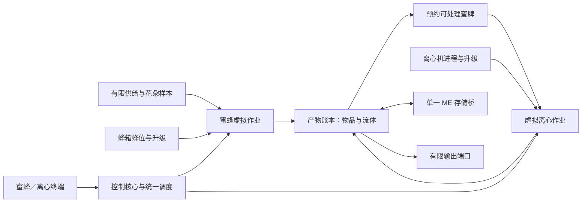

# 蜂业处理网络与独立矩形多方块：大型更新设计方案

## 文档导航与维护规则

本文件保留系统目标、不变量、数据模型、事务、恢复与验收标准。未附已验收步骤的功能描述是目标合同，当前已开放范围只以路线状态和对应证据为准；不得据设计里的类名创建重复框架。开始网络任务时先读本节和[实施路线](bee-processing-network-roadmap.md#current)，再按任务读取对应合同、最近一条验收记录及所用参考；无需每次重读全部历史。

| 内容及唯一更新位置 | 维护范围 |
| --- | --- |
| [主设计合同](bee-processing-network-design.md) | 第 1–9、10.1–10.3、12 节：目标、职责、权威边界和通用验收标准；行为变化在原条目内修订 |
| [实施路线与当前状态](bee-processing-network-roadmap.md#current) | 第 11、14 节：唯一的当前状态、下一步、依赖、未完成门与小步交付清单 |
| [当前验收记录](bee-processing-network-evidence-current.md) | 第 10.52–10.57、10.59–10.69、10.88 及 10.94 起：本步改动、失败及修复、实际证据、结论与未完成边界 |
| [基础阶段验收归档](bee-processing-network-evidence-foundation.md) | 第 10.4–10.21、10.46–10.51、10.58：D01–D12／P2 与 M02／M03 的历史证据 |
| [生产与升级阶段验收归档](bee-processing-network-evidence-production.md) | 第 10.22–10.45、10.70–10.87、10.89–10.93：生产、升级和 M04 的历史证据 |
| [界面、材质与美术规格](bee-processing-network-visual-design.md) | 第 9.1–9.5：GUI 坐标、交互、材质、模型、动画与资源交付清单 |
| [参考实现与采用边界](bee-processing-network-references.md) | 第 13 节：本地源码路径、版本／提交、实际读取入口、采用原则与不采用的行为 |

1. **先改合同，再签收步骤。** 实现改变行为时更新主合同或视觉规格；任务拆分、依赖和下一步只在实施路线更新。每个独立步骤在审查、必要测试／运行验证通过后，补验收记录，再更新路线中的状态。提交同一小步涉及的文档，不能只写“已完成”。
2. **一项事实只保留一处完整记录。** 路线表只放状态和验收链接；主合同不追加构建流水账、提交列表或会话交接；验收记录引用合同和参考，不复制整段设计或源码。
3. **证据带范围。** 每条新增验收记录使用连续的 10.x 编号，列出日期、步骤、行为与边界、失败及修复、实际 worktree／依赖／运行 ID、结果和仍未通过的父门。区分纯测试、构建、专服、真实客户端／玩家文件、Spark 性能数据；原始日志、截图和探针产物继续放在忽略的 build 目录。
4. **参考有版本，变化有去向。** 新学习先更新参考文档的具体版本、调用链和取舍；采用后在相关合同写明行为，验收记录链接对应证据。固定发布源码不写成“已拉取最新”；旧性能数字不改成新版本的测量。
5. **历史只作必要勘误。** 已验收归档不滚动追加现行状态；发现错误时在原记录标明勘误日期并链接替代结论，不删除失败或重写当时版本。当前验收文档接近 400 行或 128 KiB 时，按完整阶段移入一份有明确范围的归档，再更新导航；不按每次聊天新建文档。
6. **保持定位稳定。** 保留已有章节编号及显式 s 编号锚点；跨文档引用必须使用相对 Markdown 链接和目标锚点，不再只写“见第 10.x 节”。移动内容同时更新正文、索引和引用，检查无丢段、重复权威描述、断链、BOM 或乱码。
7. **当前状态不代替验收。** 子步通过不关闭父阶段；未完成、失败和待真实玩家／性能验证的门保持开放。涉及仅文档拆分时检查内容保留和链接，不额外运行无关游戏测试。

## 1. 推荐结论与目标

新增“蜂业处理网络”：本模组蜂箱、离心机、控制核心及专用端口六面相邻时构成自由形状的多方块结构。每台蜂箱／工厂贡献蜂位、等量喂食槽以及按本机升级计算的生产能力；每台离心机／工厂贡献按本机进程数、并行和升级独立计算的处理能力。网络汇总这些能力，在统一调度器中完成全部虚拟生产。托管成员不执行实际生产、离心、配方推进或独立物流。

**2026-09-22 范围补充：** 同时开发可独立工作的矩形多方块机器（长、宽、高可不同），各有主机控制器、内部核心、外壳、接口与端口，形成后可接入上述蜂箱／离心机网络。自由连接图与矩形机器是两层组合关系，不把独立机器缩减为网络核心的装饰龛，也不要求普通蜂箱先搭矩形外壳。通用结构引擎只依赖 Minecraft／NeoForge 基础 API，不新增 AE2、LDLib、Veil 或第三方多方块框架依赖；本模组既有 PB／Mekanism 依赖保持。详细合同见 2.4、3.3、7.2、[9.1](bee-processing-network-visual-design.md#s9-1)，实施路线见 [11.12](bee-processing-network-roadmap.md#s11-12)。

AE2 通过一个桥接端口双向访问产物库存：合法产物可存入、查看和提取，可供合成与外部机器消费。蜜蜂终端和离心管理终端都能管理对应成员的升级；离心终端还管理处理优先级、AE2 主动拉取、分层保留和目标库存。独立机器模式继续存在，只有成功脱离网络后才恢复独立生产。

“无限存储”按无限盘定义：合法产物不设数量容量、种类配额或总存储字节配额，不需要购买磁盘扩容；数量超出 long 后仍精确保存。计算、暂存、网络包和缓存的单次工作预算不属于库存容量。取消第一版提出的固定变体数及总存储字节保护线；硬件、磁盘空间和 Java／AE2 接口仍有实际边界，异常时暂停或隔离，绝不截断数量或清空库存。

已确认准入规则为“合法产物类型”，不追溯来源：若金锭在当前服务器的蜜蜂生产／蜜脾处理链中合法，采矿得到的相同类型金锭也可存入；与蜂业产物无关的物品拒收。这是明确选择的产品行为。

主要收益假设是减少库存搬运、逐机 AE2 节点与接口调用、重复配方检查和界面同步；不是把工作搬到异步线程。已有机器已经进行部分虚拟化和批处理，实际收益必须相对当前版本测量，不能对比一个虚构的完全未优化版本。

### 1.1 方案比较

| 方案 | 实现与兼容成本 | 性能边界 | 取舍 |
| --- | --- | --- | --- |
| 继续优化每台机器的 AE2 IO | 最低，现有路径稳定 | 仍有每机 tick、节点及反复进出库存 | 主分支持续做，不能替代此次更新 |
| 相邻机器共享缓存，仍各自完整 tick | 中等，容易过渡 | 减少物流，重复生产编排仍存在 | 可作为实验，不作为最终架构 |
| 控制核心统一调度，成员贡献能力 | 较高，需所有权和存档协议 | 能减少内部 IO 和重复调度，保留机器价值 | 推荐主线 |
| 把一切装入单个虚拟蜂箱方块 | 开发形态简单，但改变现有玩法 | 方块数少，仍有真实生产计算成本 | 不符合相邻机器构网目标 |

### 1.2 必须成立的不变量

1. 一只蜜蜂、一个处理中输入、一份能量、一个产物数量，在任一时刻只有一个权威所有者。
2. 托管成员不能同时执行独立生产、旧 AE2 推拉、直连弹出和网络作业；断线也不能自动双跑。
3. 原料、能量、已生成结果与进度的变更在内部事务中一致提交；不能先吞输入，再发现输出无法接纳。
4. `SIMULATE` 不改变库存、预约、随机状态、能量、统计或持久化状态；实际执行重新校验。
5. 普通库存必须来自已结算生产或实际外部转移，并通过相同的合法产物规则；后续仅允许 [2.6.4](#s2-6-4) 明确授权的创造无限来源按请求交付。无限标记不写成有限余额，客户端不能上传数量后凭空增加账本。
6. 不为内部物流、积压或拆网生成海量掉落物实体；满载、异常和未知状态使用暂停与保管。
7. 未加载区块、未加载核心、未知配方、未知蜂种不得继续生产；不进行离线补产。
8. 无 AE2 时核心生产、存储、终端和有限端口仍可用；专用服务端不得解析客户端类。
9. 一个矩形机器只贡献一份机器身份与能力，外壳、内部单元与多个端口不得重复贡献；结构成形不等于授权联网或接管。
10. 扫描、搭建预览与核心渲染共用结构坐标定义；动画状态不能决定生产、收费、库存或持久化真值。

## 2. 玩家功能与方块职责

| 方块／入口 | 职责 | 默认规则 |
| --- | --- | --- |
| 蜂业控制核心 | 网络身份、权限、形成状态、调度、能源分配 | 每个连通结构一个；本体内置产物账本，不额外要求磁盘 |
| 本模组蜂箱／各级蜂箱工厂 | 提供蜂位、每蜂位一个喂食槽、升级能力及环境位置 | 原蜂位数和基因效果保留；升级只作用于对应成员 |
| 本模组离心机／各级离心工厂 | 提供本机进程数、每进程并行、速度、能耗和升级 | 独立计算后按兼容能力分组汇总，本机不运行配方 |
| 蜜蜂管理终端 | 查询、分配蜂位、逐位喂食、装笼、逐机安装／拆除升级 | 按蜂种或机器查看，批量操作逐机返回真实结果 |
| 离心管理终端 | 能力汇总、逐机升级、优先处理、AE2 拉取、保留及目标库存 | 规则页与机器页分开，显示不能运行的具体原因 |
| 供给端口 | 蜂笼、花朵样本、食物、升级件 | 使用有限槽位；其中本身符合产物规则的物品可另经存储入口入库 |
| 输出端口 | 向普通管道提供被配置的产物 | 仅暴露有限展示槽／罐及有限搬运；无人使用时不轮询全部库存 |
| ME 桥接端口 | 将可提取产物暴露为 AE2 存储 | 首版每个蜂业网络一个活动桥；物品和流体统一挂载 |
| 网络连接框架 | 无生产能力的结构连接件 | 后续加入；首个原型只用直接贴合，避免先做电缆系统 |

**D18a 专用终端入口：** 蜜蜂与离心终端首步直接贴合唯一一个蜂业核心，通过终端自身八格距离及核心既有访问／升级授权管理全网对应基础成员；终端不持资产、不参与成员产能或连接传播、不提供核心接管／交还／授权控制。两个菜单分别固定基础蜂箱或基础离心机类型，成员／升级页直接遍历该类型的不可变位置索引，每页最多八行；库存页仍是同一网络的公共产物。类型索引随占用位置原子派生、读档时计入逐条预算重建，最终发布只冻结根，生产／升级只更新记录根，不重建索引；单页查询 O((P+1) log N)、P≤8，索引更新 O(log N)，类型数目前固定为基础蜂箱／离心两类。终端替换／卸载、核心替换／身份／权限变化或出现第二个邻接核心均撤销旧菜单，断开后不能转绑；读取只用已加载区块。六邻格存在未加载区块时拒绝选择核心，不加载区块以消除歧义。首步复用核心紧凑界面及已验收资产事务；完整检索、蜂种／基因／花源详情、订阅刷新、能力池和规则编辑仍由 D18 后续及 D21–D22 接入。

推荐流程：把已有机器紧贴摆放 → 放置核心并预览成员和问题 → 点击“接管” → 核对蜂位、能量、升级及旧库存 → 接入供给与终端 → 启动。后续放置的空闲且有权限的相邻机器可在事务边界加入；已有其他网络或所有者的机器不能被自动夺取。

终端可共用一套菜单、权限及分页基础设施，但保留两个主要入口，避免把生产管理和离心排障挤进同一个页面。产物库存是两者可打开的共享页签。

### 2.1 平衡与容量

- 核心作为中后期升级，配方可采用高级蜂箱、离心工厂、Mekanism 控制电路和本模组材料；核心配方不能硬依赖 AE2，ME 桥接配方仅在安装 AE2 时存在。
- 网络不凭空增加蜂位、生产倍率和离心进程。调度效率提升是奖励，产量公式沿用成员等级及升级。
- 核心有基础维护能耗，蜂箱和离心作业按已有公式计费；具体 FE 数值在基准测试和平衡测试后确定，不在设计阶段伪造精确值。
- 蜜蜂“休眠保管位”与“工作蜂位”分离：前者有配置上限，后者只能来自已加载的蜂箱。拆掉蜂箱不能让其蜜蜂继续享受产能。
- 不设 AE2 式逐机通道。计算预算只控制完成工作的速度；不能把达到 CPU 预算伪装成库存满或偷偷减少产量。

### 2.2 每台机器先计算，再汇总能力

蜂箱成员 i 提供 `H_i` 个蜂位和 `F_i = H_i` 个喂食槽；网络在线工作蜂位为 `ΣH_i`，对应在线喂食槽为同样数量。每个槽以 `(memberId, slotIndex)` 标识，空蜂位也保留自己的喂食槽。卸载成员不贡献工作能力，但槽内蜜蜂、喂食物品及升级仍由网络保管。

离心能力描述符保存：`processCount p_i`、`operationsPerCycle q_i(recipe)`、`cycleTicks t_i(recipe)`、逐 tick 能耗、配方适用集合、升级效果、来源成员和 revision。在资源充足且某配方 r 可运行时，理想吞吐为 `C(r)=Σ[p_i × q_i(r) / t_i(r)]`。这是展示和调度的理论上限；实际吞吐还受供电、原料、保留、成员红石状态和调度预算影响。

例如 A 有 3 个进程、每进程每 10 tick 处理 4 份，B 有 5 个进程、每进程每 20 tick 处理 2 份，则该配方理论能力为 1.7 份／tick，即 34 份／秒。不能将进程、倍率分别相加后相乘；更不能让 A 的升级同时加成 B。

网络不将不同能力抹平成一台“平均机器”。按配方适用性、升级效果、计费公式和周期分为能力池，池内使用紧凑的虚拟进程／相位计数，每次资源分配满足全部成员贡献之和。整数工作量、周期余数、各级别并行和进度都保留；增加进程数不会凭空缩短单次处理的时延。移除或升级某成员仅使对应能力版本失效。

每个配方的总能力都是“所有可用进程用于此配方”的条件上限，多个配方展示值不能相加承诺可同时达到。不同配方、配方版本、输入／环境上下文、升级效果和单操作价格必须分别标识；即使满载能耗同样饱和到 long 上限，单操作价格不同也不能合并计费。D15 在真实分配时对 `(memberId, laneIndex)` 做唯一预约。

蜂箱能力先按“完成生产周期／tick”表示，与最终物品数量分开；基因、概率、蜜脾块、动态结果及转化仍由生产计划结算，不能仅用蜂位数乘升级倍率当实际产量。`FactoryTierConfigService` 的堆叠／流体倍率是物理缓存容量，独立记录用于界面和交接，不能再次乘入 p／q／t。能源容器已应用的配置平衡与 SPEED／ENERGY 效果同样不能重复计入。

### 2.3 一蜂位一喂食槽与升级管理

每个蜂位显示一个真实喂食槽，默认仅为该位提供花朵、转化目标或食物。相同物品可以共享只读匹配缓存，但不能复制库存。消耗性配方在提交时准确扣除对应槽或供给账户；多个蜂位争用同一补料库存需统一预约。

支持多花需求时，允许玩家将已经存在的喂食槽组成显式共享组，界面仍为每蜂位一格，组内仅共享真实存在的样本；消耗性物料依然预约扣除。不能增加隐藏无限喂食库存，也不能把一个物品复制填满所有槽。蜂位重新分配默认不搬走槽中食物；提供显式“连同喂食配置迁移”事务。旧蜂箱的共享饲养板接管时只移动真实物品，无法覆盖的蜂位显示缺少喂食，不免费补齐。

D14 的基础布局从旧 9 个共享槽迁往 3 个逐蜂位槽。迁移先合并同完整组件身份、同禁用状态的物品栈，再填空位；每格上限为 `min(64, 物品实际堆叠上限)`。全量放不下则拒绝生产激活，保留原封存映像供交还，不能只迁前三格或另设不可见溢出库。即使没有蜜蜂，三个喂食位仍存在。默认每格独立，显式共享只改变匹配范围；多个消费请求在同一私有候选中共用剩余量。

蜂位移动保留 beeId，槽位只是当前位置。当前仅支持同一基础成员内移到空蜂位，默认保留食物；携带食物要求目标喂食槽为空且双方未共享，先解除共享再移动，避免隐式重写其他蜂位配置。已付费积压先结算。跨成员移动会改变能力／环境归属，留给逐机能力事务与终端接入阶段。喂食编辑校验独立 feeding revision；正常生产进度变化不会使未改动的喂食计划失效，发布时仍携带最新蜜蜂状态。

升级终端使用 `memberId + expectedRevision` 定位具体机器，显示本机已安装数量、上限、适用类型及预计能力变化。安装扣真实玩家／供给槽物品，拆除预留接收空间；来源不一定是产物库，因为升级件通常不是合法蜜蜂产物。批量安装按确定顺序逐台执行，清楚返回成功、缺料、不兼容、达到上限和离线等结果。

核心升级页首先开放已激活基础成员的单成员有限交换：每次最多查询八个成员，每成员最多显示十种已准入升级的标准物品图标、安装数量、当前上限及可安装状态。请求仍只发送会话、序号、页代际、行号、已定义升级选项、真实背包槽和 1–64 的数量；服务端解析成员身份，保留所有者或显式升级授权、距离、加载与类型校验。选择绑定不可变封存资产映像的身份，正常蜂／离心进度不会使选择过期；任何实物升级变更、交还、重新绑定、重新加载或超过 100 tick 都使旧选择失效，即使升级数量随后恢复原值也不复活。执行前读取当前成员 revision，仍由同一升级服务原子提交。展示上限不是授权，执行时重新检查配置、互斥、组件及实际接收空间；拒绝不修改资产，成功或失败后释放旧选择并要求刷新，不自动重试。此入口复用现有网络存档，终端协议版本递增；旧机器代理、能力预估、批量及双玩家联合门按[11.5](bee-processing-network-roadmap.md#s11-5)继续交付。

核心升级页支持显式“本机／本页”范围。本页批量仅处理当前服务端选择页中的最多八个成员，按展示顺序逐机执行同一种升级，每机请求量为 1–64，共用所选真实背包格；前一台的实际扣除／接收结果立即成为后一台的可用量。每台独立校验当前资产版本、权限、就绪、组件、容量与互斥，旧选择、缺料或满格只返回该台失败，不回滚已完成成员，也不自动重复整批。回复逐项携带行号、有限名称、状态和实际数量，总数必须等于逐项之和；完成后释放旧选择。

悬停安装／取回按钮可查询当前成员的能力预估。服务器复用同一有限交换的模拟检查，按当前真实槽可转移量构造私有升级候选，并从同一封存能力适配器读取前后周期系数、单位 FE/t、成员容量、并行、生产力与效果开关；不发布候选、不预约、不延长原页面有效期、不影响旧工作。预估只表示当前成员下一工作段参数，批量中其它成员仍以各自执行结果为准；它不是实际吞吐或随后成功的承诺。终端协议版本 7 仍限 53 字节请求、16 KiB 回复，新增有界预估和逐项结果，不修改网络存档 schema。

升级变更在调度边界提交：已预约且已开始的有界工作段按旧能力快照结算，新的工作段使用新版本；不能把所有旧作业清零、重抽产物或重新扣费。托管时机器原 GUI 转为同一服务的代理，禁止其继续修改另一份本机升级库存。独立模式保留原逻辑。

托管基础成员的主手非潜行右键转入该成员的网络升级页，取消旧方块／手持物品交互。菜单固定当前成员、交接引用、物理 BE 实例、核心及权威域；显示与命令只允许该成员的升级查询、预估、安装和取回，不开放产物、喂食、批量或全网管理。服务器权限仍来自核心，距离按源成员中心八格内校验，不能要求远端成员旁的玩家同时靠近核心。成员／核心卸载或替换、确认失联、绑定变化、交还或权限代际变化使旧菜单无效。拓扑审计或重建待验证时仅保留菜单，查询及资产命令全部拒绝；审计确认连接未变后可继续刷新，确认失联后关闭且不因重连复活。不强制加载区块、不扫描全网、不放开物理升级槽。除[9](#s9)的含蜂蜂笼／PB 刷怪蛋快捷入蜂外，其它潜行操作和无法验证的隔离状态继续拒绝，独立机器保持原 GUI。

首个有限交换适配为已激活基础离心机的原生 SPEED：仅所有者的当前核心菜单可对一个真实主背包槽安装／拆除，数量不超过当前 Mekanism 上限；安装只接受与标准升级件完整组件相同的物品，因为原生已安装记录仅保存类型和数量，不能吞掉自定义组件。先准备接收空间，再同时发布权威升级映像、递增的成员 revision 和背包结果；模拟、旧 revision、离线／越权或无空间均不改资产。已有离心作业的计划、随机种子、投入预约、进度和冻结结果保持原值，新作业从最新升级映像编译。此步沿用持久化的离心成员 revision 使旧候选失效，不新增存档字段；其它成员不变，托管物理升级组件继续为空。PB 升级、蜂箱、批量与客户端入口按各自步骤验收。

ENERGY 安装／拆除沿用同一有限交换和旧工作段合同，并原子更新封存映像与离心成员的容量。容量使用本机已平衡的基础容量、当前 Mekanism 配置及变更后数量计算，不能再次乘平衡系数或沿用已清空的物理升级数量。若成员尚未迁入共享供能且本地 FE 超过新容量，则整个请求以容量不足拒绝；等于新容量可以提交，不截断电量、不隐式迁移。共享供能成员本地 FE 仍为零，升级不改共享余额或核心容量；脱网只归还当前本地 FE 及升级，未消费共享 FE 留在网络。原生交还先恢复升级并重算物理容量，预检完整往返一致后才交付。

基础离心机的 PB 有限交换只准入已支持的四级生产力、两级时间、稳定性及无用副产物效果。新安装复用本机当前配置上限与 BalanceConfig 等级互斥；已有超上限或旧互斥组合保持真实数量，拆除不受新安装限制。已安装状态只记录类型／数量，因此只接受标准完整组件物品，拆除仍先预留真实主背包槽空间。变更仅更新目标成员封存的 PB 数量，保留原生升级、PB 输入／输出槽、FE 及全部旧作业；新的能力与输出过滤只用于下一作业，不追溯改写已付费结果。精华转化、粗矿熔炼及其它未准入效果仍须独立适配；蜂箱支持范围由下述独立适配规定。

基础蜂箱的原生 SPEED／ENERGY 沿用相同实物交换、上限和 FE 缩容保护。只准入现有静态铁蜂路径，蜂位、基因、喂食及环境条件不随升级改变；PB 蜂箱效果逐项适配，创造／扩展工厂另行验收。已开始的周期保留原耗时及单价，未采样或冻结产物先按旧计划结清；进度为零且旧产物已结清后，下一次成功生产才将新耗时／单价、递增能力版本、生产进度和付款一起提交。模拟、缺电、缺花或环境不符不发布计划切换。跨旧周期边界的请求只推进到该边界，后续调用再读取当前升级；正式调度仍每次接纳一个真实 tick。脱网若仍有与当前升级不同的部分周期则先拒绝交还，完成旧周期后再交付，不能在物理机用新单价续跑旧周期；已匹配当前能力的部分进度仍按原规则保留。

基础蜂箱的 PB 时间适配仅准入 TIME／TIME_2，安装上限读取蜂箱配置，沿用等级互斥及标准完整组件实物交换。封存数量使用蜂箱自己的 PB 键；已有超上限或旧互斥组合保持原数量，仍可逐次拆除。时间除数复用独立蜂箱的 `1 + timeBonus × (TIME + 2 × TIME_2)` 饱和公式，与原生 SPEED 时间倍率组合；每 tick 单价和容量不因 PB 时间升级改变。安装、拆除与配置变化均沿用旧周期结清、新周期首次付款时切换和不同能力部分周期拒绝交还的规则，产物、基因及喂食不变。生产力与蜜脾块按下述独立产物计划准入；基因采样及其它尚未适配的效果继续拒绝，不得因离心机已支持同名类型而放行。

生产力输出计划采用本机公式已经计算出的有限正 float 倍率 M：每个生产周期包含 floor(M) 轮，并在该周期固定样本 u∈[0,1) 满足 u<frac(M) 时追加一轮。对已支持的固定单产物，每轮先按原栈数量应用基因及既有单栈数值语义，再精确汇总轮数；不能把倍率直接乘到最终数量上取整。轮数与总数量超出 int／long 时使用精确数量，不沿用物理批处理入口的总轮数饱和。确定性轮数聚合的成本不随轮数逐项增长；概率／多产物配方不能用这个固定输出捷径，仍须有预算的独立采样段。

轮数纯内核只接收样本，不拥有随机源、资产或恢复状态。正式接入须把周期身份、旧能力／输出计划与确定的随机状态绑定到同一付款及进度提交；模拟、候选丢弃、重放、重启和分段采样不得获得新样本或重新收费。蜂计划保存已经冻结的 float 生产力倍率；每只蜜蜂保存固定种子与下一个未采样周期序号。种子由首次蜂身份派生，移位、结算、升级及正常恢复保持；采样以种子和序号确定 53 bit 样本，与调用分段无关。游标仅随已付费周期的冻结结果一起发布，付款但未采样的周期仍由 pending 保管。小数倍率每次最多采样 64 个周期且不超过调用者预算，整数倍率按精确数量聚合；游标或 pending 的 long 序号空间耗尽时拒绝推进，不截断或回绕。α／β／γ 生产力实物沿用蜂箱当前上限、等级互斥和标准组件交换；倍率与独立蜂箱共用 `1 + Σ(factor × count)` 的有限 float 公式，旧超限或旧互斥组合可保留并拆回。新装蜂或初次接管使用当前封存倍率；升级及配置变化不改正在进行的周期，新的耗时、单价和生产力倍率只在旧周期结清后随首次获准工作一起提交。模拟、缺电、缺花、旧请求和禁用均不切换计划；已付费 pending 或冻结产物仍用旧倍率、种子和游标结清。交还时，能力不同的部分周期须先完成；即使当前能力相同，小数倍率部分周期也须先结清，因为物理蜂箱不能接收网络随机游标。匹配当前能力的整数倍率部分周期仍可交还。

Ω 沿用第四档生产力公式并自带蜜脾块效果，BLOCK 单独提供转换，两者同时存在只转换一次。转换复用 PB 对 HoneycombItem 的映射，按 1:1 替换保留已计算数量，不除以 9、不额外乘倍率；非蜜脾、已是块的产物或映射返回空时保留原键。实际产物组件以 PB 返回栈为准，原配方完整键另存，不能把源栈的所有组件盲目拷到另一物品。映射抛错或目标组件无法无损编码时拒绝开始新周期，不扣费也不改种子。周期计划冻结实际输出键；安装、拆除、配置变化及重启只影响之后的周期，旧 pending／冻结数量按旧键结算。交还除倍率、时间和费用外还比较实际输出键；不匹配的部分周期须先结清。其它产物效果继续按[11.5](bee-processing-network-roadmap.md#s11-5)独立验收。

网络 checkpoint 写入 schema 9，蜂状态带 samplingVersion=3，分别保存原配方键、实际输出键及单蜂 enabled。完整及预算 decoder 兼容 schema 6／7／8／9：schema 6 的完整旧蜂字段按倍率 1、身份派生种子与游标 0 迁入；schema 7 保留原倍率及随机状态，两种旧格式的原配方键取其原输出键；schema 8 保留独立的原配方键。schema 6–8 的蜜蜂默认启用，原进度、pending 与冻结数量不变，schema 9 必须具有包括 enabled 在内的全部字段。流式读取不依赖 schema 字段顺序，混合格式、未知版本、错误字段或负游标均拒绝整域恢复。仅支持旧 schema 的程序不能读取 schema 9，回退须使用一致旧备份；不会把缺失字段或损坏的新存档默认为旧格式。

### 2.4 独立矩形多方块的职责与两种运行模式

| 角色 | 权威职责 | 与蜂业网络的关系 |
| --- | --- | --- |
| 主机控制器 `CONTROLLER` | 带 GUI 的主机；独立 `machineId + generation`、所有者、布局版本、结构状态和服务入口 | 是整台机器的唯一逻辑成员；它不是第二个蜂业网络核心 |
| 内部主核 `CORE` | 结构中的等级核心，声明能力上限、提供动画与后续自动搭建锚点 | 不持 GUI／账本；主核与主机位置可不同，后续合同见 [2.6](#s2-6) |
| 框架／外壳／玻璃 `FRAME/CASING/GLASS` | 满足角、棱、面等几何约束 | 默认无 BE、无 ticker、无物流能力，不作为蜂业网络的连接捷径 |
| 功能单元 `UNIT` 与有限升级槽 | 按本机规则贡献工作能力；升级只归这一台机器 | 形成后派生单份能力快照，不把多个倍率跨机器相乘 |
| 管理接口 `INTERFACE` | 打开该机器／托管网络的同一授权服务 | 不复制库存或开第二套生产调度 |
| 能源、输入、输出端口 `PORT` | 分开的角色及朝外连接面；有限物品槽／罐和 FE 契约 | 多端口转发同一机器服务，缓存能力每次操作复核绑定代际 |
| 蜂业连接端口 | 表示机器与蜂业图的连接边 | 首版每机一个活动连接端口，面相邻接入；不得借机桥接两个蜂业网络 |

`STANDALONE` 时由机器自身服务持有有限物料／FE／工作状态，并按相同计算内核生产；无需蜂业核心或 AE2。`JOINING → MANAGED → LEAVING` 复用既有封存、准备、接收回执及代际合同：联网后领域状态唯一归网络，机器持身份引用和只读运行投影，原独立执行器与 IO 路径关闭。结构状态与所有权模式正交；结构失效／卸载不能自动从 MANAGED 回到 STANDALONE。

独立库存有限，不把网络无限账本复制进多方块控制器；安全脱网只交还这一机器的蜜蜂、食物、升级及可装入的有限物料，网络共享产物留在网络。空间不足或仍有未知交接时保持暂停。首台机器已由用户确定为**蜂箱与离心一体机**；具体长宽高范围、主核等级、单元数量、配方和能耗在 M02／M04 进入时明确，不能因预留框架自动承诺所有组合已支持。

**M04a 复合工作内核：** 一台机器的不可变工作根同时持有机器身份／代际、显式蜂位数与离心 lane 数、单份 FE、蜂记录、离心作业和有限物品槽／流体罐。容量由具体机器能力给出，不能按壳体体积或部件数量重复倍乘；内核允许超过基础蜂箱的三蜂位，但此步不决定正式平衡数值。蜂计算抽为单蜂候选，与基础蜂箱共用付款、旧周期切换和随机游标实现；基础蜂箱存档及三蜂位准入保持。每次候选只可提交到原不可变根，模拟、旧候选或处理异常不能修改库存／FE。

物品槽每格按 `min(64, 实际组件堆叠上限)` 容纳，流体罐按显式固定容量容纳，完整组件不同不能合并；先补已有同键栈再填空槽。离心预约将实际输入从有限缓冲移入单个作业，两路工作从同一 FE 余额扣费。已付费蜂产物可部分交付，剩余精确数量与原随机游标保留；离心保留原冻结样本及单独的已交付数量，权威待输出量为两者之差，不改写原样本来绕过必得产物校验。满槽／满罐时保管余量，可分次腾空后继续交付；不重新抽样、不重复收费、不生成掉落物实体。缓冲操作成本随实际槽／罐数变化，不随精确产物数量枚举。世界线程、结构／所有权资格、持久化及外部端口由后续服务接入，内核通过不表示一体机已经能够独立运行。

**M04b1 容量与工作存档：** 首版 capacityVersion=1 固定为 6 个蜂位、3 个离心进程、27 个物品格、4 个各 16,000 mB 的流体罐和 1,000,000 FE；六种布局使用相同参数，蜂位对应的喂食与插件实物入口在 M04c 接入。这是首版工程容量，不是已完成平衡或吞吐验收的结论。工作存档初版使用独立 schema=1，M04c2a 升至 schema=2 并兼容严格读取初版；显式保存容量、机器身份／代际／revision、单份 FE、全部蜂原始映像／计划／随机游标、离心原冻结样本和 delivered，以及按槽位保存的有限缓冲。复用单蜂／单作业 codec，原网络 schema 6／7／8 兼容与基础三蜂位限制不变。缺字段、未知字段／版本、重复身份／lane、非法交付量、无法恢复的组件或物品堆叠上限下降均拒绝整个候选，不截断数量、不重抽样、不返回空状态；持久化调用者负责保留原文件并隔离。容量升级必须显式迁移，不能修改常量后默默缩容。此 codec 不授予结构／所有权资格，世界落盘及生命周期由下述 M04b2 服务负责。

**M04b2 世界保管与运行资格：** 每台机器的有限资产独立保存在主世界 `data/pbg_machine_<UUID>.dat`，资产封套 schema=1 同时固定所有者、维度、控制器坐标及工作身份／代际。控制器只保存 storageVersion=1 和是否已引用资产；旧无引用字段的身份格式可首次创建空资产。必须确认文件不存在且控制器从未引用资产才允许创建，并先完成空资产落盘；已有引用缺档、读取失败、字段损坏或锚点不匹配均关闭服务，不能重建空库存。正常世界保存与停服写入同一资产根，临时文件完整写出、强制刷盘并原子替换成功后才清 dirty；失败保留旧文件和内存资产，暂停工作，之后成功保存方可恢复。错误 schema 保留原始数据，不覆盖原文件；运行计算异常保存 RECOVERY 及原根。控制器被拆、替换或卸载只撤销访问，不删除资产文件；新控制器不能自动领取旧机器遗留资产。人工恢复／领取入口仍需后续实物交接设计。

结构有效与资产可用是两道独立门。服务读取／提交均检查服务器线程、实际 BE 实例、全结构区块可用、当前绑定、资产锚点和 STANDALONE 模式；一次访问凭据同时绑定结构凭据与不可变资产根，结构重新形成也不能复活旧操作。部件不持资产或生产 ticker。单机工作与结构扫描分别消费同一全服预算，每台机器每个真实 tick 最多处理一次，轮转且不离线补产。世界调度保留已持有输入的离心旧工作及已付费蜂采样／有限交付，并通过 M04c2b 下述真实花源与配方入口启动新工作；升级插件能力另由 M04c3 接入。资产根由主世界 SavedData 保管到服务器结束；控制器、区块和世界卸载清理活动队列／部件引用，资产根不持世界对象。读取和正常保存同步处理单台有限记录，成本随蜂记录、配方产物、槽罐及组件／大数编码字节变化；不据此承诺大量机器的保存延迟，相关测量仍留 D29／D30。

**M04c1 角色端口：** NeoForge 能力只在已形成机器对应角色的朝外面提供，未指定方向也不开放。能源口仅接收 FE；输入口仅接收物品／流体，输出口仅提取；控制器、管理接口和内部单元不重复暴露物流。所有端口转发同一份有限缓冲与 FE，不另存部件库存。物品按请求的真实槽号存取，不把指定槽操作转移到其它空槽；完整组件不同不能合并，接收量遵守实际堆叠上限。流体按同完整键先补已有罐再填空罐，取回只减少实际交付量。返回栈是独立投影；传入栈不修改，余量交回调用方，不生成掉落物实体。SIMULATE 只计算可转移量，不提交权威根、分配持久身份或推进配方编译。

输入资格复用全服同配方代际的静态蜂业产物目录；目录准备期间保留调用方物料，未确认动态变体不由端口自行发现。编译在共享工作预算内每次至多推进八个既有编译单位，端口仅查询已发布索引。配方代际／配方集合变化立即拒绝旧目录，新目录发布后恢复准入；已持有产物的提取不受新目录收紧影响。能力对象固定部件实例、角色、朝向及当时结构绑定，每次操作再取得当前资产凭据；失效对象不能自动转绑另一台机器或新结构。形成提交后的部件发布显式失效 NeoForge 能力缓存，包括曾缓存的 null；卸载查询使用 getChunkNow，不续区块票据。单次 IO 成本受槽罐数及组件编码字节影响；无新增 AE2 依赖、存档字段或网络包。

**M04c2a 蜂位与喂食资产：** 六个逐蜂位喂食槽直接进入同一不可变工作根，默认各自独立；食物完整组件、有限数量、禁用状态与规范共享组使用既有单槽格式。任何食物实际变更都会递增工作 revision，使此前取得的资产操作失效；生产／FE／缓冲操作保留同一喂食内容，模拟只构造候选。基础蜂箱的三格、旧九格迁移及来源指纹规则保持独立，不能放宽成六格。

工作 schema=2 必须包含六格完整喂食数据；只有字段集合严格符合 schema=1 的旧文件才可迁入六个空槽。新格式缺字段、异常数量／分组、未知物品或不能完整往返的组件均隔离原始存档，不默默补空。单机装蜂候选使用机器身份、代际、原根 revision 与槽位派生新 beeId，模拟不消耗随机源，取出后重放旧身份无效；取蜂必须先结清已付费积压，未完成周期按装笼语义取消且不退 FE，食物留在原槽。此步只提供守恒候选与正常保存／恢复，真实背包交换、花源匹配和新周期入口继续 M04c2b，不凭构造候选开放客户端资产写入。

**M04c2b 真实交换与新工作：** 已形成独立控制器由所有者在八格内打开六蜂位菜单；每次操作同时校验服务器线程、实际菜单／会话 UUID、单调序号、查看版本、结构绑定和资产原根，旁观者不可交换。查看版本只在蜂身份、食物或升级资产变化时前进，正常生产不会令未改变的选择持续过期；结构重建仍永久撤销旧菜单。请求固定 52 字节，只含有限索引和数量，每玩家沿既有共享预算限流。客户端不发送物品、蜜蜂 NBT 或配方键，机器状态使用 114 个有限数据字段及仅物品基础图标，完整组件留在服务端。

单笼交换复用 PB 普通／加固笼完整投影：普通装蜂笼放入后消耗，加固笼在原背包格留下保留非实体组件的空笼；取蜂要求选中一个真实空笼，拒绝已付费积压，取消未完成周期不退款。食物存取在选中的一个背包格与一个真实喂食格间按完整组件／实际堆叠上限交接，满载只转实际接受量；双方候选完成并再次核对原根后提交，两次赋值间无外部回调。发送失败不回滚已经提交的资产；未知结果不自动重试。原版鼠标搬运／丢弃／创造复制入口关闭。

首个生产准入仍限未转换静态铁蜂和已审查普通蜜脾离心配方，不放宽特殊蜜蜂、动态万化或喂食转化。新蜂周期检查本位／显式共享组的真实花源和基因环境条件，复用原周期、产量与随机内核；基础能力使用现有配置能耗的一次 1/5 向上取整平衡，无插件时倍率为 1。空离心进程最多扫描本机 27 格，从同一缓冲移交实际输入再扣共享 FE，每真实 tick 每 lane 至多推进一次。单机正负配方缓存上限 128、蜂计划资格缓存上限 32，配方目录／能力参数／基因规则变化时失效，卸载与停服清理；已付费工作继续按保存的旧计划完成。新蜂公式在下一个周期起点切换，部分周期不能改价。单机联合验收须把真实物料入口、服务器持续调度、独立能力／产量／FE 对照、满载保管和正常跨 JVM 恢复串成同一守恒账目；部件数量不能增加调度次数。蜂箱小数生产力按固定种子与游标对照，离心概率按已审查批量采样合同对照，不要求与独立物理机使用不同随机源时逐件结果相同。

**M04c3a 原生实物插件：** 同一工作根增加四个有限槽，依次为蜂箱 SPEED／ENERGY、离心 SPEED／ENERGY，每槽上限 8；使用 Mekanism 标准升级件，只接受与标准件完整组件一致的实物。安装和取回复用上述单背包格、模拟、会话、查看版本、共享限流和原根提交；装满保留背包余量，取回满格保持原资产，不生成掉落物。两路分别计算，蜂箱插件不改变离心能力、离心插件不改变蜂箱能力，也不影响其它机器。ENERGY 在此载体只降低对应工作单价，capacityVersion=1 的 1,000,000 FE 缓冲不扩容；界面明确说明该差异。

速度和耗电采用已审查的基础 Mekanism 10.7.19.85 公式与现有一次能耗平衡，蜂箱时间复用 `ApiaryUpgradeMath`，离心超单 tick 并行继续受现有配置上限约束。已开始的蜂周期、已持有的离心作业及冻结产物保持原计划、费用、种子和游标，新周期／新作业才使用新能力；蜂周期仍在首次获准付款时切换。改写原生上限或公式的 Mekanism Unleashed／Empowered 未适配时拒绝安装，取回不依赖能力公式预检；没有新增可选依赖类型引用。原生槽不提供 PB 效果；PB 插件按下述独立目标槽处理，自动离心直出仍另行接入。

工作当前使用 schema=4，保存四个原生槽、独立递增的升级 revision 和蜂箱／离心两份 PB 数量映射；schema=1／2 仅在旧字段集合完整时迁入空升级，schema=1 同时迁入空喂食，schema=3 保留原生槽并迁入空 PB 映射。新格式必须包含两个 PB 字段；缺字段、未知字段／类型、非正 PB 数量或负 revision 隔离整个候选并保留原文件，升级与旧工作共享同一份世界存档。旧程序不支持 schema=4，不能用回退程序覆盖该文件。插件不改变蜂位、lane、槽罐或 FE 容量；拆结构及卸载继续撤销服务并保管同一资产根。

**M04c3b PB 插件与管理接口：** 蜂箱的七种 PB 目标为四级生产力、TIME／TIME_2 和 BLOCK；离心的八种目标为四级生产力、TIME／TIME_2、STABILITY 和 USELESS_BYPRODUCT。分别持有实物映射，不把同名升级广播到另一子系统。新安装读取现有蜂箱／离心配置上限及 BalanceConfig 等级互斥；标准完整组件、部分接收、满格保留和双方原根提交与原生槽一致。已有超限或旧互斥组合保留真实数量，可继续分次取回；当前上限只约束新安装。基因采样、精华转化、粗矿熔炼、模拟及自动离心直出均不由该白名单放行。

蜂箱复用已审查的生产力轮数、PB 时间除数与 Ω／BLOCK 单次映射；离心复用现有生产力并行、可配置产量倍率、时间、稳定性和副产物过滤公式。工作费用仍独立核算，PB 只改变已有公式规定的部分；蜂箱产物进入有限缓冲后按普通串联离心处理，不冒充自动离心直出。升级或配置变化只影响下一周期／新离心作业；已开始的周期及旧冻结输出沿用旧计划。配方缓存随当前离心能力变化失效，蜂箱在周期边界读取当前能力，保留固定随机游标。

控制器与 INTERFACE 部件打开同一个管理服务。接口入口固定当时的部件实例、结构绑定与控制器，校验所有者、同维度、非旁观者和距实际入口中心八格；接口操作无需同时靠近控制器。每次查询／交换只读取已加载区块，复核部件仍位于原坐标、仍为 INTERFACE、绑定未变和核心资产可用。拆除、替换、卸载或重建使旧菜单失效，新绑定不能复活旧菜单；接口不持库存、升级或生产 ticker。客户端仍只发会话／序号／版本和有限索引，升级索引为 0–18，请求协议版本 3、固定 52 字节；查看版本也随服务端上限变化前进。升级数量及上限各以两个 16 bit 字段同步，保留完整正 int，页面只是有限展示。

### 2.5 首台一体机与自动离心升级（2026-09-23）

首台独立矩形多方块同时具备蜂箱生产和离心加工能力。未装自动离心升级时，蜂箱产出蜜脾，离心工作单元按规则从本机有限缓冲取料，两部分各有进度、能力和费用。联网后同一 `machineId` 只接管一次，两个子系统由网络统一编排；端口、内部单元和主核都不能另发一份机器能力。现有 `OwnedMachineRecord` 只允许基础蜂箱或基础离心机二选一，M04／M05 必须实现有版本的复合工作状态与严格恢复，不用两个伪成员或复用基础三蜂位上限来绕过这一差异。

用户要求的升级使蜂箱在生产结算时直接交付对应离心产物。它是**产出流水线内的一次转换**，与普通串联取料分开；不先把蜜脾存进公共账本再猜测它是否已经转换。本地 `auto-centrifuge-upgrade-design.md` 对 Mystian Apiary 1.8 的研究仍可参考，旧草案的“直接接全部机械蜂箱继承链”、文件数量和工期估算不再作为本轮实现方案。

| 安装载体 | 当前方案 | 预留边界 |
| --- | --- | --- |
| 主机升级插件 | 首发方案；装入本机受限升级槽，自动离心为功能型、最多一个有效实例，默认不额外倍乘产量 | 正式安装事务校验机器能力、冲突与槽位；托管后通过网络权威服务操作，GUI 不能直改部件库存 |
| 结构升级方块 | 后续扩展；需要空间成本或结构等级玩法时提供 | 模板先声明 `UPGRADE` 角色，位置绑定到同一机器；不拥有 ticker、库存或独立倍率。与插件汇总为同一份能力输入，同功能不能重复计数 |

M04／D17 先建立载体无关的升级定义、已安装实物及有效能力快照边界：区分功能、数量／等级、来源槽或来源部件、兼容谓词和能力 revision。载体保存真实资产，快照只是计算结果；形成扫描不凭空生成一份升级物品。先交付实际使用的插件路径，升级方块在对应模板和交接验收前不注册为空壳功能。升级只作用于这一台一体机，不广播为全网升级，也不将其倍率与独立离心机倍率再次相乘。

**转换与守恒合同：**

1. 蜂箱原始批次先完成自身产量计算与已支持的蜜脾块转换，再使用共享离心配方解析／数量内核处理一层。无配方产物原样保留；配方匹配后执行失败属于待处理或隔离，不能当作无配方吞掉结果。离心后的副产物过滤、精华转换和多种流体分别显式适配，不能漏掉 Wax 或蜂蜜。
2. 批次固定输入、配方／能力版本、种子及批次切分、费用、转换状态和冻结物品／流体结果。生产力在蜜脾阶段已应用，离心阶段不得再次放大同一份蜜脾；批量概率以 D15a 已有内核为准，不宣称等同逐件独立二项分布。配方／配置重载和卸载升级只影响新批次，不重新抽已付费结果。
3. 蜂箱工作费与直出加工费分别核算、原子扣付，网络维护费仍按真实 tick 只收一次。直出不要求外置离心机；其本机吞吐来源、与普通离心单元的共享或独立能力关系及数值费用须在 D25-auto 启用前明确并压测。若共用能力额度，同一时段不得同时满额贡献直出与普通离心；不能借“即时转换”免除处理成本或 CPU 预算。
4. 缺电、预算耗尽或有限输出空间不足时保留已付费批次并对对应蜂位施加背压；不得无限积压，也不能输出成品后仍保留可再次入账的蜜脾。结果向本机库存或网络账本只交付一次，成品不再自动路由进离心池。批次身份在混合余额前完成来源判定，普通相同键不能继承另一批次的处理标记。
5. 物品和所有流体都进入有所有权的待输出记录；安装、拆卸、拆结构、脱网和恢复都要覆盖这些记录。拆卸前预留真实接收空间；已付费转换未结清时等待，不能回退重开。相关稳定性等升级若失去适用条件，须一起安全退回或拒绝拆卸。不得生成掉落物实体。
6. 蜂箱自身蜂蜜与离心配方流体分别记录来源，默认对齐明确的蜂箱加离心参考链；旧草案的“装升级默认抑制蜂箱蜂蜜”不直接采用。若后续确需平衡开关，必须明确改变的产量，配置界面与中英文本同步，不能以去重为由删掉合法独立副产物。

**分步与验证：** M02 模板给主核、蜂箱单元、离心单元和插件安装界面留位置；M04／D17 交付有限槽、复合工作状态与升级事务；D25-auto 单独接直出转换，M05 验收其联网所有权，M06 接活动状态。D25-auto 可在这些直接前置完成后先做已准入的静态蜂种；D25 其余特殊蜂种及 D24 扩展机兼容仍各自验收，不因一条直出链通过就整体关闭。验收须比较相同输入／能力的固定种子产物及 FE，覆盖无配方、原生／派生蜜脾块、概率余量、多流体、满槽、缺电、升级更换、重载／重启与托管切换；实际玩家安装入口不可由手工修改 NBT 代替。

### 2.6 后续科技发展线：等级核心、蜂蜜工业与终局（2026-10-03）

本节是用户确认的后续目标合同，尚未实现。实施必须等蜂箱／离心网络、独立多方块及完整终端通过联合完成门，具体前置及步骤只在[11.14](bee-processing-network-roadmap.md#s11-14)维护；不能以新增等级／材料开发替代当前 D／M 门。新机器围绕资源蜜蜂的产物和 Mekanism 工业体系，AE2／MEK 附属增强体验，但基础科技流程在未安装可选附属时也能完成。

**核心与主机的术语。** “多方块核心”是结构中的 CORE 部件，决定本机等级／能力上限并作为搭建锚点；“主机”是带 GUI 的 CONTROLLER，唯一持有机器身份、运行服务与资产引用。核心右键提供结构预览／自动搭建交互，不打开生产管理 GUI；主机和管理接口打开同一授权面板。现有“蜂业控制核心”是自由连接网络的管理方块，保留注册 ID 和存档语义，不能与矩形机器 CORE 混为一物。当前核心尚无自动搭建功能，后续按 T02 接入。

#### 2.6.1 等级与能力合同

| 层级 | 玩家获得的能力 | 适配规则 |
| --- | --- | --- |
| 基础 → 高级 → 精英 → 终极 | 逐级解锁配方等级、蜂位／工作进程上限、每进程并行、周期时间、FE 缓冲／输入和冷却超频上限 | 使用本模组的四级核心及材料，颜色／名称遵循 MEK；等级不是单一“全部乘 N” |
| MEK 附属扩展 | 包含 Extras 的至尊及其完整等级链，后续覆盖悖论无限相关等级及已声明支持的 Evolved／EMExtras 组合 | 稳定命名空间 tierId＋显式能力描述与升级前置，逐个核对实际附属 ID／版本；不按跨模组 enum ordinal 排大小 |
| 毕业核心 | 创造级稀有度的可合成终局生产核心 | 有限生产、极大批量及独立终局计费合同，见 2.6.5 |
| 万象创世核心 | 创造模式／管理员取得的无限资源来源核心 | 无合成配方；不是上述有限生产等级的下一档倍率，见 2.6.4 |

每个版本化能力快照明确 recipeTier、蜂位 H、进程 p、每周期 q、周期 t、单次／批次 FE、输入率／缓冲、冷却预算、允许升级及配方集合。普通工厂可参考 MEK 的 3／5／7／9 进程阶梯，但蜂位和多方块平衡独立定案，不能把这个数字直接套入现有六蜂位。核心提供等级与上限，功能单元提供本机工作位；有效能力按各字段约束计算，不能把核心、壳体体积、单元和升级重复计数。蜂箱与离心两路独立算完再合并为一台逻辑成员，高级核心不广播增强其它网络成员。

按用户追加，将主核、蜂业工作单元、离心工作单元、冷却单元与必要的能源／端口部件设计为可辨等级方块，主机负责汇总与展示。结构模板明确允许的混级组合和瓶颈；低等级部件只约束其负责的字段，不把所有能力统一降为最低等级或把每块的倍率连续相乘。外壳／玻璃如承担等级约束必须在配方与结构说明中明示，不靠装饰颜色暗含能力。

成型机器支持“一键替换升级”：主机先给出目标档、准确坐标／替换件清单、能力预估和旧部件回收空间；服务器验证所有权、已加载结构、原 machineId／generation／部件版本后冻结新工作，按预算逐格替换并记录可恢复进度。只消耗实际安装的新部件，旧部件进入原所有者的预约接收空间或本机已付费暂存，绝不生成掉落物。材料／回收空间不足则不开始，世界保护拒绝、区块卸载或外部同步修改时暂停并保留日志／资产；没有证明整机替换的跨文件原子性前，不承诺断电回滚所有方块。恢复检查每格旧／新状态，不能重复扣件、重复返还或把不认识的中间结构自动当新机器。安全完成后一次发布新能力代际，旧工作结算与网络唯一所有者保持。

配方、配置、核心／单元及升级共同产生 capabilityRevision；只影响新周期，已付费计划保留原费用、结果与随机游标。换核／降级先暂停新工作、撤销旧菜单和能力、结清或保管旧计划，再验证新容量；无法容纳蜜蜂／物料／FE 时拒绝缩容并保留原资产。未知附属等级、缺模组或损坏描述进入受限恢复，不默认为基础档或丢弃库存。存档保留稳定 ID 和版本，迁移必须显式覆盖旧 M04 工程容量。

#### 2.6.2 玩家材料与机器发展流程

以下物品与机器名称为设计工作名，注册 ID／配方数量在对应实施步冻结。每台机器承担一个可说明的加工职责，复用现有 MEK 侧面配置、红石、升级与有限缓冲设计，不通过复制整套蜂箱／离心机继承树增加新机器。

| 发展环节 | 输入 → 输出及用途 | 机器与解锁 |
| --- | --- | --- |
| 起步与引导 | 现有蜂蜜／蜂蜡／蜜脾产物＋MEK 金属与电路 → 蜂蜡复合基材、基础机架 | 工作台／现有 MEK 机器制造第一台基础加工机，不能要求自身产物才能造第一台 |
| 分离提纯 | 蜜蜂产出的原料 → 蜂源精质与副产物；蜂蜜 → 精制蜂蜜 | 蜂源精炼机：物品／流体有限输入输出，给材料链及冷却液供料 |
| 材料形成 | 蜂源精质＋不同金属／晶体 → 蜂晶复合材料、导热基材 | 蜂晶成型机：基础材料经升级配方成为高档材料，服务核心、单元和外壳 |
| 冷却制造 | 精制蜂蜜＋导热粉末／蜂晶资源 → 分级蜂蜜冷却液 | 蜂蜜调配机：入门液在超频前可制造，高档液解锁更高超频 |
| 结构装配 | 复合材料＋MEK 电路＋前级部件 → 核心、工作单元、冷却部件和结构件 | 蜂业装配机：等级限制配方，普通配方保留可读的升级链和回收规则 |
| 循环与毕业 | 热态冷却液＋FE／必要补充料 → 再生冷却液；多条高阶产线汇合 → 毕业核心 | 冷却再生机后续独立交付，禁止零成本倍增流体；毕业配方汇合多种蜂源材料和最高已开放自产核心 |

所有加工机都规划基础／高级／精英／终极及可选附属等级；首步先完成一个基础机器的生产、升级、存档和侧面 IO 闭环，再复用成熟机制覆盖其它机器和等级。使用 MEK 原版 SPEED／ENERGY 等组件只在对应机器支持且公式已核对时开放，不把不适用升级列为有效。升级安装／拆除保持物品完整组件与实际接收量；安装器迁移必须保留输入、输出、进度、FE、升级及侧面配置，放不下就拒绝。

AE2 采用可选适配，复用本项目既有直连供给／输出原则，后续按机器需要接样板处理；没有 AE2 时普通管道及 GUI 足以完成全线。联网托管的载体必须关闭独立 IO，不能同时从两套服务扣料。新材料是否可入蜂业无限账本，由明确的蜂业产物／批准加工链逐项登记；不能因为新建一个配方类型就把任意 MEK 配方和全物品目录放行。

配方按可选模组条件启用；缺少 Extras／悖论等附属时，核心基础线和本模组毕业路线使用独立配方，不留下不可得的必需输入。整合包可通过数据包／KubeJS 提高毕业难度；内置配方和默认脚本不得给创造核心添加获取路径。指南与 JEI／EMI 展示解锁顺序、材料去向、最低等级和瓶颈；平衡以资源种类、产线建设和稳定供能为主，不用大量没有用途的中间件或纯等待填充流程。

#### 2.6.3 冷却与超频

结构冷却入口接入本机有限输入罐及热态输出罐；部件不各自存一份冷量。采用 ECO 的“流体配方给出冷却能力与最大超频档”思路，独立实现版本化 coolingRecipe：完整流体键、输入 mB、热态／消耗结果、可移除热量与最高档。不能照搬其查询中可能补充冷量的行为：本项目 SIMULATE、能力预览和 GUI 查询不扣液、不充冷量、不推进生产。

新工作按 requested 档、核心档上限、冷却液档上限及当前 FE／冷却／输出空间确定有效档；p、q、t、FE 和热负荷分别定义，超频不得隐式增加概率或重复倍乘产量。先预约输入、FE、冷却消耗与热态输出，再一致提交工作段；部分 mB 换算使用精确余数，保存余数且绑定流体／配方身份，不能每 tick 向下取整白嫖冷量。无工作不收生产冷却费，维护费如有需单列。

缺冷却液、低档液或热罐满时默认暂停需要超频的工作，保留进度与已付费输出；玩家可选择让后续新工作降到可运行档，不能中途改价、退费或重抽样。冷却失效不炸机、不删除资产；已完成的付费结果可继续安全交付。关闭冷却／换液／换核／配方重载和拆结构撤销旧候选，独立／托管模式始终只有一份热状态与冷却账户。缓存以配方代际、完整流体键、核心能力版本为键，有界且在卸载／停服清理。

#### 2.6.4 无配方的万象创世核心

核心与万象创世蜜蜂建立名称、外观和产物目录关联；只有创造物品栏／管理员命令可取得，模组不注册工作台、机器或概率掉落获取路径。它仍是已形成矩形机器中的唯一 CORE，通过有效的网络连接将无限来源挂到已有无限存储；仅持在背包、结构未形成、卸载、双重绑定或脱网时均不授权。无需逐只装入全部蜂种。

无限来源覆盖当前资源蜜蜂全部可产出的合法物品／流体及已批准离心产物链，以现有 ProductPolicy 和完整组件 ProductKey 判定。目录建设复用万象创世／D25 的产物解析器，在配方／标签／KubeJS 重载后预算化重建。可枚举配方给出全部有效结果；动态输出由对应适配器提供结果集合或精确资格谓词，不能只靠随机抽样或“已经生产过”来宣称覆盖全部。对无限组件空间按请求验证并按需投影，不预造所有 NBT 组合；未知世界副作用的结果不得猜造，上线前必须列明并补齐支持范围。

普通账本仍保存精确有限余额；另保存有版本的无限来源描述（machineId、generation、catalogRevision），不把 Long.MAX_VALUE 或某个巨大 BigInteger 写成“无限数量”。查询合并有限余额和无限标记，GUI 显示 ∞；来源键提取直接按请求交付有限数量，不减无限标记、不先凭空充值有限余额。AE2 long 接口只上报饱和视图，单次最多返回请求量／接口上限，并验证其缓存、重复提取和其它库存聚合不会溢出；这不限制来源的累计可取量。

存入物品仍按实际接受量进入有限账户，不因无限来源存在而吞掉外部物品；提取默认从无限来源交付，保留原有限余额。内部加工同样通过明确的来源授权获得实际投入，不能客户端上传数量。拆除、停用、权限变化、失联或目录失效立即撤销来源及旧挂载，重连产生新凭据；有限余额、已交付资源与已付费工作保留。来源引用复制不能克隆有限账户，不把来源状态塞入可复制的核心物品 NBT。第 1.2 的“所有新增库存有可证明来源”在这里增加显式创造来源这一种受控来源，其它入口不变。

#### 2.6.5 可合成的毕业核心与吞吐目标

毕业核心是独立物品和能力档，可在生存流程中极难合成，代表整合包结档级目标。配方汇合多蜂种高阶材料、核心逐级装配、完整冷却循环和大规模加工成果；不消耗无配方创造核心，也不把未安装附属的材料设为必需。安装后只增强所在多方块的蜂箱／离心两路，仍需真实蜜蜂、合法花源／输入及有效结构，不给整个网络的每台机器再乘一遍倍率，也不提供 ∞ 来源。

目标对标 Useless 的多方块万象合金炉高阶／毕业配置，须固定上游版本、线圈等级、线程、配方、能耗配置、供给和外部接口。当前源码显示其最高线圈存在 1 tick、极大并行和整批固定收费特例，不能只比较普通线圈默认倍率或抄一个 Long.MAX_VALUE。采用大数工作信用／按产物键聚合方向，每次处理成本随活跃工作组、结果键及数值位数增长，不随虚拟次数逐次循环；概率／动态结果继续满足 D25 的已声明随机合同，不能乘一次随机结果替代独立试验。

终局 FE／冷却采用显式批次计费描述，可与普通逐份计费不同，但每个批次的授权工作量、价格、余量、暂停和恢复须可精确核算；参数在 T07 按实测校准，不能用溢出、饱和扣费或零费重放实现“无限并行”。UI 分别显示理论处理能力、实际入账量／秒、蜂生产与离心瓶颈及外部取出吞吐。验收同时比较有限大批量完成时延、稳定每秒入账、FE／冷却和主线程成本，并单列原生 AE2 long 与上游大数扩展接口的差异；源码能力说明不等于已测到相同 MSPT 或吞吐。

## 3. 相邻拓扑、接管和失联

### 3.1 连通规则

同维度、面相邻、连接面允许且注册了网络成员适配器的方块构成图；不接受斜角连接。普通容器、AE2 电缆、PB 原版蜂箱不会因为贴合就变成成员。扳手可关闭连接面，允许两个独立网络紧挨摆放。

首个可玩原型限制在同一已加载区块。正式首版增加跨区块连接，但只计算已加载、可验证的路径，不强制加载区块。完整卸载网络不运行；核心区块加载也不能让卸载成员贡献产能。

使用事件驱动的脏节点队列：放置、移除、旋转、连接面变化、区块加载／卸载标记相关节点及邻居。调度器增量 BFS 重建受影响组件。不能只用并查集，因为移除边后必须识别分裂；不能每 tick 扫描整个范围。

一次完整重建为 O(V+E)，六面连接下 E≤6V；按节点预算跨 tick 执行并合并重复事件。计算期间受影响旧组件进入 `REBUILDING`，冻结生产和外部库存操作；发布新拓扑版本时一次性替换视图。增加低频、有游标的校验，补偿外部模组未正常触发事件的改动。

跨 tick 重建绑定 topologyMutationEpoch；扫描期间再次收到结构变化或区块卸载时，废弃受影响扫描结果并合并重试，发布前重新核对 epoch。不得发布已经过期的连通图；成员失去已加载路径后立即撤销可执行资格，不等待长 BFS 才停止生产。持续抖动的结构保持暂停，并用合并／退避避免全服被重建占满。

### 3.2 组件状态与唯一性

网络状态：`FORMING → RUNNING ↔ PAUSED`；变化时进入 `REBUILDING`，双核心为 `CONFLICT`，数据或所有权不确定为 `RECOVERY`，无在线核心为 `DORMANT`。停电暂停生产和普通 AE2 提取，允许所有者在本地进行恢复和有限取回。

成员状态：`STANDALONE → JOINING → MANAGED → LEAVING → STANDALONE`；非正常断连变为 `ORPHANED`，必须完成交接才回到独立模式。控制身份采用 `networkId + controllerId + generation`；成员身份采用服务端生成的 `memberId + generation`，不能只依赖坐标。

| 事件 | 数据和运行规则 |
| --- | --- |
| 放置第二核心形成直接连接 | 整个冲突组件暂停，标出两个核心；首版不自动合并账本 |
| 拆除中间机器导致分裂 | 含原核心的一侧保留网络身份和账本；其他成员孤立暂停，不复制共享库存 |
| 一部分区块卸载 | 不把它当永久拆机；撤销其产能及已不可验证的路径，蜜蜂与处理中作业保留 |
| 核心卸载／失去供电 | 所有生产暂停；AE2 挂载按状态撤下或拒绝操作，不能转由每台机器偷偷运行 |
| 核心被炸毁 | 账本留在世界数据；所有者通过替换核心认领旧身份，旧 generation 作废 |
| 蜂箱被毁 | 对应蜜蜂转为网络休眠保管，不生成实体；已结算产物不回滚、不再生产 |
| 离心机被毁 | 该成员的在制作业暂停，按保留的进度和计费信息回收或迁移，不重新免费开工 |
| 两个失联部分重新连接 | 校验相同成员身份和版本后恢复；未知／重复身份进入恢复状态 |

正常拆卸提供“安全脱网”：停止接新任务，结算已完成结果，解除预约，将选定蜜蜂和可装入的有限供给交回机器或蜂笼。接收空间不足则保持暂停，明确显示尚未交接数量。结构破坏本身不能把整个无限库存打包成方块 NBT。

绑定身份还需校验权威位置。活塞、移动结构、装箱工具和方块复制不得直接迁移托管数据；首版只支持安全脱网后搬运，发现未知搬运或重复 memberId 时暂停该成员并要求重新绑定。重新认领核心必须校验原所有者与旧核心状态，原代际失效后才能激活替换核心。

将来支持网络合并时，做所有者明确发起的独立操作，并要求双方暂停、权限相同、无未决外部 IO、账本合并与成员重绑定同事务完成；它不是首版必要功能。

### 3.3 矩形机器形成与蜂业图的组合

**M02 首台模板合同（布局 1，2026-09-24；布局 2 补充见 [10.58](bee-processing-network-evidence-foundation.md#s10-58)）：** `combined_apiary` 的原三种局部宽×高×深为 `7×5×5`、`7×5×7`、`7×5×9`，索引 0–2 保持不变。布局 2 追加高度 7 的同深度模板，索引 3–5；扩大空腔不增加工作能力。控制器 `(3,1,0)`、管理／插件界面 `(3,2,0)` 朝前；内部主核 `(3,高/2,深/2)`，蜂箱单元 `(2,1,深/2)` 和离心单元 `(4,1,深/2)` 朝前，各唯一。能源口 `(0,1,2)` 朝左，输入／输出口 `(2,1,深-1)`／`(4,1,深-1)` 朝后。角和棱为框架，其余面为外壳或玻璃，其余内部为空气。`UPGRADE/NETWORK_PORT` 角色仍不允许替换空气或外壳；主核单格中心为共享视觉锚点。

插件资产后续通过同一控制器／管理接口服务安装，不在扫描时生成插件或额外库存。M02 只确认基础主核及两个单元的角色，等级、蜂位／进程、槽数、配方与 FE 数值由 M04 校准；不由壳体体积推算倍率。模板以四种区域规则加八个固定特例表达，每次按坐标 O(1) 查询，保留完整空气检查且不创建逐格列表。扫描和预览使用同一规则表及方向变换；实际注册与方块状态映射在 M03 交付。

结构定义采用 `definitionId + layoutVersion`、正整数长宽高、控制器局部锚点、逐位置角色规则及视觉布局。默认局部前方为 NORTH，x 向右、y 向上、z 向后；四个水平朝向共用可逆变换。方块位置按整数格转换，动画中心按格中心转换，不能混用而偏移半格。角／棱／面／内部是几何分类，`CORE/PORT/...` 是业务角色，具体模板决定允许组合。明确 `AIR` 与 `IGNORE` 不同：前者必须检查内部空气，后者不参与占位或能力；首版使用完整矩形定义，复杂稀疏造型另行扩展。

矩形扫描使用声明式规则与注入的状态查询，按格预算跨 tick 推进，不套用蜂业 BFS，也不调用 AE2 `MBCalculator`。沿用 M01 的 O(1) 按索引定位，避免开始扫描时构造整块体积的列表。尺寸上限是机器设计约束，工作预算是全服公平调度约束，两者不能冒充库存配额。重复层／可变尺寸由模板声明有界候选，显式朝向优先，歧义候选拒绝形成，不在一次回调中穷举全部体积。

**M02b 扫描合同：** `StructureScan.advance(budget, access)` 的预算是本次调用所有候选共享的工作单位；一单位最多一次高度／边界／区块可用性检查和一次方块状态读取，坐标溢出等无读取失败也消耗一单位。每批前后各检查一次 `machineId + generation + mutationEpoch + definitionId + layoutVersion`，没有整格集合、整块组件快照或世界引用缓存。每个失败候选只保留首个诊断，异常另保留一次故障，最多 17 条；至多保留两个匹配即判歧义。无关方块返回 `OTHER`，缺区块与错误角色分开，不把空气视为通配。

必须排除其余候选后才接受唯一匹配：如果一个候选已匹配、另一个仍因缺区块无法判断，状态为 `SUSPENDED`；两个已匹配立即为 `AMBIGUOUS`。缺区块或旧代际不会在原作业内自动重试；M03 的区块／方块／定义事件增加 epoch 并重新排队。异常返回 `FAILED`、保留原异常，由 M03 适配层记录一次并退避；取消后不再查询，回调重入不能执行第二批或取得待发布结果。`readyMatch(currentStamp)` 再检查当前凭据，只给只读候选，不代表占位或形成已提交。

世界适配器必须在同一服务器线程提供 O(1) 凭据和不加载区块的查询，并把覆盖区块的卸载、控制器替换、方块转向和定义重载接入失效。M02 的纯状态测试验证拒绝逻辑，不能证明 M03 尚未接入的事件完整性，也不提供严格单格延迟保证。M03 调度器必须从同一个全服预算扣本次 `inspected`，禁止每台机器各发一份完整预算。

生命周期为 `UNFORMED → VALIDATING → FORMED`，结构变化进入 `REBUILDING`，缺区块为 `SUSPENDED`，冲突／数据不明为 `RECOVERY`。扫描捕获结构 mutation epoch、定义版本和机器 generation；读取区块前确认已加载，并在发布前核对当前代际。覆盖范围内每个所需区块都要检查，不能只检查四个角。未加载与方块不匹配分别报告，不强制加载，也不把缺区块当成已永久拆除。

服务端 tick 统一执行“验证候选 → 预约排他占位 → 绑定部件及能力 → 发布 FORMED”，并持有短期提交重入守卫。epoch 用于拒绝过期结果，不能替代提交期间的互斥／重入保护。相邻但不重叠的机器允许共存；任何必需格（含保留空腔）不得由两个机器占用，冲突按完整身份拒绝，不依赖扫描先后挑赢家。失效先撤销可运行资格和能力绑定，再异步展示外观更新，不能边更新外壳边允许生产。

区块索引只记录已存在控制器的候选包围盒与形成结构；放置、破坏、转向及区块生命周期事件合并入脏队列，低频有游标审计补漏。索引、队列和缓存随卸载／停服清理，不为每块普通外壳创建活动对象，不每 tick 扫描世界找控制器。M03 已接入现有全服预算的结构服务，扫描和审计共用公平份额；当前固定模板不开放动态重载，未来开放时必须同步接入定义版本失效。

**M03c 补充：** FULL 可用性丢失、实际区块对象卸载和正常重启分别验收。旧绑定访问也要检查区块可用性，不能只等 Unload 事件；纯 formed 展示同步禁止无必要的邻居形状传播。审计既不能饿死，也不能周期性取消尚未完成的扫描；200 tick 仅是最早启动间隔，不是任意规模下的完成时限。静默 LevelChunk 修改先撤销资格，直接绕过该入口修改 section 的非常规行为由有预算审计补漏，不能声称即时覆盖任意外部内存修改。

联网适配器将已形成机器及其活动连接端口映射为一个逻辑成员，身份绑定 `machineId + generation + structureRevision + capabilityRevision`。成形不足以授权接管；接管仍走用户权限与双回执交接。多个物理接口只转发到该成员，内部结构边不合并两个蜂业核心；失效、暂停、断网或旧 capability 引用均不能造成双重执行。

## 4. 虚拟生产与内部物料流

```mermaid
flowchart LR
  SUP[有限供给与花朵样本] --> BEE[蜜蜂虚拟作业]
  HIVE[蜂箱蜂位与升级] --> BEE
  BEE --> LEDGER[产物账本：物品与流体]
  LEDGER --> RESERVE[预约可处理蜜脾]
  CENT[离心机进程与升级] --> JOB[虚拟离心作业]
  RESERVE --> JOB
  JOB --> LEDGER
  LEDGER <--> ME[单一 ME 存储桥]
  LEDGER --> OUT[有限输出端口]
  CORE[控制核心与统一调度] --> BEE
  CORE --> JOB
  TERM[蜜蜂／离心终端] --> CORE
```

蜜脾队列引用账本中的预约数量，不额外拥有同一份蜜脾。先扣互不重复的事务预约与转移锁定量，再由第 6.4 节的保留策略计算某一消费者的可用量；保留线是约束，不是另一份被扣减的库存。队列分别显示待处理量、已预约量、被保留量和实际在制量。

### 4.1 蜜蜂数据与管理

每只蜜蜂有独立 `beeId`，保存完整原始数据、蜂种／实体类型、生产力与行为基因、纯度、进度、归属蜂位、暂停原因和版本。复用现有 `BeeSlot` 对 PB Occupant 数据的理解，不能只存蜂种 ID，也不能直接把现有可变 NBT 引用当作不可变键。

虚拟分组只是调度索引，不删除个体记录。分组键至少包含蜂种、影响产出的基因、升级配置、花朵与世界上下文、配方版本及相关生产状态；基因不同或环境不同的蜜蜂不能为节省时间合成一份相同产量。调换蜂位、喂食改基因或升级变化会拆组并使缓存失效。

花朵样本是否消耗沿用现有蜂箱语义；具有物品／方块转化效果的蜂种按真实配方消耗目标。消耗性食物来自有限供给或网络已有合格产物。基因零食、蜂笼、升级和工具不因“与蜜蜂有关”而自动获得无限存储资格。

日夜、天气、维度、群系与特殊环境按蜂箱成员原位置判断，不能统一替换成核心的位置。组共享可复用检查；环境变化事件和有预算的周期复核共同驱动失效。采蜜表现可虚拟化，生产条件不能省略。

动态战利品、Wanna Bee 琥珀、多花型蜜蜂、基因采样、万象创世随机输出、精华转化、副产物过滤及自动离心升级分别适配。首个原型只接纳已验证的静态蜂种；不支持的成员在接管预览中明确阻止接入，不能少产一部分后声称已支持。另案规划的自动离心升级尚未实现（见 [10.29](bee-processing-network-evidence-production.md#s10-29)）；未来 D25 接入时必须定义其产能来源与计费，在混合入账前区分已转换结果，禁止对同一批次递归离心。

当前基础蜂箱生产准入为关闭喂食转化的静态铁蜂，基因、原位置环境和真实花源必须通过；D17 已扩展 SPEED／ENERGY、PB 时间、四级生产力及 Ω／BLOCK 转换，标准实物和旧周期约束见[2.3](#s2-3)。D13b 的“无升级、固定单产物”只是历史起点，不再用作现行全局限制。D14 的逐位／显式共享花源与容量迁移规则仍有效；未知特殊蜂种、转化和未支持工厂拒绝生产激活，保留完整保管与交还。

### 4.2 调度、概率与能量

- 全部权威变更发生在服务端主线程；一个真实游戏 tick 只执行一次网络调度。成员只保留必要的生命周期／轻量状态适配，不能推进生产、配方、作业能耗或物流。不能简单调用原完整 tick 后再把输出汇总，也不能无条件调用有熔炼／弹出副作用的 Mekanism 父类 tick。
- 到期任务采用时间桶或最小堆，空闲组不逐蜂完整扫描；同上下文的小批次合并成数量增量。生产、离心、拓扑、外部 IO 和 UI 各有独立预算及公平轮转，另设全服务器总预算，防止大量小网络绕过预算。
- D16b1 用可按身份删除的有序到期索引实现上述约束：每核心、每蜂位最多一个排队项，不按延迟的每个 tick 建对象。当前每次获准执行仅接纳一 tick；未获预算、缺电、缺花、暂停、卸载时间不转成追补信用。此策略在预算不足时降低实际吞吐，不能把理论能力显示成实际产量。以后批处理须先证明区间内条件有效及费用已保留，不能直接照搬 AE2 的 `ticksSinceLastCall`。
- 同一配方批次最多处理输入、能量、成员进程和预算共同允许的次数；超出部分保留紧凑进度，不按每个产物建立任务对象。预算耗尽推迟执行，不减少已付费产出。
- 任务积压到保护线后暂停接纳新的工作量并显示“调度积压”；没有正式接受的外部加速信用不能被显示成已完成生产。禁止无界累计欠账，禁止丢弃已扣原料／能量的工作。
- 精确随机路径按逐次事件或经证明等价的联合采样执行。共享抽签、互斥产物、关联战利品不能拆成各产物独立二项分布。现有大批量 Poisson／CLT 近似是独立兼容模式，不能称为严格等价；同种子逐次等价和分布等价也要区分。
- 输出生成后、提交前需要延期时保存这一次的结果或可重放随机状态，重试不能重新抽奖。带世界副作用的脚本／战利品适配器不能假定可重放，未支持时暂停该作业。
- 核心负责统一能量账户和分配，FE 不属于无限产物库存。基础容量由 `bee_network.energyCapacity` 配置；降低到当前余额以下时保留原容量，待余额降低后应用。原储能先由接管协议保管，激活生产时原子迁入共享账户；容量不足则推迟共享激活，原保管余额不变，不启动自动生产。D16a 先提供显式迁入入口，D16b 接自动激活。迁入后成员本地 FE 恒为零；交还只恢复当前本地值，未消费的共享 FE 留在原核心网络，不按机器原电量分摊返还。初期仅核心 FE 口受电，成员能力保持隔离；成员受电口和 Applied Flux 集中供能在后续阶段接入。
- 总能耗 = 核心维护 + 蜜蜂实际推进所需能量 + 离心实际推进所需能量。D16b2c2 将核心维护定义为工作服务费：同一网络在一个真实服务器 tick 中首次成功推进新工作时收取 `bee_network.maintenanceFe`，与该次进度及工作耗能原子提交；本 tick 其他蜂位／离心通道共享已支付资格。暂停、缺条件、缺电、休眠及纯结算不收费，不追补调度延迟／停服时间。费率默认 0，非零定价仍待平衡测试；不能把尚未标定的数值当发行默认价格。周期能耗与逐 tick 能耗沿用对应内核，不能将两者同时扣除；已付费的部分进度需要保存。

JDTE／Time Wand 加速先记到被作用成员的工作信用，再由控制器结算；不能“核心倍率 × 每成员倍率”重复放大整个网络。原型拒绝托管成员上的不受支持加速，完成守卫和等价测试后再开放 64×／256×。

### 4.3 离心作业

每个作业保存配方 ID／版本、精确输入键、源账本、预约数量、能力池及来源贡献、剩余进度、已付能量与输出计划。相同能力的机器组成虚拟处理池，成员来源仅用于容量、升级和失联结算；实际执行始终在网络内。不同等级或升级不能简单平均后改变速度／能耗。

默认先使用本网络可用蜜脾，缺料时按终端规则从外部 AE2 拉取；无论原料最初来自哪里，入库后都是相同的合法键。玩家可设配方优先级、原料保留、启停、目标库存和对外保留；同优先级轮转，低优先级可选择公平模式或明确的严格优先模式。没有适用离心能力时蜜脾原样存储，不会因入库就自动消耗。

第一版处理已审查的 PB 蜜脾／蜜脾块链和明确支持的蜂业升级转换。“优先铁资源”可编译为优先生产铁产物的合法蜜脾配方，不代表把铁锭当离心输入。后续复用现有熔炼兼容时，仅为合法产物及明确的加工适配器开放；无关原矿或任意容器不会仅因存在通用配方而获得无限存储资格。

## 5. 无限产物账本与防滥用

### 5.1 按合法产物类型准入，允许外部双向存取

允许集合来自当前服务器的蜜蜂直接产物、有效蜜脾／蜜脾块及其离心产物，以及已明确支持的蜂业产出升级结果。类型匹配和组件校验同样适用于内部生产、玩家、管道及 AE2，不能靠一种入口绕过规则；记录来源仅用于统计，不作为已入库物品的提取限制。

| 对象 | 无限账本行为 | 条件 |
| --- | --- | --- |
| 本网络自产物品／流体 | 接受 | 已提交真实生产事务，符合当前或已冻结的合法计划 |
| 外部金锭、钻石等 | 接受 | 当前生产链确实能产出该类型；无需证明它来自蜜蜂 |
| 合法蜜脾／蜜脾块 | 接受，可排队处理 | 蜂种、组件和配方校验通过；不是标签命中就放行 |
| AE2 取消合成／玩家退回的产物 | 接受 | 和普通存入采用同一类型规则；没有来源证明要求 |
| 花朵、食物、蜂笼、升级件 | 通常拒绝无限存储 | 进入有限供给；若某一精确类型确为合法产物，则按产物规则接受 |
| 非蜂业物品、非产物流体 | 拒绝 | 即使有普通合成／熔炼配方也不能自动获准 |
| 装着任意物品的容器、含蜜蜂的笼子 | 默认不作为普通产物接受 | 内容组件需专门适配；禁止借一个合法外壳存储任意内部物品 |

金锭准入不意味着忽略全部组件。普通名称等非容器组件可以保留为独立变体；`bee_type`、嵌套库存、实体内容等会改变合法性，必须由具体适配器验证。必须保留完整键身份，不通过删除组件把非法物品“洗成”合法物品。

### 5.2 配方资格、数据重载与动态输出

`ProductPolicyRegistry` 建立 `AllowedProductDescriptor`：基础注册类型、组件谓词、来源蜂种／配方、适配器 ID 和规则版本。根据 PB 生产配方、合法蜜脾处理索引及受支持升级构建；只展开已规定的蜂业链，不能递归扩张所有下游合成配方。标签只作筛选条件，不能独立签发资格。

静态产物在重载后直接建立描述符，玩家不必先生产一次才能存入。动态战利品由受支持适配器提供可验证的结果谓词；确实无法静态证明时，网络实际生成并核验过的精确键可加入该配方版本的发现表。未经证明的外部动态键显示“尚未确认该变体”，通过后所有来源的同键均可存入；这不是持续追溯来源。

客户端不能提交 `isBeeProduct=true`、任意 NBT 白名单或生产结果。服主的数据包／KubeJS 可改变合法生产集合，这是服务器内容的信任边界；如果服主把任意物品定义为真实蜂业产物，它就可以入库。重载原子替换策略快照，不能半数规则更新后继续接受输入。

重载删除资格后，老库存允许提取但停止新增，并在终端标为“历史产物”；AE2 退回同类历史物品也可能被拒收，使用普通外部仓库或有限恢复缓冲，不能销毁。未执行作业解除预约并重建；已付费或已生成的旧计划按保存结果结算一次。缺失模组或不能解码的键以原始记录隔离保存，不当作零数量。

### 5.3 不限种类与字节的数值、索引设计

内部 `ProductKey` 为物品／流体注册 ID 加不可变完整 DataComponents，数量与键分离；重复生产只增加数量。`ProductAmount` 提供非负精确数值，普通量用 long，溢出前转 BigInteger，减回范围内可降级；不得用饱和运算更新真实数量。对外 long 投影不改变原值，禁止使用 `-1` 表示真实无限数量。

候选实现 A 为 EAEP 1.21.1／ECO 当前采用的稀疏大数分层：绝大部分键走原生 long，少量超范围键进入 BigInteger 区。候选 B 借鉴 AE2LT／Thunderbolt：不可变键映射到 entryId，数量、脏标记、序列化键缓存放分段数组，再配稀疏大数区。持有已解析 entryId 的内部作业可减少重复哈希，但外部按键调用仍要查索引，额外间接访问不一定更快。D02 数量实验暂选 A 作为 D04 起点，B 保留到真实作业句柄、内存或保存数据支持时再引入；数据与边界见第 [10.5](bee-processing-network-evidence-foundation.md#s10-5) 节，不把原型排名等同于参考模组整体性能排名。

AE2LT 的 `DualLong126` 是有限双 long 表示，不能直接满足本方案任意精度目标。只有基准证明大于 long 的频繁微量增减是热点时，才考虑双 long 中间层或另行验证的可变分肢计数；仍必须支持继续提升为任意精度，并以 BigInteger 作为性质测试参照。ECO 当前维护分支采用 long 可见量加 BigInteger 溢出表，不再将旧参考的 WideAmount 当作当前实现。

不设置 `maxTypes`／`maxStorageBytes`／产物数量容量配置，不将分段大小或 UI 页大小当作库存上限。稳定作业引用与数量后端分开设计：需要 entryId 时采用可扩展身份层，回收空槽时附带 generation，避免旧预约指向复用后的另一物品；不为此强制把数量表改为候选 B。零余额且无预约／历史隔离引用的条目可回收。

需要有界的是缓存、订阅历史、待提交工作段、I/O 队列和单次编码工作。大量合法变体应通过增量索引、延迟查询、分段保存和流控处理；磁盘满、序列化失败、内存压力时停止受影响域的新增事务、保留已经拥有的内容并报告，不把这种故障包装成“达到种类容量”。对畸形客户端组件和包长度的校验属于输入协议验证，不是累计库存字节限制。

生成器必须支持有界工作段或数量型结果；不允许一次创建与产物数量等长的对象列表。动态结果未知时先完成受限生成与校验，再提交消耗；失败保留可恢复计划。不要尝试捕获 OutOfMemoryError 后继续执行已经破坏的事务；应在正常状态就控制临时分配和批次大小。

物品和流体从可玩闭环开始都支持。Mekanism 化学品不是 AEFluidKey，留给后续独立适配。蜜蜂个体、喂食物品和升级有各自的真实容量和身份，不因产物库无限而变成无限蜂位。

### 5.4 参考实现比较与选择

| 参考 | 当前已核实实现 | 借鉴点 | 不直接照搬的部分 |
| --- | --- | --- | --- |
| Thunderbolt-Core-Reborn `42e0e7d2`（另保留 beta.3 历史参考） | `IndexedStorage` 的键 ID、lo／hi 数组、脏队列及键缓存；可选 `wideAmounts` 与 `BigStorageOps` | 数量／结构脏分离、按实际接受量的有界桥、空槽回收 | 默认 126 位、精确模式 16,384 位仍是容量上限；精确模式的 long 操作也转入 BigInteger，不能套用普通模式零分配结论 |
| EAEP 1.21.1，提交 `85a50ea5` | `InfinityDataStorage.longAmounts/bigAmounts`，升降级、总数增量缓存、模拟不分配 UUID | long 常见路径、只读模拟、按需物化大数、世界数据与物品引用分离 | 全部盘写入同一个 SavedData 的保存规模和逐盘回调开销 |
| Neo ECO AE `main / 21.2.0`，提交 `70cea49f` | long 投影主表＋BigInteger 溢出；世界保存周期的原子异步快照；遗留 journal 只在升级时重放；所有可见键的 ExactAmountSource | 坏记录保留／拒覆盖、结构缓存 revision、迁移收据与精确合计 | 主线程全量构造 NBT、后台写盘与完成回执分别计量；结构 revision 不可代替资产事务 revision；精确接口不是 AE2 原生 API |
| DataEnergistics 3.3.0，提交 `dbdfe17e` | UUID→HostState、BigInteger 数量、分类总数、排序视图缓存 | 按宿主隔离、分类统计、只在变更时重建查询视图 | `InfiniteDataCellInventory` 是特定自定义资源的创造供给，并非有限真实物品的无限容量记账 |
| Mekanism QIO 10.7.19.85 | 键索引、脏物品集合、查看者订阅 | 只更新变化和实际查看者、清理失效会话 | 不继承 QIO 磁盘容量和全量客户端列表模型 |

2026-09-28 根据更新的 `build/infinite-storage-research/notes.md` 重新核对本地 ECO `70cea49f`：`ECOInfiniteStorageData.save(File,...)` 在服务器线程构造快照，交 IO worker 原子写盘；普通 add／subtract 仅标脏，没有逐操作 `force(true)`。`replayJournal` 是旧世界迁移入口，快照成功后才删除遗留日志。旧 `1cae738a/f26aab47` 的 WAL 说明仅适用于历史实现，不能用来评估当前吞吐。后台完成状态、失败重试、停服等待及坏文件拒覆盖仍需分别验证，不能由“SavedData”名称推断耐久性。

`InfiniteStorageAmounts` 主表对超 long 键保留 Long.MAX_VALUE 投影，溢出表保存真实大数。ECO 当前对所有可见键提供精确观察：即使每个库存单独小于 long 上限，聚合也可能饱和；D18／D20 的精确显示须包含这些普通键，不能只发送超 long 条目。精确数量／long 投影只共享同一份权威资产，不建立第二库存。

**本轮采纳与验证门：** 保留 `ProductAmount` 的 long 快路与任意精度、`ProductLedger` 的逐次资产 revision 及 `PagedProductAmounts` 的冻结根。当前账本已不用旧 `SparseProductAmounts` 作余额后端；分页快照为 O(1) 根冻结，枚举仍 O(K)，不可将旧 sparse 全表复制基准外推为当前热路径。ECO 的结构 revision 仅用于键目录／格式缓存，数量变化仍推进本项目资产 revision 和保存脏状态。Thunderbolt 的脏队列仅证明内存 NBT 增量更新，不等于磁盘 O(changed) 写入；全量编码、压缩、发布及恢复分开计量。

**模型实验先于后端替换：** `runInfiniteStorageComparisonBenchmark` 的 schema 2 比较当前分页、旧 sparse、数组加稀疏宽值模型及纯大数模型；共享真实 ProductKey、统一完整 NBT 格式，分别测变更、遍历、标签构造与字节编码。逐键精确 oracle、模拟不变、126 位进位／宽值连续变更、提取降级／归零、真实 NBT 往返、坏结果拒绝全部通过后才写 passed。它不包含上游脏队列／压缩、真实 AEKey、预约／收据、活网同步或磁盘 I/O，也不提供模组排名。D28 必须在 D20／D27 后以真实账本和相同耐久性重测；只有生产调用链与 Spark 共同确认热点，才考虑有预算 visitor、增量结构缓存或存储布局替换。

## 6. AE2 与普通物流集成

### 6.1 采用本地已核实的 AE2 19.2.17 接口

`compat/ae2` 内提供桥接 `IManagedGridNode`，注册 `IStorageProvider` 服务，通过 `mountInventories(IStorageMounts)` 挂载稳定的 `MEStorage` 对象。核心、账本和公共服务接口不得出现 AE2 类型；继续使用现有可选依赖守卫原则。

D20a 先交付实际连接及展示：`bee_network_me_bridge` 由宿主所有者放在网络核心或独立多方块控制器的六面相邻位置，同一宿主只能有一个同所有者桥，桥旁只能有一个同所有者宿主；歧义或结构／所有权失效关闭连接，不任选其中一个网格。当前只直接连接这两类控制器，不扩张网络拓扑或接管独立机器。节点要求 AE2 供电及一个通道，空闲消耗 1 AE/t；未安装 AE2 时保留物品与原 NBT，显示不可用。首个服务器 tick 才创建节点，卸载／移除销毁，NBT 加载不连接；每次访问重验实际桥、宿主实例与代际，查询只读，不创建节点或强制加载区块。菜单同步一个有界 ME 状态，显示未装、无桥、仅所有者、宿主不可用、多桥冲突、断电、启动中、缺通道、在线及隔离原因。首步 ME 入口仅宿主所有者可用，并沿当前菜单／无线设备授权与世界交互权限；AE2 19.2.17 已无旧版安全终端权限服务，采用该版实际可用的访问约束，不虚构旧 API。产物存储挂载和自动化授权由 D20b 独立交付；D20a 不暴露库存，也不提前开放未实现的下单按钮。

D20b1 当前实现将双向产物挂载限定在网络核心。桥默认未授权，所有者在八格内潜行空手右键后才向整个已连接 ME 网格公开存储视图；再次操作撤销。来源为玩家时必须是同维度存活的非旁观所有者并通过桥与核心位置权限；机器来源必须提供同一网格的活动 actionable node，匿名来源拒绝。独立多方块桥仍提供原有连接与下单入口，不挂载网络账本或有限缓冲。桥 NBT schema=2 保存授权位，完整 schema=1 迁移为关闭；坏数据保留并隔离。

物品和 mB 流体保留完整组件。存入仅查询同配方代际已发布的静态蜂业资格，编译在共享桥接步骤中每次最多推进八个单位，未完成、重载失效或不合法时返回零；取出按当前可用量扣除既有预约，已持有旧产物仍可提取。SIMULATE 不发布根、推进编译或创建持久身份；实际长整数转移发布唯一精确账本候选，通知异常不能把已提交量改报为零。桥重入拒绝，关闭、宿主暂停、所有权失效或节点失活时枚举与转移均关闭。

键投影每步最多推进 32 个索引单位，与其它网络服务共享全服预算；首次扫描和两代差异各保留有限个不可变根，已知键分批发布，数量始终读取当前账本。持续生产不阻止已发布键可见，归零键随差异清理；卸载及停服撤销队列与投影。常规生产按真实 tick 合并缓存失效，显式转移、授权与核心暂停即时失效。原生 AE2 枚举仍随已知键数变化，组件编码与大数算术成本另计；预算不是库存种类上限。

| 方法／能力 | 本网络语义 |
| --- | --- |
| `MEStorage.getAvailableStacks(KeyCounter)` | 枚举缓存的可提取产物键和有界可见数量，不能扫描蜜蜂或机器槽位 |
| `MEStorage.extract(AEKey,long,Actionable,IActionSource)` | 校验桥活动、权限、预约及数量；模拟只读，执行按实际可取数量扣账 |
| `MEStorage.insert(...)` | 合法物品／流体按实际接受量入账；模拟只读；非法键返回 0 |
| `IStorageService.invalidateCache()` | 实际库存可见值变化后合并调用，通常每真实 tick 最多一次／桥 |
| `IStorageProvider.requestUpdate(...)` | 只在挂载资格／拓扑变化时请求重挂载，不为每份产物调用 |
| 供给端口的 NeoForge 物品／流体能力 | 接受有限合法输入，可与 ME 输出总线／样板供应器配合 |

本地 AE2 `StorageService` 会通过 `getAvailableStacks` 重建缓存并比较变化；本方案不假设该版本存在可直接调用的“逐键增量库存 API”。内部维护脏键可以减少本模组重算，但 AE2 仍可能 O(K) 枚举可见类型，必须纳入压测。长时间终端打开、多种类库存及多个存储提供者是重点场景。

D02 已验证 global provider 在同一 tick 内卸载后，`getCachedInventory()` 可能继续返回旧缓存。库存执行、挂载／卸载、暂停／恢复及准入视图变化必须显式使缓存失效。普通生产变更可在统一提交边界合并；安全门控和拓扑撤销须在下一次同步库存查询前失效，不能为了“每 tick 一次”拖到仍会被查询的窗口之后。

桥接需要 AE2 正常供电和通道，遵守 AE2 自身状态；本模组另校验所有者授予的自动化权限及可识别的 `IActionSource`。桥接拥有者不能替任意跨权限玩家授权，无法确认来源时按更保守的端口策略执行。

`getAvailableStacks` 没有 IActionSource，不能提供按每个查看玩家过滤的库存名单；挂载代表所有者同意向这个已连接 ME 网格暴露自动化视图。玩家管理操作在本模组终端独立校验；提取时对可识别来源再次校验，不能依赖一个自制 source 字段替代 AE2 网络自己的安全规则。宿主暂停、恢复或离线时，枚举、模拟和执行使用同一门控版本。

第一版一个蜂业网络只准一个活动桥，因此不会将同一库存多次挂载到同一或不同 ME 网络。托管机器原 AE2 节点销毁／休眠，产物账本不再经成员的 `ME_STORAGE`／普通槽位重复暴露。桥本身也不同时提供可被存储总线再次读取的同一份完整账本能力。以后多桥必须实现明确的主桥选举与分区策略，不能单纯多造几个包装对象。

### 6.2 大数量、流体与回流

AE2 数量使用有符号 long，内部 BigInteger 不可窄化后溢出。普通数量按真实可用量报告；超过 long 的数量使用饱和投影，本模组终端显示完整数值，不保留旧设计人为设置的 `10^12` 可见窗口。`getAvailableStacks(out)` 必须累加已有提供者的计数并防溢出，不能用本库存数量直接覆盖调用者已有值；单次存取合法范围仍是 long。

本提供者可以把自己的加法安全饱和，却无法保证随后其他模组仍安全累加。D02 已在 AE2 19.2.17 实测：本桥报告 Long.MAX_VALUE、后挂原生元件报告同键 1 时，网格总数为 Long.MIN_VALUE；反过来挂载，本桥执行饱和累加则为 Long.MAX_VALUE。修复自身加法不等于修复网格，不能依赖不稳定挂载顺序解决它。

D20 将原生大数量兼容列为单独验收项。D20b1 采用显式配置 meStorageSafeAggregation（默认 true）控制含蜂业桥的逐提供者饱和汇总；用可组合的 WrapOperation 保留其它合法包装链，启动时以只读字节码核对方法、字段与调用点，不兼容时跳过修复并停止蜂业库存挂载。负数量保留负标记并锁定该网格的桥接存储故障，本模组拒绝新的计划与确认并保留任务查看／取消，后续正数不得掩盖；修复仍须覆盖真实 AE2 聚合与自动合成边界，D20b2 已通过当前静态产物范围的合成消费／取消回流联合检查，见[10.117](bee-processing-network-evidence-current.md#s10-117)。有限显示投影只能降低风险，任意其他提供者本身就可能接近 long 上限，不能宣称它能保证所有组合安全；发现负数或无法验证的聚合状态时报告兼容故障，不把负数当零库存触发补货。因此本步不提供任意固定窗口作为安全承诺；配置关闭或修复缺失时停止库存挂载，保留精确余额与原有下单入口。汇总修复不修改真实余额、不限制已授权单次 long 存取，也不削减本模组终端精确显示。在该验收通过前，不宣称原生 ME 终端能正确显示任意多个无限盘的合计大数。

流体以 mB 记账，本地 `AEFluidKey.AMOUNT_BUCKET = 1000`；转换时同时保留流体组件，禁止误用其他平台的流体单位。AEItemKey／AEFluidKey 对象按不可变内部键缓存，有界并随键移除清理。

AE2 自动合成可消费本网络暴露的可用产物，取消合成或玩家存回时按相同合法类型规则接受；非法或重载后失效的类型拒收。首版不将蜂业生产发布为 AE2 请求型合成配方，但离心终端的主动拉取属于正式功能，不能降级为必须手动配置 ME 输出总线；具体实现见第 6.5 节。

### 6.3 外部事务边界

外部 `SIMULATE` 后的 `EXECUTE` 可能返回更少数量。供给和输出采用有界暂存及“实际返回值”记账，失败剩余物留在原拥有方或明确的暂存账户，不能按模拟值删除。主线程串行也需要防回调重入；事务中不调用任意外部库存，账本提交后再分发通知。

第三方能力没有跨模组持久化事务协议。若对方已经修改库存后抛异常，不能盲目重试同一数量；隔离端口、记录有限恢复信息并停止相关传输。内部 exactly-once 不能外推成断电时跨 AE2、玩家背包和所有区块的全局原子性。

### 6.4 库存保留：三个不同作用域

参考本地未入库研究 `docs/2026-09-15-天枢库存保留研究与对齐方案.md`，并以新版 AE2LT 源码及 AE2 19.2.17 API 复核。所需语义在本节完整描述，仓库读者无需依赖该本地文件。本网络使用三种独立、明确命名的保留，防止一个数值承担互相矛盾的职责。

| 作用域 | 生效位置 | 例如保留 1,000 的含义 |
| --- | --- | --- |
| 外部来源库存保留 | 本网络的 AE2 主动拉取服务 | 本服务拉取后，外部可提取蜜脾尽量不低于 1,000；不能约束其他模组的消费者 |
| 本地加工保留 | 内部配方预约 | 离心作业不能消费本地最后 1,000 份该原料；这些原料仍可按对外策略取出 |
| 本地对外保留 | AE2 暴露、实际提取及普通输出端口 | 留下 1,000 份供本网络内部使用；本地加工仍需满足加工保留 |

另设“完全锁定”状态，可分别禁用对应消费者；管理终端取出保留物需有权限并明确解除／覆盖保留，不使用隐含绕过。`ALL` 是独立枚举，不使用负库存或 BigInteger 的特殊值表示。

对于单键、某个消费作用域：令 `A=max(0,S-Q)`，S 为真实库存，Q 为互不重复的已预约／转移锁定量。全局保留 G、当前规则保留 R 同时存在时，允许量为 `min(max(0,A-G),max(0,A-R))`，即采用更严格者，而不是把 G 与 R 相加。配置“未设置”与“0”分开；0 不能覆盖更严格的全局规则。现有独立机 `effectiveReserveFloor` 是单项覆盖全局的语义，本次只给新网络采用分层语义，不暗改维护分支的独立机规则。

例如本地蜜脾 1,000、已预约 100、全局加工保留 200、规则加工保留 300，则下一批最多预约 600。保留 300 不是一次实际扣库，重复查询不会再减 300。

匹配分为 `EXACT`、`BEE_TYPE`、`BASE_ITEM`：EXACT 保留完整组件；BEE_TYPE 区分不同蜂种且明确蜜脾／块的计量单位；BASE_ITEM 明确让同物品所有组件变体共用额度。默认蜜脾不使用裸 `dropSecondary()`，否则多个蜂种的可配置蜜脾会被错误合组。蜜脾与蜜脾块默认分别按件计数，只有配方确认的换算规则才能用“等效蜜脾”表示。

组保留需联合分配：A、B 两变体各 100，组保留 150，则它们合计最多消费 50，不能分别得到 50。借鉴天枢，每一层中存在独立 EXACT 规则的变体从该层的组回退约束中排除，其他变体共享剩余组库存；不同层的约束取交集。按稳定键身份排序生成联合配额，真实预约后更新共享额度。排序不能仅用 hashCode，发生碰撞也必须确定且可重放。

本地账本可精确保证以上约束。AE2 来源保留只能保证本网络自己的操作：执行前重探外部可提取量、扣除本次协调器已预约量，并按实际提取值更新缓存；别的模组随后继续消耗并不受本规则控制。缓存仅能跨明确无外部写入的操作段复用，不能把“同一 tick”直接当成永不变化的真实库存。

本地保留及水位使用 ProductAmount，支持超 long 精确比较。外部来源只有原生 AE2 long 查询时，不能证明超 long 保留线：默认允许配置 long 范围的外部保留，ALL 仍可完全禁拉；要求更大精确保留的规则须有经过验证的第三方数量查询适配，否则显示“不支持验证该保留量”并停止该规则。不得把饱和上报的 Long.MAX_VALUE 当作真实任意精度库存。

### 6.5 离心终端的拉取、优先级与供需规则

规则结构建议为 `ruleId, revision, enabled, inputMatcher, recipeConstraint, sourceMode, priority, fairnessMode, batchLimit, localLower, localUpper, processingReserve, sourceReserve, outputGoal`。输入匹配复用现有精确键、bee_type、白／黑名单、标签表达式及按需筛选能力；过滤和“这份输入实际可加工”的能力索引都要通过。规则匹配不改变存储键身份。

执行顺序：规则准入 → 确认所需配方和能力池 → 计算本地加工可用量 → 计算本地待补缺口 → 按优先级选择外部候选 → 在有剩余暂存空间与能源／处理需求时拉取 → 统一入账 → 预约虚拟作业。规则同时命中一个键时，按优先级和 ruleId 决定一次归属，不能重复拉取。配置“无限拉取”表示不设用户批次数上限，仍遵守保留、滞回和每 tick 公平预算。

补料数量为 `min(高水位 - 本地用于补料判定的库存 - 已在途数量, 外部高于保留的可取量, 本轮接纳预算)`。低于低水位开始补料，达到高水位停止；入库但已预约的原料是否计入补料库存由统一口径固定，默认补料关注“未被消费的全部本地该输入”，不能将同一预约同时记作欠料和在途。

UI 示例：优先级 100 的铁蜜脾规则优先喂给可处理它的能力池；优先级 20 的铜蜜脾保持最低公平份额；缺电时显示缺电且不无限囤积；达到目标产物库存时暂停对应加工，其他规则继续。严格优先模式允许低优先级饥饿，必须由玩家明确选择，默认采用带权轮转。

一个蜂业网络只使用一个拉取服务，替代每台机器轮询 AE2。按具体键建立索引，模糊／标签查询增量扫描并有游标，负命中、空库存和慢网络退避；对应库存／配置／网格变化时唤醒。不每 tick 对每规则扫描全网，也不把海量“源库存”复制为本地幽灵 ItemStack。

防止自拉取：桥可通过本服务专用 IActionSource 身份和受控调用上下文识别 `INTERNAL_IMPORT`，自己的 MEStorage 在该调用中拒绝提取；其他提供者仍正常响应。不伪造另一份 ME 网络，也不先抽出自己的产品再灌回。`getCachedInventory()` 仍包含本网络上报值，因此来源保留的最终判断必须在排除自身的真实模拟上进行，不能复用“缓存数够大就跳过探测”的旧捷径。

同一外部网格上的多个本模组处理网络，由会话级协调器串行处理共享来源预算，防止同时补同一缺口；不强行干涉第三方消费者。即使外部提取成功后本地遇到异常，数据也先进入已预留的有限转移暂存账户，不会消失或凭返回重试复制。

### 6.6 目标库存维护与 AE2 自动合成的边界

“补库存”首先通过本网络蜜蜂生产和虚拟离心实现。目标规则使用低／高水位滞回，并统计可用量、已经入库量和在制目标产物的不同口径；概率产物只能给预估在途，不能作为可提取数量。多个输入配方可产同一目标时，遵守玩家优先级和配方选择，不反向展开整个合成宇宙。

启用相互依赖的目标规则前检查当前已支持生产链中的环。对无法确定推进方向的循环或互相禁止的保留条件，暂停相关规则并指出原因；不递归创建补货任务。单次需求按 ruleId／目标键去重，副产物只更新真实库存与后续需求，不立即递归触发另一轮全网规划。

可选的 AE2 自动合成补货单独排在基础网络后：状态机为 `IDLE → CALCULATING → SUBMITTING → RUNNING → COMPLETE/BACKOFF`，保存链接、去重目标并处理 CPU 不可用、取消、重启和计划过期。后台规划只能使用服务端事先捕获的节点、actionSource 与不可变库存／保留快照，不能在 worker 线程访问 Level 或可变账本。

纠正旧研究中一个实施假设：AE2 19.2.17 原生 `ICraftingSimulationRequester` 只提供 actionSource／gridNode，没有自定义 `usablePreexistingStock` 钩子。新版天枢的 requester 同时实现 Thunderbolt 的 `CraftingStockPolicy`，这是额外扩展。仅仅实现原生 requester 无法把任意外部 ME 仓库的保留线注入合成规划。

因此本地对外保留直接通过本网络实际存储可见量和 extract 强制执行；外部来源全网合成保护不能宣称已实现。未来可选接入经过验证的 Thunderbolt 扩展，或另立受控兼容方案；无此支持时，外部自动合成规则必须标明保护范围并默认禁用要求全网强保留的规则。提交前再检查 `plan.usedItems()` 能发现过期计划，但它本身不能证明提交到执行期间的全网原子保留。

## 7. 可实现的代码分层与现有接入点

现有领域包为 `com.ayoshiko.productivebeesgenesis.apiculture`，与数据包包 `network` 分开。下表按实际职责定位已实现入口；后续目标名仅表示责任，不要求按早期草图搬包或创建同义服务。

| 子包／关键职责 | 建议类或接口 | 依赖约束 |
| --- | --- | --- |
| `topology`／`ownership` | `NetworkTopologyService`、`MemberBinding` | 只处理成员图、版本、形成状态，不生成产物 |
| `runtime` | `NetworkRuntime`、`NetworkRuntimeService` | 编排服务、持有预算，不实现所有业务细节 |
| `capacity` | `MemberCapabilitySnapshot`、`CapacityPoolIndex` | 逐机计算后按兼容签名聚合；不执行物理机器 tick |
| `production` | `BeeMemberState`、`BeeWorkExecutor`、`NetworkBeeService` | 个体、工作条件、生产计划分开 |
| `feeding` | `FeedingSlotStore`、逐位／共享组策略 | 一蜂位一槽、补料预约、真实消耗 |
| `core`／`ownership` | `MemberUpgradeService`、`MemberUpgradeChange` | 终端／原 GUI 共用逐机升级事务 |
| `centrifuge` | `NetworkCentrifugeService`、作业／lane 分配 | 配方与产能匹配、进度、预约，不写 AE2 |
| `storage` | `ProductLedger`、`ProductKey`、`ProductAmount`、`ProductPolicyRegistry`、`SnapshotRecords` | 权威数量、资格、事务和不可变记录根；不依赖 ItemStack 的数量上限 |
| `policy` | `ReservePolicy`、`GroupAllowanceAllocator`、`ProcessingRuleIndex` | 三作用域保留、组额度、优先级与滞回 |
| `energy` | `NetworkEnergyAccount`、`NetworkEnergyService` | 有限储能、统一预留与计费 |
| `persistence`／`ownership` | `NetworkCheckpointSource`、`NetworkMemberRecords`、`NetworkSavedData`、`OwnershipTransferService` | 捕获、记录约束、序列化、恢复及交接分工；捕获源不授予机器所有权 |
| `port`（D23 目标，尚未实现） | 有限供给与网络输出服务，命名随接入冻结 | 有限外部 IO、实际数量确认、退避 |
| `terminal`／`core` | `NetworkSelectionSession`、`TerminalClientState`、`NetworkCoreMenu` | 授权命令、分页查询、订阅快照 |
| `compat` | PB／Mekanism／AE2／JDTE 适配器 | 外部类型止于对应适配层 |

建议的核心调用契约：`plan(context,budget) → WorkPlan`，`reserve(plan,expectedRevision) → Reservation`，`commit(reservation,generatedOutputs) → CommitResult`。仅提交器能改权威余额；终端和 AE2 调用查询／提取服务。实际签名在抽取纯逻辑阶段确定，这些不是假装已经存在的第三方 API。

下列是语义字段表，当前对应 `NetworkCheckpoint`／`OwnedMachineRecord`／`BeeMemberState` 等已有记录；后续扩展这些真实模型，不另建同名平行库存：

| 记录 | 必要字段 | 关键关系 |
| --- | --- | --- |
| `NetworkRecord` | networkId、ownerId、controllerId、dimension、generation、topologyRevision、schemaVersion | 一份权威记录对应一个网络 |
| `MemberRecord` | memberId、position、bindingGeneration、mode、capabilityRevision、upgradeInventory | 升级只有一份权威库存；不可变能力快照派生自它 |
| `BeeRecord` | beeId、完整原始蜂位／蜜蜂数据、memberId／slot、progress、stateRevision、冻结配方／能力版本、未采样轮数、冻结产物 | 唯一归属，分组只引用 beeId；旧模板不可直接作为当前进度交还 |
| `FeedingSlotStore` | 独立 revision、原喂食布局与迁移指纹、H 个有限槽、完整物品身份／数量／上限、禁用标记、显式共享组 | 只保存真实实物；不属于产物白名单；计划不持有第二份库存，提交时校验原快照 |
| `FeedingSlotRecord` | memberId、slotIndex、实际物品、共享组、revision | 数量恰等于该成员提供的蜂位数，未加载不删除内容 |
| `ProductEntry` | ProductKey、ProductAmount、reservedAmount、revision | 只有账本保存真实产物数量；保留策略不伪装成扣库 |
| `WorkRecord` | jobId、sourceAccount、recipeVersion、reservationId、progress、paidEnergy、preparedOutputs | 预约引用源账户，不复制原料 |
| `TransferRecord` | transferId、source／target 身份和版本、phase、payload／摘要 | 有限未决交接，完成后压缩为防重放状态 |
| `RuleRecord` | ruleId、scope、matcher、priority、floors、watermarks、revision | 保留／目标规则持久化，运行中共享额度是可重建索引 |

源账户必须区分产物账本、有限供给、外部转移暂存和迁移保管区；合法外部蜜脾确认转移后可以进入产物账本，确认前不能重复计入两个账户。终端列表使用这些记录的只读投影，不另建可写“GUI 库存”。

### 7.1 基于当前源码的拆分顺序

| 现有文件／模块 | 已有能力 | 需要的改动及原因 |
| --- | --- | --- |
| `apiary/BeeSlot.java`、`ApiaryNbtSerializer.java` | 完整蜜蜂状态、序列化 | 抽取可持久化快照与唯一身份，作为接管／交还的数据边界 |
| `apiary/FeederSlotManager.java`、各蜂箱工厂槽位定义 | 现有饲养板匹配与缓存 | 新增一蜂位一槽数据层；迁移时不复制旧喂食物品 |
| `BeeSlotTickProcessor.java`、`BeeWorkConditionEvaluator.java` | 分组、计时、环境、能耗 | 分离规划和应用，避免中央调度再调用每机完整 tick |
| `BeeProduceProcessor.java`、`BeeProduceBatchSampler.java` | 升级、动态产出、批量概率 | 增加数量型输出汇聚接口，避免先生成巨量 ItemStack 再合并 |
| `util/CentrifugeRecipeIndex.java`、`mek/PbRecipeFinder.java` | 蜜脾配方索引和查询缓存 | 复用配方语义；以版本、组件及升级为失效条件 |
| `mek/PbRecipeContext.java` | 现有配方上下文 | 仍绑定物理槽、罐和 MachineEnergyContainer；先抽取更小的计算／输出接口，不能宣称直接套上网络即可 |
| `PbRecipeProcessor.java`、`PbRecipeCompleter.java`、`PbRecipeFlusher.java` | 计时、概率、缓冲、输入输出提交 | 复用公式与测试，拆开物理搬运与纯结果计算，网络使用账本提交 |
| `PbVirtualTickPlan.java`、`BatchEnergyLedger.java` | 合并刻与能量数学 | 验证边界后复用；int／long 批次数由分段器适配，不能静默截断大数量 |
| `ApiaryTickHandler.java`、`MekCentrifugeTickHandler.java`、各工厂路径 | 独立机 tick、AE2、Mekanism 父类处理 | 在统一运行模式入口分流；审计父类 tick 的弹出、熔炼和能量副作用，不能只跳过自定义配方 |
| `mek/ae2/Ae2GridNodeManager.java`、`CentrifugeExternalAeStorage.java` | 节点生命周期、物品／流体视图 | 借鉴契约，另做网络桥；不能直接复用逐槽扫描实现 |
| `Ae2InputFilter.java`、`Ae2InputPuller.java`、`Ae2NetworkInventoryView.java` | 过滤、同刻查询、真实模拟、退避 | 抽取可复用逻辑；中央拉取排除自身、重新验证来源保留，不能直接沿用逐机缓存结论 |
| `Ae2FilterPullPolicy.java`、`Ae2PullAmountMath.java` | 原独立机保留与数量策略 | 新网络使用分层策略，旧调用方语义保持独立测试 |
| `network/ModPayloads.java`、`PayloadRateLimiter.java` | Payload 注册、限流 | 新增终端会话命令，使用同样的服务端校验边界 |
| `config`、`client/screen/ServerConfigScreen.java`、语言资源 | 配置与 GUI | 新配置必须同时接入 NeoForge 配置界面及 `zh_cn`／`en_us` |

单个新类以职责为界，超过约 500 行拆分评估；不把所有逻辑放进控制器 BE。不全库搬家，不借本功能重写无关渲染、材质和现有独立机 UI。

线程策略遵循现有规范：跨线程索引使用 ConcurrentHashMap，低频变更且确需并发遍历的监听集合使用 CopyOnWriteArrayList，跨线程计数使用 AtomicLong；权威账本仍仅主线程操作，多字段提交由专用临界区／重入守卫保护。不能以容器线程安全为由异步访问 Level、AE2 网格、实体、配方或 ItemStack。高频任务不用 CopyOnWriteArrayList 反复复制。

### 7.2 独立多方块的代码边界

通用包使用 `com.ayoshiko.productivebeesgenesis.multiblock`，蜂业接入留在 `apiculture` 适配层。几何与定义只使用不可变值，不持有 Level、BE、玩家或库存；实际查询和提交只在服务器线程。通用层不继承 Mekanism／AE2 BE，不增加第三方框架依赖。

| 子模块 | 首步／后续职责 | 可验证边界 |
| --- | --- | --- |
| `geometry`（M01） | 矩形尺寸、懒索引、位置分类、锚定旋转／逆变换、核心中心与渲染边界 | 非立方体四向、负坐标、半格中心、边界与溢出、可变 BlockPos 防御性冻结 |
| `definition`／`validation`（M02） | 角色谓词、尺寸候选、布局版本、预算扫描、分开的缺块／缺区块诊断 | 相同定义生成扫描与预览；禁止访问未知区块与发布旧 epoch |
| `runtime`／`persistence`（M03） | 机器目录与身份、排他占位、事件索引、成形提交／撤销、只读恢复 | 控制器／部件只有身份引用，不各存完整机器状态 |
| 具体机器与 `apiculture` 适配（M04／M05） | 有限库存、独立工作、按本机聚合能力、蜂业交接、角色端口 | 同内核单一执行者；多个端口只有一份权限、余额与能力 |
| `client`（M06） | 模型／连接材质、低频视觉快照、动画插值、剔除边界与降级 | 服务器不加载 renderer；材质替换不改变结构或业务格式 |
| `placement`（M07） | 同定义预览、材料差额和逐步补全 | 先校验权限、区块及真实材料，再逐格提交；失败保留可确认余量 |

不提前制造巨型通用 Controller 基类。声明式模板、能力计算、所有权交接、菜单和渲染各自组合；新接口必须对应当步调用者和测试，M01 不添加未使用的网络能力或注册空壳机器。

## 8. 事务、存档和恢复

### 8.1 内部提交协议

一次工作提交包括：校验运行／拓扑／配方版本 → 预约输入、能量及本次结果暂存空间 → 生成一次结果 → 再校验预约有效 → 同时应用输入扣除、产物增加、能量／进度结算、事务序号 → 标脏 → 对外通知。暂存预算限制一次工作段，不限制产物库总容量。暂缓完成的计划保存已产生结果，确定失败则解除尚未消费的预约。

已运行一部分的作业可以先记已付能量和进度，但两者必须同次提交；完成时不得再扣一遍。单次结果提交不跨 tick 暴露半成品状态。内部事务不用“每件物品一条日志”；以批次为粒度，用高水位序号和有限未决集合实现幂等。

### 8.2 权威数据归属

采用小型世界网络目录，加“每个 networkId 一份权威状态域”。首个后端可用每网一个 SavedData，域内同时保存成员绑定、蜂群、喂食槽、升级、账本、供给、能量、在制计划、规则及版本；当前访问／升级权限绑定核心 owner／controller 并保存在核心 BE，见[9](#s9)，不能再造第二份权威权限表。内部事务的多个账户不能任意拆进不同文件；世界目录只索引域，不重复持有产物。比一个维度的所有网络塞进同一份巨大 SavedData 更利于隔离加载与保存。

BE 保存身份、连接面、显示所需最小状态及迁移标记；托管后不保留可独立运转的第二份蜜蜂和库存。核心物品只保存可校验的身份引用，实际账户留在世界，复制物品引用不会复制账户。启动先加载权威数据，再恢复成员，最后开放 tick 与外部能力。

按 NeoForge 1.21.1 `SavedData.Factory`／`DimensionDataStorage` 生命周期接入，每次权威变更调用 `setDirty()`，由正常世界保存处理。`setDirty()` 不等于已经落盘，也不等于数据库事务。正常保存／退出需要完整恢复；强制杀进程可能回到最近一次世界保存，不能承诺跨区块和外部模组零损失、零回滚。

D02 已核实 NeoForge 21.1.214 的补丁细节：`SavedData.save(File, registries)` 在主线程编码并深复制 NBT，排队后台写入后立即清除 dirty；后台 IOException 被日志捕获，不会自动恢复 dirty。因此 D09 必须增加保存完成回执：记录 snapshotRevision／persistedRevision，写成功才更新持久化进度，失败回主线程保留未保存状态并进行有界退避。保存期间新产生的 revision 不能因旧快照完成而被标成已保存；正常退出须等待并检查结果。不能仅把原生 `isDirty()==false` 当作保存成功。

单网巨大库存已在 D02 触发保存瓶颈，因此持久化接口分开 `prepareSnapshot`、`writeSnapshot` 和 `publishCheckpoint`，预算化工作属于 D09 前置，不能再等到 D28。D09b1／b2a 分别解决余额和元数据的内存冻结：更新时维护约束与不可变记录根，同一主线程边界取根；公开构造／文件恢复仍严格验证输入。冻结不枚举，不等于后续编码或索引恢复免费。键编码缓存是否引入及其字节上限由后续测量决定，不能把缓存全部组件当成无成本优化。

内存分页和磁盘分文件分开决策。D09b2b 在 b2a 全域不可变性通过后，采用同一个冻结 checkpoint 的后台流式 NBT：主线程仅记录请求版本、取得保存名额和捕获根；后台逐条编码、压缩并写入同一临时文件，不先构造整棵 NBT 或完整 byte[]。交易输入／输出、规则保留表、成员能力／效果和目录同样逐项写入。封闭的 CheckpointPayload 只允许不可变网络／目录快照及捕获的数据版本，不能传入可变服务或任意延迟回调；注册表验证仍留在所属服务器线程。完整文件关闭、force 与原子替换成功后才回执。

这项调整以不可变性替代主线程编码游标，消除每 tick 搬运字节和跨线程分段协议。每服所有维度共享一个未完成写入，固定两个 16 KiB 流缓冲，压缩输出同步写盘形成自然背压；等待项只合并域引用和最新请求版本，不冻结历史快照。主线程每 tick 至多检查 32 个等待项，并将失败项退避到队尾；后台按文件完成后轮转，大文件仍可能延迟后续域，不能宣称保存延迟有固定上限。32 KiB 指 Java 流缓冲，**不包含** 现有领域数据、保留旧页、单个组件防御复制、大数编码数组及压缩器固定开销；大组件与累计分配另测。仅在实测证明单文件仍不适用时再引入多文件页／manifest；工作线程始终不得访问 Level／Registry／AE2。

若增加事务日志，它必须覆盖整个网络事务，而不只是产物加减。ECO 历史 WAL 的序号和恢复协议可作参考；当前固定版本使用原子快照（见[5.4](#s5-4)）。本模组不能将每份虚拟产物直接映射为一次 fsync。先聚合同一内部工作段的输入／输出／进度／能量，再根据明确耐久性合同持久化；同步确认与异步确认的测试数据不能混合比较。未实现日志时采用正常世界保存语义，明确强制断电回滚边界；日志也不能保证外部 AE2、背包和区块的原子保存。

D09b3 分开三个可独立验收的职责：a 原始文件读取／语法传输，b 所属线程分段解码与恢复索引，c 目录／会话生命周期与最终发布。a 的 `CheckpointReadService` 不持有世界或注册表，只准入一个未消费完的文件；后台迭代解析全部 NBT 类型，数组以 8 KiB 原始字节分片输出。邮箱最多 8 批及 512 KiB 估算事件占用，普通批次目标 32 KiB／256 事件；合法最大 UTF 字段可独占一批。文件本身不设种类或总字节配额，512 层嵌套沿用原生格式保护。邮箱配额不是 JVM 总内存，须另计一个生产批次、一个正在消费的批次、容器栈、字符串解码及固定流缓冲，调用方不得累计保留已消费事件。

a 的 `VERIFIED` 仅表示完整语法和压缩流 EOF／CRC 通过，既不等于 schema 合法，也不等于域可写；最后一批消费完成、b 的所有字段／注册表／跨记录检查和索引恢复成功、c 的当前加载代际仍有效之后，才能发布 READY。语法层保留重复字段与原始顺序供 b 拒绝，不能通过构造 CompoundTag 提前覆盖重复键；b 必须在未知字段、错误类型、重复身份、未来 revision、孤立通道及超额预约时隔离整个域。读取取消／失败清空邮箱，已消费的候选状态也必须整体丢弃。注册表或配方重载在 c 使旧加载代际失效；单个组件 codec、组件复制／哈希等不可抢占操作须单列大记录成本，不能只限制每 tick 的记录条数后宣称严格时间预算。

大库存加载期间网络为 `LOADING`，AE2 暂不挂载，进度完成后原子发布完整可用视图；同步 MEStorage 调用不临时读磁盘，也不返回部分库存假装完整。若以后采用冷页换入，必须先解决同步提取和完整库存枚举的契约。数据域不存在、目录与实体引用不一致时隔离，不能自动创建一个同身份空域。内存仅可驱逐可重建缓存，不能通过删权威键来降低内存。

读取已绑定域禁止使用 `computeIfAbsent`：原生读取会将缺文件或解码异常转为 null，而便利方法随后构造新对象。使用显式“首次创建”与“读取既有域”两个入口，后者 null 即 RECOVERY，并保留原文件；失败结果会缓存 null，手动恢复应重新解码并明确替换缓存，不能反复 get 期待自动重试。AE2 的未知键还会解码成 `MISSING_CONTENT`，并在重新编码时原样写回旧字段，单靠非 null 或编码往返相等无法识别。核心 codec 必须校验实际注册项／组件是否解析成功，AE2 适配层另外识别这种占位键。

### 8.3 独立机接管与取回

接管步骤：冻结机器全部生产／能力写入口 → 生成带身份、源版本和数量摘要的交接记录 → 在权威数据建立待接管记录 → 清空或封存源有效内容并写入绑定 → 发布网络可执行所有权。加载时成员必须先查询权威绑定；旧区块 NBT 残留不能再次导入。

封存完成不等于生产数据永远不变。D13b 激活时从旧映像移出蜂位、待产周期和 FE，残余映像带 `beeAuthority` 标记；逐蜂记录与有限 FE 保管账户成为唯一所有者。正常生产只替换成员运行状态，残余物品／花样本不变。交还前排空已付费工作，以当前余数和剩余 FE 重建完整映像，再进入原 RETURNING／区块写入／RETURNED 回执流程。交还指纹对应这份当前映像，不复用接管前的资产数量；待结算时拒绝交还请求，不把正常积压升级成不可恢复故障。

只有验证过的蜜蜂转入蜂群；现存物品／流体按合法产物类型校验，符合的可通过交接事务入账，不要求自产来源证明。不合格但玩家真实拥有的内容留在容量固定的迁移保管区供取回。蜂笼、逐位喂食物品、升级和供给分别进入对应账户；空间不足拒绝接管，不丢弃。已有生产进度与待输出结果只有在适配器能证明其计费及所有权时导入，否则要求停机排空后接管。

交还是逆向交接：先冻结并预约目标容量，保存唯一转移意图，再交出实体化数据并撤销网络所有权。重启发现两边标记不一致时进入 `RECOVERY`，根据权威绑定、代际和转移记录完成或回滚；不能以“找不到核心”作为恢复独立生产的充分条件。

世界数据与区块文件不是同一个持久化事务。只要保存代际无法确定，就暂停交接并保留原始记录，而非猜测哪一份应该再发一次。把这种不确定恢复列为测试和发布门槛；极端外部回档仍需恢复一致的整份世界备份，不自动叠加两个快照里的物品。

### 8.4 数据生命周期

- 保存 schemaVersion；已有网络 schema 6／7／8 与单机 schema 1–4 的开发存档及已声明迁移必须按各自 codec 保留，未知／损坏格式拒绝且保存原文件。没有发布不等于没有需要保护的存档。
- 空网络在确认无蜂、无库存、无未决事务、无有效成员引用后才可删除。无核心但有内容的账户显示在所有者恢复列表，不按超时自动清除。
- 卸载维度、关闭服务器、退出终端后清理调度与订阅引用；缓存不能长期持有 ServerLevel、玩家或已卸载 BE。
- 每个网络有数据及数量摘要用于一致性检查，检测负数、孤立预约、重复成员／蜂 ID；检测失败隔离对应网络，其余网络继续运行。

## 9. 终端体验、同步与权限

| 页面 | 必要信息与操作 |
| --- | --- |
| 概览 | 在线蜂箱／离心机、活跃／休眠蜜蜂、产出速率、能耗、积压、故障原因 |
| 蜜蜂终端 | 蜂种／基因／机器筛选；每蜂位一格喂食；个体进度；暂停、分配、装笼；逐机／批量升级安装与拆除 |
| 离心终端 | 总进程与分配方理论／实际能力；逐机升级；规则优先级、AE2 来源、三作用域保留、目标水位、缺料／缺电／退避状态 |
| 产物库存 | 物品／流体、完整精确数量、可提取量、预约量、最近产率及有限数量取出 |
| 结构与恢复 | 缺失成员、冲突核心、卸载区块、异常作业、待交接记录；跳转问题位置 |

完整终端（D18）的全量记录留在服务端。打开页面只发送该页快照和汇总，之后按脏记录增量更新；每页 100 行、每 10 tick 刷新只是后续压测候选。核心最小入口固定八项；按 [9.3](bee-processing-network-visual-design.md#s9-3)，基础取回成功后只刷新显示，其余情况显式刷新，仍按下述小协议预算验收。详情按需获取，批量命令由服务端游标执行并有预算，不能每个 GUI tick 重新计算全库存排序。

静态名称／蜂种索引与动态数量排序分开维护；高频更新时只重算可见页或有订阅的排序索引，按数量排序可以短暂保持稳定并显示更新时间。分页使用查询 revision 和稳定游标，新增／删除键后不得漏项、重复执行操作。100 行是页面大小，不是库存种类上限。

同步包包含会话 ID、查询版本、视图版本及序号；变更过快或断序时重新请求当前页，不持续保留无限历史。客户端只发查询或命令，不能提交权威库存、蜂 NBT、生产计划或最终产量。数量以有界整数编码／十进制字符串传输，显示缩写不影响精确值。

命令校验实际打开的菜单、世界与距离、网络身份和 generation、所有者／被授权玩家、记录版本、数量范围及速率。本地与无线入口分别校验来源；无线只访问已加载的网络核心或已形成多方块的独立权威账户。权限分为查看、管理蜜蜂、提取产物、升级、自动化端口和结构管理；多人同时喂同一只蜂、取同一份物品时只有一次提交成功。

核心最小入口的普通访客保留既有查看、喂食、蜂笼及产物操作，不自动获得升级权。所有者在核心八格内通过 `/pbgnetwork access <x> <y> <z> upgrades list|grant|revoke <UUID>` 管理升级授权（list 不带 UUID），目标必须已经在最多十六人的访客表中。升级权仅开放核心单成员／本页升级及托管成员代理的预估、安装和取回，不能管理访问表、接管／交还、拓扑或生产开关。撤销访问同时撤销升级权；任一实际权限变化更新菜单代际，使所有旧选择失效，撤销后重新授权也不能复活。升级事务在提交前后实时复核授权，既有成员资产版本和背包守恒约束不变。权限表写入版本 2 的显式升级子集，兼容版本 1 并默认不授予升级权；未知字段、无访客身份的升级授权、重复 UUID 或损坏数据拒绝整个访问表，原数据保留，不能部分放行。核心原 owner／controller 身份继续绑定权限表；访问表的独立版本不随网络 checkpoint 升级而改变。菜单独立同步升级权限与所有者角色，当前协议版本 20（独立多方块菜单协议 5），客户端展示不替代服务器授权。

D18 若扩大页面，须重新验证总字节和每玩家预算，不能把候选的 64 KiB 包上限直接用于 D16c2。大量请求只影响请求者，不能触发全网络无界扫描。无人查看时不构建 GUI 包；生产统计使用固定时窗与增量计数。

**D16c2b 最小协议合同：** 开菜单数据下发一次随机会话 UUID，后续请求同时携带 containerId、会话、严格递增序号和当前页 generation。未建网时打开的菜单可以绑定后来创建的首个网络；绑定后拒绝身份或 generation 替换。查询与动作共用序号和每玩家预算，取消／关闭／100 tick 到期释放服务端页面根，换菜单不能重置限流。请求被限流时不回复、不排队，但序号已经消费；客户端等待超时后只能用新序号刷新，不能自动重发资产命令。同步或回复丢失不能推断转移失败。

请求体固定 53 字节，指令只引用服务端页行与一个真实主背包槽（基础取回可传 -1，由服务器从 36 格选择接收槽），不上传资产键、物品组件或 beeId。八行显示 DTO 的字符串、蜜蜂槽数和整体 16 KiB 包体都受编码约束，不直接序列化领域 Page。每 tick 至多接纳两条、每 20 tick 至多八条，因而自定义回复包体至多 32 KiB／tick、128 KiB／窗口；这些值不包含传输帧和 c1 已有的原版背包槽同步。256 bit 以内数量显示精确十进制，更大数量使用明确的二进制下界标记且 exact=false，转换前检查 bitLength；真实账本始终精确，展示界限不是库存配额。完整资产键不作为显示包身份；[9.3](bee-processing-network-visual-design.md#s9-3) 的有界组件图标仅用于外观，不把缩略文字或简化图标当作权威键。更大精确数与完整组件详情查询留给 D18 的独立预算。

动作先消费序号并校验当前服务端选择，再读取实时账本／喂食／蜜蜂 revision 调用 c1。蜂位选择同时核对接管收据与名册身份戳，普通生产不会导致每次点击都过期。动作完成或业务拒绝后释放当前页，返回实际量、有限状态枚举及取消的未完成周期 ticks；c2c 应提示单笼限制、等待已付费结果结清和取消进度不退款，并以独立刷新取得下一次操作依据。c2b 只交付可调用协议，不把编解码往返或 FakePlayer 当成实际客户端按钮及玩家文件验收。
**综合终端（D18d）：** 两个标准有线终端可无序合成为一个综合入口；终端物品不携带库存或生产能力，e2 材料由下述独立账户保管。当前仅接收与标准物品完整组件相同的输入，命名／自定义组件或额外物品拒绝合成，不静默丢配置。综合终端先进入蜜蜂功能，切换到离心或返回时由服务器重开同一来源、同一权威域的新菜单／session，清除旧选择；旧请求、跨类型成员、核心管理命令仍拒绝。两种功能共用公共账本和真实背包，升级只作用于当前类型。协议版本 9 新增综合菜单及打开时的功能标记，网络存档不变。

**完整网格与 3×3 合成（D18e）：** 产物图标网格、真实背包和功能侧签常驻，蜂位／升级／离心规则在功能区切换；搜索／排序由服务端有版本索引和有界查询完成，不能首开就同步全库存。3×3 为持有真实物品的有限材料格，结果格仅预览。每次制作由服务端重新匹配当前配方、校验格内完整组件，准备输入扣除、结果与容器余料的全部接收空间后提交；无空间时保留原料。批量制作有预算，按实际完成次数消耗，不把客户端 recipeId 或预览当授权。

用户明确的管理交互纳入完整终端完成门：蜜蜂终端按机器分组显示蜜蜂及一一对应的采蜜物品，直接选择蜂位后装入／取出蜂笼、存入／取回采蜜物品、显式启用／禁用采蜜物品和所选蜜蜂工作。禁用蜜蜂与禁用花源是独立设置：前者暂停该 beeId 的新推进，保留已付费进度／产物；后者让该真实喂食格不参与匹配，不删除实物，也不能借禁用一个共享花源冒充禁用蜜蜂。e1c 开关绑定当前 beeId，默认启用；暂停不新增工作、不扣生产 FE、不清进度、不改随机游标，已经付费的待采样／冻结结果仍可按预算结清。启停不改变食物、升级、蜂种或原始实体数据。正常生产不使开关选择失效，但启停会重新签发成员名册戳，旧选择及先关后开的 ABA 请求拒绝。同网移位保留开关，正常保存／重新加载保留开关；装笼和安全交还结束旧网络身份及其设置，新装入／重新接管默认启用，独立机器仍按原机器工作条件运行。网络 checkpoint schema 9 为每蜂记录严格保存 enabled，兼容读取 schema 6–8 时默认启用；新格式缺字段或字段类型错误隔离，独立一体机原保存格式不变。离心终端显示按配方条件汇总的总进程、并行／周期、理论速度、实际吞吐及限制原因，不将不同配方能力值直接相加。各终端显示机器名称、维度与真实坐标；定位标记只使用已授权显示数据，不授予资产权限或加载远端区块。独立 GUI／物品／方块纹理须与网络核心的紧凑维护面板分开。

合成材料格使用可恢复的单一权威宿主：有线绑定终端身份、无线绑定唯一设备身份，菜单只持引用；格内资产与宿主销毁／迁移／归还同一个保存协议。关闭／切页／掉线不将余料扔进世界，不能依赖原版 close 的掉落兜底；满背包时留在原权威格或已保存的待归还账户，重开可取。任何从公共账本自动补格的动作单独预约实际材料，合成输入不限于可存入产物账本的类型，但非合法产物不得借清理网格写入无限账本。一次未知外部接收不重试。正常玩家文件与宿主跨 JVM 恢复随 e2 验收，异常断电仍由 D29 验证。

D18e2 有线材料账户以维度／终端位置为稳定身份，绑定创建时的核心所有者；同位置的终端实例更换、综合功能切换和正常重启只重新绑定引用，不携带或复制资产。拆除后在原位置重建、连接相同所有者的核心可取回；非空账户不能被其它所有者接管，空账户可重新认领。终端禁止活塞移动，破坏或替换不生成材料／结果掉落物，不将账户塞进终端物品。每账户独立保存九个有限材料格及一个已付费结果格，不扩大无限账本的合法类型；已有引用缺文件、坏字段或损坏物品数据暂停并保留原数据，不能创建空账户覆盖。

合成先以当前 3×3 输入重新匹配配方、核对完整源栈与已展示版本，并准备结果及余料空间。扣料后先把输出发布为账户内已付费结果，再执行一次原生制作回调、NeoForge 制作事件及配方奖励；回调成功后交付背包，地图后处理等组件变化只作用于本次新结果。回调抛错或状态未知保留结果并暂停，不重新执行制作回调；正常回调后背包变化时保留未交付结果，下一次点击仅取回，不能再次扣料。每请求最多制作 8 次，每次最多向背包交付 64 个，未交付部分保管；全服配方匹配／制作共享每 tick 32 次额度。普通关闭不返还到世界；显式取回材料按实际接收量减少，满载部分留在原格。首次空账户保存成功才开放输入，正常保存使用原子文件替换、失败保留 dirty 并暂停；与玩家文件的故障断电一致性仍待 D29。

**D18e1a 独立终端显示合同：** 核心仍使用八行维护面板；三类有线终端由独立 Screen 和原创纹理渲染。服务器 MEMBER／UPGRADES 页每次最多八台，PRODUCTS 页最多 36 个完整变体，客户端只保留当前页。核心和旧机代理保留冻结根、每次最多扫描 128 条及 100 tick 固定保留期；专用终端按下述 e1b1 当前页订阅更新。名字／基因筛选与全局数量排序按下述 e1b2 合同交付；基础蜂箱能力排序按下述 g1a 共用索引提供，不能把有界 ID 检索宣称为全功能搜索索引。

**D18e1b1 当前页订阅：** 专用终端按当前位置正反翻页，成员可依机器类型的位置索引或 g1a 的能力索引，产物默认依 ID、类型和完整组件键索引；不累计页历史或跨 tick 保留旧账本／全成员根。单步最多扫描 32 条，完成页最多另作两次邻接查询，发布前重新读取最多八成员／36 产物的当前记录；稀疏查询跨步延续游标。返回上一页后固定其左边界刷新，键删除可向后补满；目录／蜂名册变更重查当前页，数量和生产进度更新保持行身份。全部产物数量映射的键索引随零／非零转换 O(log N) 更新，快照和恢复分叉复用根；数量更新不重建键索引。

每个服务器的终端订阅共用既有公平总预算，终端子预算最多八步／tick、500 μs 软上限，单次不能抢占的投影／编码仍可能越过软时间线。共享发送预算为 256 KiB／tick、2 MiB／20 tick，单包 64 KiB；该预算只计算自定义订阅包，不包含原版槽同步和按玩家限流的命令回复。当前页一般每十 tick 检查，无变化每四十 tick 发送续租帧；只有发送成功才发布／续租服务端选择。关闭、换菜单、权限／来源失效删除队列项，停服清理服务器状态；队列只持玩家和菜单 UUID，不保存玩家／菜单／世界引用。

**D18e1b2 检索与数量排序：** 64 字符查询支持中英内置名称、ID、模组、标签、类型、机器／蜂种、坐标／维度、花源、状态及五项基因；空格表示 AND，双引号保留短语，`-` 排除，`@`／`#` 分别简写模组／标签。同一成员的蜂种／基因／花源条件由同一蜂位满足；筛选不扩大准入或改变资产身份。名称字典在服务器启动通过类加载器读取已安装模组的中英资源，停服释放。原版服务端仅自带英文；客户端按当前语言／资源包对原版注册表生成名称匹配位图，按相同的已同步原版 ID 排序定位，补充普通名称／花源条件。至多 32 个原查询词、每类 64 个 long 位图字；仅允许原查询中实际出现的名称词，不发送库存、组件或名称字典。位图只收窄／补充展示筛选，伪造匹配不能绕过加载、权限、完整组件键和当前余额校验。模组自定义客户端资源包名称仍以服务器安装资源为准。花源／状态／标签查询按预算重查，标签重载后不继续使用过期匹配。

产物排序可在 ID、总数量降序／升序间切换，数量使用任意精度，同分按 ID／类型／完整组件键破同分。每核心仅有数量订阅时维护一份排序索引，初次 O(N log N)，后续差量遍历跳过共享余额子树，每个节点／条目计预算并与单步 32 项查询预算共用；每轮最多保留两个冻结余额根，完成才原子发布排序根。至少间隔 40 tick 采样；当前页查询完成且停留首页时最短 100 tick 更换排序，翻页固定该排序根至刷新或新查询，已删除键跳过，新键在下一排序快照可见。每菜单只持当前页和一个排序根，不积累历史。显示排序距今秒数，实际显示／取回始终重读当前余额；关闭最后订阅或核心卸载清理索引。单次哈希桶、比较和投影仍受软时间边界约束，不据操作数宣称严格耗时上限。

协议 16 保持查询序号、已处理命令序号和更新 revision，旧查询、旧会话、早于资产命令的帧不能重新启用操作。新查询先收到完整页才接受空续租包。客户端保留同类型旧显示并禁用资产操作，切到不同类型清除旧页；服务器失效或超时只保留只读显示，资产命令不自动重发。成员位置及 beeId 未变时保持详情选择，蜜蜂替换则撤销旧选择；操作后新页确认仍使用既有完整组件、名册／喂食／升级资产验证。

显示行新增独立机器 ID、维度与整数坐标，以及各蜂位的采蜜基础物品 ID、真实有限数量和禁用状态。字段不作为资产身份，命令仍只引用服务器会话／页／行／蜂位。读取一个基础物品 ID 不复制完整资产 NBT；采蜜图标只展示基础物品，实际存取继续按完整组件。启用／禁用命令显式设置目标值，并核对当前成员名册和喂食 revision；旧请求与新花源替换后的旧选择拒绝，不收费、不改变物品数量。禁用单只蜜蜂需要独立持久化控制状态，不能用本步的花源开关替代。

定位只保留一个已授权显示的位置，显示 20 秒后过期；换维度、退出或该位置方块类型不再匹配则清除，未加载区块不读取／不加票据。它是客户端寻找标记，不是资产操作凭据或持续定位订阅。独立终端查询包含原版名称补充位图，最多 48 KiB，与 53 字节命令共享会话序号和现有每玩家限流；回复外层上限为 64 KiB，以容纳 36 格组件预览，普通核心八行协议回归仍核对原 16 KiB，含基因的扩展显示统一受 64 KiB 外层限制。命令回复上限为每玩家 128 KiB／tick、512 KiB／20 tick，不包含原版背包同步；自动订阅另受 e1b1 的全服预算约束。

**2026-10-04 终端操作与全网蜂务补充：** 完整终端以 AE2／AE2WT 的实际操作习惯验收：输入即筛选、右键清空搜索、保留搜索与当前功能、滚轮／滚动条浏览、稳定选择、短数量＋精确提示、左右键与 Shift 快捷交换、配方／用途查询。资产令牌的短有效期继续由服务端校验，但完整订阅界面不得周期性清空列表或要求玩家不断手动刷新；显示快照与可执行选择分离，更新时保持成员／beeId／完整组件键的选择身份。分页与当前页订阅须有全服公平工作／字节预算；未实现的连续浏览或全局排序不得用本页排序替代并宣称完成。

蜜蜂终端最终管理同一网络的全部托管蜂箱／工厂及已准入一体机蜂位，包含 MEK 和已安装附属等级；不接管未授权的独立蜂箱。成员列表提供等级、已安装插件、单蜂处理周期、生产力、可用蜂位、供电／花源资格及位置，支持相应排序。显示索引与自动分配共用服务端封存能力来源，不能按注册名、客户端行序或插件总件数估算能力。默认自动入蜂先过滤在线、授权、有空位且支持该蜂种的成员，再按稳定等级从高到低、同级按该蜂的有效生产能力及升级后的周期排序，最后按稳定位置／成员身份破同分；显示当前排序不改变此默认策略，玩家可显式指定成员／蜂位。排序缓存绑定成员、能力／配置和配方代际，零效或不适用插件不增加优先级。自动入蜂不迁走已有蜜蜂，提交前重验目标和真实来源槽；候选失效可重新查询，已提交／结果未知请求不得重放，满网时原物保留。

**D18g1a 基础成员终端输入：** 蜜蜂页和其升级页默认按共享能力索引排序，可切位置顺序；目前只为已准入基础蜂箱／静态铁蜂提供排名，等级统一为基础等级。同级比较升级后的生产轮数倍率／真实整数周期，再按更短周期、位置和身份破同分；蜜蜂基因作为同一输入在所有候选间的共同因子，界面标为升级基准。ENERGY 不增加轮数，BLOCK 改变产物形式，不把插件件数或容器价值计作轮数。索引绑定成员能力 token、核心拓扑、配方 revision 及 MEK／PB 时间和生产力配置；每核心保留一份 O(N) 的纯身份／能力值，首次或失效重建 O(N log N)，每个终端服务步最多解析四台成员，完成时只冻结索引。日常生产、数量和入蜂不重建能力索引；核心移除／加载清理，未使用的旧索引最多保留到下次访问或核心卸载，不持封存资产／世界引用。排序或成员能力代际变化重查第一页，旧行令牌不能用于新排序。

自动入蜂按钮和蜜蜂页 Shift 点击背包槽均默认从最高能力成员续查，每步最多检查四台，过滤失效／暂停／无空位成员，最终复用正式单蜂交换再验权威、名册和完整源栈。一个菜单只保留一个未扣物请求，80 tick 内未完成、源栈／创造权限变化、关闭、撤权和来源失效均取消，取消前不消费；结果只回复一次，不自动重放。该服务与订阅共用全服工作及字节预算，执行步预留 128 字节用于最终回复；保留原版槽同步的独立边界。指定蜂位同样接受蜂笼或刷怪蛋，普通笼消耗、加固笼原槽返回空笼，生存蛋扣一枚、创造蛋保留，未知蜂种／满载均无转移。本条不扩大工厂／一体机或其它蜂种准入。

**D18g1b 世界快捷输入：** 持含蜂蜂笼或 PB 刷怪蛋潜行右键托管基础蜂箱，只向该成员交付，优先选中空蜂位，否则使用第一个空位；右键蜜蜂／综合终端按 g1a 全网能力分配，离心终端拒绝入蜂。接受、满载、未知蜂种、损坏组件和无权限均消费本次方块交互，不能落入物品 useOn 生成世界蜜蜂。独立蜂箱继续沿原入口。主手绑定当前快捷栏槽，副手绑定副手槽；普通／加固蜂笼和刷怪蛋沿同一准备、守恒及无掉落物事务，返回容器留在原手槽。

世界输入不创建临时菜单。每个在线玩家最多一个未扣物请求，仍使用既有终端全服工作／字节预算和每玩家限流，最多等待 80 tick。固定源方块实例、核心／网络／授权代际及手槽和完整源栈；打开其他服务端容器、换槽／换手导致源变化、离开八格范围、来源替换／卸载、网络或权限失效、死亡／离线时取消，不自动重试。队列仅保存玩家 UUID 与请求代际；请求中的来源／核心／玩家为弱引用，停服和离线移除队列及未消费快照。完成结果通过一次状态栏消息说明，每个执行步预留 256 字节；原版槽同步另计，副手使用背包索引 40。取消同时使请求失效，续排与移除均核对当前请求身份，旧请求不能覆盖替代请求。发送失败不能撤销已提交资产或重放交付。原版 RightClickBlock 路径不新增自定义请求序号，依靠单 pending、限流、提交前源栈／身份复核和单请求完成标记防止重复交付，不宣称具备终端协议的自定义序号防重放。

终端蜜蜂详情显示蜂种、当前五项基因、当前周期／进度、采蜜样本及禁用状态、归属机器和位置；年龄／生命值及产物计划等扩展详情按需读取有界投影，不下发完整实体 NBT。悬停蜜蜂向 JEI 提供 PB 原生 BeeIngredient，沿用玩家配置的“配方／用途”按键查询 PB 已注册的产物、采蜜花朵及其它相关配方；不把可配置蜜脾物品冒充蜂种。JEI 未安装时自身详情仍可用，相关类型只存在于 JEI 插件内。

快捷输入统一接收含蜂蜂笼及资源蜜蜂刷怪蛋，并同时支持指定蜂位与默认自动分配。刷怪蛋沿现有 PB 初始化／组件及创造模式语义；服务器准备一只不入世界的蜜蜂候选，确认接收后才提交蜂记录和实际源栈扣除。潜行右键托管蜂箱与终端的实物快捷入口转入同一服务；接受、满载和拒绝均拦截原版 useOn，不能在世界额外生成蜜蜂。未知蜂种、未准入工厂及异常组件返回明确原因，不能把有限基础蜂箱实现宣传为全等级准入。

基因小食以每成员／选定 beeId 的启用状态和完整组件模板配置，默认关闭直到玩家配置。来源顺序为网络有限供给缓冲、蜂业账本中合法且可提取的同组件小食、已连接且有权限的 AE2 库存；不能为小食扩大“合法产物”库存准入，非产物小食可进入独立有限供给缓冲。先准备需求及有限接收空间、实际提取后登记保管，再按真实喂食结果提交一次源栈消费和蜂数据更新；未知外部提取结果隔离，禁用／断线／卸载保留已提取暂存。复用现有基因优劣判断、PB 纯度概率和 TYPE 基因拒绝，不喂无提升目标、不重复抽样；旧已付费周期按原计划结清，新基因在下一周期边界生效。供给、候选筛选与实体转换共用全服预算，禁止各蜂箱在高倍率加速下各领独立扫描／实体创建预算。保存、升级、脱网和恢复均保留模板、启用状态、实物暂存及唯一所有权。

**无线终端（D18f）：** 提供蜜蜂、离心及综合三种功能配置，学习 AE2WT 的已安装功能集合和当前功能切换；无需依赖 AE2WT／AE2 才能使用。按 2026-10-05 用户补充，目标包括蜂业网络核心和独立多方块核心。潜行右键网络核心绑定 networkId／controllerId／代际；右键多方块控制器或已形成结构的内部 CORE 绑定 machineId／owner／generation，内部 CORE 只解析同一控制器，不另建机器。两类目标均保存维度、控制器位置及唯一设备身份；首次实现限定同维度、有效范围内的已加载核心，不开区块票据或离线访问。每次命令核对实际持有的设备、当前菜单、权限、距离／连接及 FE，模拟不充电也不消耗；切功能重建选择并保留权威材料格。交换／丢出设备、耗尽 FE、核心或路径卸载、撤权和旧绑定撤销菜单。网络入口沿现有综合终端检索／操作／合成，多方块入口直接使用原 MachineMenu 和 MachineExchange 管理该机器，不伪造网络身份或触发 M05 接管。单功能设备只允许对应蜂务或离心升级，综合设备允许两类。设备材料账户独立 schema 2，以 device UUID 为身份；切目标只换绑定，不搬动九格及已付费结果，绑定到其它所有者拒绝。多方块无线菜单提供本机管理／升级与设备合成页，合成共享网络终端的有限事务、JEI 填格及原 schema 2 设备账户；切页、切目标只换展示，同一九格和已付费结果继续保管。两类设备功能都可使用普通合成，单功能的蜂务／离心权限不因此扩大。合成协议与本机管理协议分别维护有序请求，共用菜单的提交重入锁、真实设备／结构／所有者校验和全服预算；Shift 制作交付背包前检查空间，普通结果点击交付鼠标前检查同组件容量，余料始终必须有保管位置；关闭及结构失效不清格。直接打开控制器的本地机器页不创建无线账户。设备缺失／销毁不会删除服务器材料账户，未加入自动掉落或恢复物品复制入口。

设备容量 200,000 FE，新物品为空，标准 NeoForge 物品能力只接收 FE。同维度范围默认 64 格，打开菜单每真实 tick 默认 1 FE，通过会话／速率校验的请求默认 8 FE（包含查询及业务拒绝），均为研发值；范围及费率进入服务端配置界面和双语说明。校验与 SIMULATE 不收费，实际收费保留至少 1 FE，余额不足即关闭；不补扣关闭期间时间。普通合成以全新标准有线终端、末影珍珠及红石转换为对应无线配置，带附加组件输入拒绝。主副手各持无线蜜蜂／离心终端时，潜行在空中右键合并为一台综合终端并放回主手，副手腾空；创造模式也消费两台实物。只在未打开容器、实际主手调用、玩家存活且非旁观时执行，使用现有每玩家共享限流。两台 FE 精确相加，超过 200,000 拒绝；除能量与绑定外的组件及自定义配置须相同，不同的绑定宿主／代际或非本人账户拒绝。两个不同材料账户不能同时非空（含已付费结果），须先取回其中一套；有材料时原样保留该设备 UUID／账户，无材料优先保留主手已有绑定，否则保留副手绑定，两台未绑定则继续未绑定。合并只合并功能与实物引用，不搬动、清空或重新保存任何材料账户；旧空账户继续保留。提交前复核两栈和账户版本，返回结果使用新绑定 token；成功后只同步两手的已提交内容，拒绝／模拟／重复调用不改变物品或 FE，不产生掉落物。

**2026-10-05 完整工作终端补充：** 以 AE2 终端的功能和操作习惯为基础组织通用存储／合成能力，再叠加本模组的蜂务、升级和机器管理。通用操作包括常驻产物与真实背包、名称／模组／标签筛选、稳定排序和数量显示、常用鼠标／Shift 存取、清理与保留合成网格、JEI 配方／用途与“＋”填格、合成数量选择、计划确认、任务进度及有权限的取消。自己的功能包括全网蜜蜂名册和筛选、便捷放入／装笼取出、蜂位／采蜜物品／个体启停、逐机及批量升级装卸，以及机器位置、能力、FE、进度、限制原因和已安装插件详情。批量操作返回逐项实际结果；满背包和无效目标保留资产，不以 GUI 槽操作绕过事务。

JEI 填格是服务端按当前配方重新规划的资产命令，客户端仅提交配方身份、数量意图及菜单会话，不上传材料资产。优先复用格内材料与真实背包；蜂业账本及 ME 来源分别接入明确的有限提取事务，不能因自动填格扩大无限产物准入。混合标签与组件变体保持正确匹配，旧材料无处安置、缺料、重放或失效不清空原格；模拟预览不移动物品。普通合成不要求服务器安装 JEI。e3a 首步接受服务端已有的标准有序／无序配方，填格从九格与 36 格背包规划；不识别材料清单的特殊配方明确拒绝。普通点击填入至少一份并尽量保留原有适用材料，Shift 按当前完整组件组求可填次数、每格不超过 64／物品栈上限。本地最多 45 个组件组与九个位置使用容量匹配，宽泛选项不抢占其它位置的唯一材料；计数只为本次最多 576 件需求作饱和查询，真实栈不截断。回收旧格所需的全部背包空间在发布前确认，无变化不改 revision，缺料／无空间不清格。请求最大 512 字节，只携带配方 ID、批量意图、菜单／session／序号，使用终端原有全服制作预算与无线 FE 校验；操作意图在服务端以执行时的完整材料状态规划，不能带客户端资产快照。

**2026-10-07 用户补充：AE2／WCWT 终端操作目标。** 有线、综合和无线终端的合成九格及玩家 27＋9 背包改为标准连续槽位布局，并接入真实菜单 Slot／Container 交互。D18j1 将原型的选择式背包操作改为原生拿放，材料九格与结果各自使用独立 Container，菜单槽序号保持 0–35 背包、36–44 材料、45 结果。支持左／右键拿放、半组／单件、拖拽分配、Shift 快速转移、数字键交换、双击归集与通用槽位同步；自动入蜂等专有功能使用明确入口，不再全局抢占背包 Shift。整理插件通过实际槽容器和稳定索引访问；采用标准 Slot 只是兼容基础，仍以具体插件版本的实际操作证明兼容。

原生操作仍由服务器核对当前菜单、玩家、权限、无线设备及账户版本，客户端预测不能创建权威资产。材料、已付费结果、玩家背包与鼠标携带栈必须明确唯一所有者；有线账户可被多位授权玩家同时使用，因此鼠标保管必须按玩家／菜单隔离，不能把一个公共 cursor 槽交给所有访客。关闭、掉线、死亡、无线失效及满背包时保留未交付携带物，不使用原版 clearContainer／drop 回退。D18j1 的鼠标物品由玩家持久 attachment（terminal_cursor，schema 1）保管，菜单 carried 只投影当前玩家的栈；每次原生操作结束更新，关闭先插入真实背包，无空间余量留在玩家存档，再清空菜单 carried。附件随死亡复制，损坏的任意 Tag 保留原样并隔离；材料位置／设备账户沿用 schema 1／2。材料槽标准 Container 的 setChanged 也提交到同一账户，双玩家查看前同步当前版本，制作与原生槽编辑共享账户 busy 和菜单重入锁。结果只通过一次已付费制作／待交付入口领取，普通 Slot 的 mayPickup=false，不能经双击归集提取预览。原生拿放、拖拽和快速整理沿原版槽协议，不使用管理命令的每 tick 两次低频限流；配方匹配与实际制作仍受全服共享预算约束。丢弃包及窗口外丢弃拒绝；数字键遇到会触发原版超大堆叠掉落的交换分支整次保留原物。正常保存语义沿玩家与世界存档，跨文件强制断电耐久性仍由 D29 验收。

通用功能以 AE2 终端为基线：名称／数量／模组排序及独立升降序、已存储／可合成／两者浏览、物品／流体／其它已注册类型过滤、可见类型配置、持续搜索及滚动、搜索记忆／自动焦点／JEI 同步、实际数量存取、手动合成／JEI 补格／批量制作、下单／材料与 CPU 计划／任务取消与完成提示。蜂业账本继续仅保管已适配的物品和 mB 流体；AE2 附属注册的化学品、能量、魔源或灵魂等须通过其实际 AEKey／转移接口独立适配，显示类型不能扩大蜂业准入。没有对应依赖时保留核心终端可用，不注册虚构资源或无效开关。

WCWT 补充功能逐项跟踪：样板编码与处理模式、样板批处理倍率／替换、样板缓冲和供应器搜索／管理、工具包及装备／副手入口、选取方块、缺料合成、补货、磁力与拾取入网；用户设置还包括合成完成物品置顶、完成提醒、关闭时可行的材料回存、配方拉取后定位手动区和样板上传失败保管。这些属于完整终端的兼容与功能目标，不因最小下单页已通过而删除；每项先确认所属 AE2／WCWT／其它附属接口，按实际依赖提供，保持失败保管和无掉落约束。界面合同见[9.4](bee-processing-network-visual-design.md#s9-4)，步骤与功能差距见[11.5](bee-processing-network-roadmap.md#s11-5)。

**D18j4a1 原生处理样板倍率：** ME 工作页增加样板页，库存页任务图标左键保留任务、右键读取鼠标上的样板。仅接受 AE2 原生处理样板，处理鼠标上最多 64 张同版样板；正整数倍率同时作用于全部非空输入与输出，缩小要求每个数量可整除且结果为正数，放大和同键合计使用精确 long 运算。缺失资源、空输入／主输出、非法数量或超出原生 81 输入／27 输出边界时保留原物品，不截断、不舍入。普通合成、锻造、切石和第三方自定义样板不在本子步范围。

只在服务器副本上替换 ENCODED_PROCESSING_PATTERN，保留原有稀疏槽位及顺序、完整 AEKey、物品类型／张数和其它组件。预览不移动样板、不领取材料或产物、不调用 ME 库存；原样板和准备结果只由当前菜单保存，最多 108 个资源行，每页八项，完整长数量在提示中显示。倍率修改后必须重新预览；确认使用已展示 revision，并重新检查同一菜单、完整鼠标栈、玩家保管投影、无未决资产和容器锁。先撤销旧预览，再原位发布同类同数量物品；即使之后同步失败，也不能用旧授权再次改写。关闭、切换工作区和玩家退出释放副本，不自动应用；预览从生成起最多有效 600 个服务器 tick，过期必须重读。

样板倍率与普通合成编码不依赖在线 ME 网格，入口在桥解析前处理，仍沿宿主权限、设备／距离、会话／序号、无线收费及共享昂贵操作预算。AE2 类型位于可选集成守卫后，未安装时返回明确不可用状态。回复超出 32 KiB 时取消该预览授权。ME 协议 9 包含倍率与普通合成编码动作、模式、输入／输出行与结果状态，旧枚举序号保持；使用既有逐玩家 cursor 存档保管改写后的实物，不增加存档 schema、后台任务或全服缓存。自由处理样板编码、跨多个不同样板的批量替换、缓冲和供应器管理继续另行交付。

**D18j4a2 九格合成样板编码：** 在现有材料九格摆好普通合成配方，鼠标持 AE2 空白样板，打开编码页或右键库存任务图标读取。每个非空格只取一件完整组件样本，保留九格位置；沿当前配方查找、有限合成与配方书权限，仅接受非特殊配方。输出须非空、功能启用且数量不超出正常一组。调用 AE2 原生合成编码并重新解析详情，核对完整输出；默认关闭物品替代与流体替代。异常空白样板若已有任一原生编码组件则拒绝覆盖。

预览绑定实际材料账户及不可变 State 引用、配方对象、九格样本、输出和原鼠标栈；最多十个资源行，沿现有八行分页与 600 tick 有效期。新读取／倍率请求先撤销旧授权，再申请共享预算。确认先销毁旧预览，再锁住材料账户重新匹配及组装，复核账户／配方／完整输出与权限仍一致，最后将鼠标上最多 64 张空白样板转换为同张数原生合成样板。保留空白样板自定义组件，只写入新的合成编码；九格材料不消耗、不领取合成结果，不调用外部库存。配方查找和组装仅处理私有输入副本，输入被配方修改时拒绝。编码期间材料编辑共享账户 busy，鼠标转换沿原 cursor 容器锁和无掉落保管。

编码要求当前菜单可提供真实材料账户；有线／无线网络终端及已有无线材料账户的独立机可使用，没有材料账户的本地独立机拒绝编码。材料、配方重载、权限或鼠标变化后必须重读；客户端仅提交动作和预览版本，不能上传结果或配方材料。配方 ID 仅作为有界展示文字，服务端保留完整身份；此步不加入虚拟材料格、处理样板自由编辑、资源替换或存档字段。

**e3b 蜂业账本材料补格：** 有线／无线网络终端在本地材料不足或请求 Shift 批量时，查询当前已授权核心的可用物品余额；独立机器的材料账户仍只使用九格与背包，ME 来源另按连接／提取事务接入。只沿配方物品 ID 的已有有序索引查找完整组件变体，每次最多解析 256 个配方示例并访问 128 个账本候选；超出本次工作预算明确返回暂不可用，不把截断候选当作缺料或成功，也不限制账本容量。无跨请求缓存或全库扫描，ID 定位及变体续查为 O(log N)。候选数量排除在制预约并仅为 576 件需求作饱和投影，物品组件无损往返，流体及无线设备不作补格材料。
在可完成的填格次数下，九格使用最小缺额匹配，优先消耗格内／背包的真实材料；同缺额才优先保留原位置，宽泛标签可让出唯一材料。Shift 先求可填批量，再最小化该批量的账本提取量，不把不同组件相加到同一格。全部旧材料接收空间、账户下一状态和最多九种缺额先准备，在同一服务器调用内以当前账本根作乐观预约，再一次发布全部扣款与材料／背包接收结果。任一校验失败不发布部分扣款；提交前重核账户、真实背包、核心授权、账本根与配方身份。账本发布后的展示索引异常仍完成已经准备的接收，不退款或自动重试。保管、正常保存与未知制作回调沿 e2 账户；未新增存档格式，跨文件异常断电耐久性继续由 D29 验收，不能从单次内存提交推导崩溃原子性。

**D18j2a ME 材料补格：** 九格／背包和蜂业账本不能满足普通填格，或请求 Shift 批量时，继续查询当前宿主的实际 ME 网格。候选沿 AE2 的物品主键／完整组件索引访问，单次最多 256 个配方示例、128 个 ME 变体访问，账本与 ME 合并最多 128 个候选；外部库存聚合仍受全服昂贵查询预算，第三方枚举／存储调用不承诺严格时间上限。物品完整组件往返匹配，九格最多 576 件；不把 ME 物品写入无限产物账本或改变其准入。通过本次 action source 排除同一蜂业账本在 ME 中的挂载，模拟和执行都排除；不能从饱和总量减去本地数量猜测外部库存，也不重复计入同一份材料。

先准备完整配方、旧材料回收空间、内部扣款和九格接收布局；缺料、旧材料无处安置、过期身份或模拟失败均不发布。内部材料一次提交后，九格中剩余空位作为外部有限接收区，每格按真实返回量接收，最多九次正式提取。外部库存执行时不足则保留已收到的部分材料，后续操作从真实九格重新计算缺额，不自动退款或回滚已转移物品。每次外部调用前保存槽号、完整组件请求量与来源位置，成功返回才将实际量放入九格并清除请求；异常／非法返回量保留未决请求，不把它计为已拥有物品，也不重新提取。此时仍可手动取回已知材料，自动填格暂停且界面明确提示。未决请求通过有线 schema 3／无线 schema 4 保存，完整旧 schema 1／2 仍接受；无未决请求时继续写原 schema，设备合并和空账户换主将未决请求视为占用。正常保存保证保管记录可恢复，跨外部存储／玩家／账户的强制断电原子性仍由 D29 单独验证。

**D18j2 ME 库存浏览与物品存取：** 网络终端默认库存首页和宽屏管理页的常驻产物区可切换蜂业／ME 来源；独立机器沿同一菜单的 ME 页进入。ME 视图合并已存储与可合成键，提供全部／已存储／可合成、物品／流体／FE／化学品／其它类型、名称／数量／模组及升降序筛选；名称排序使用服务器可解析的名称，不声称按客户端本地化顺序排序。一个网格共享 40 tick 库存快照和最多八个查询结果，菜单只保存当前结果，停服清理；完整外部枚举和 O(N log N) 排序仅在共享昂贵查询预算内执行，不把该预算或分页数变成库存容量。库存页最多 36 项，计划／任务页仍最多八项，ME 协议 9 的回复仍受 32 KiB 上限；客户端只发送行号、版本和有界筛选条件，完整 AEKey 留在服务器。库存首页与管理页沿同一菜单切换，折叠管理时撤销列表订阅但保留独立合成命令；迟到的列表回执不能恢复旧选择。连续网格的可见行数只影响本页投影，不改变存取行号或库存容量。

本步物品按完整组件实际存取：左键最多一组、右键一个、Shift 提取到背包，携带物点击 ME 格区存入，Ctrl 点击可合成项下单。每次最多 64 件，执行前检查同一菜单、宿主、网格、权限和有限接收空间，数量以原生 ME 接口实际返回量为准。玩家 cursor attachment 在外部调用前记下未决请求；存入时先将请求物品从可操作鼠标栈转入保管，结果未知不恢复成可再次存入的物品。实际接收和明确拒收余量进入玩家有限待交付槽，关闭／换菜单时仍保存，下一次打开或腾出空间后恢复，不生成掉落。attachment 在仅有物品扩展状态时写 schema 2，仅含流体扩展状态时写下述 schema 3，存在 FE 状态时写 schema 4，存在化学品状态时写 schema 5，均严格兼容完整 schema 1；未知请求保持隔离。其它 AEKey 保持可浏览／筛选／下单，不作为普通物品提取；流体容器按下述独立交接合同接入，附属资源仍分别验收。

**D18j3c3 ME 完成产物置顶：** 客户端“ME 完成产物置顶”默认关闭，独立于完成提醒。服务器仅观察 AE2 向在线作业所有者发送的真实 FINISHED 状态，要求正请求量、零剩余量；按服务器／玩家保留最多 32 个作业 ID 的短历史，网格仅持弱引用，查询时取当前网格最新 9 种完整 AEKey。仍在短历史中的重复作业不延长保留时间，记录在 12000 个服务器 tick 后失效，事件与查询时清理，玩家退出／停服时释放；不持作业、库存数量或持久化资产。网络功能关闭时不新增记录。显示记录异常只停止该 CPU 的记录并记一次根因，不打断 AE2 后续作业清理或成品回存。

启用后，每次正常 ME 库存刷新在原搜索、类型、内容筛选结果内，将仍有正库存的完成项排在最前，完成项按最近完成顺序，其余沿原排序；当前页不被强制跳转，首页可见全局优先项。同种 ID 的不同组件、其它玩家和其它网格不共享置顶。共享的 40 tick 库存／筛选缓存保持不可变，只重排当前菜单私有列表，页行号与实际取物／流体交接／下单引用同步更新；零库存不伪造可取物品。关闭设置恢复普通排序，尚未过期的历史可在重新开启后再次显示。没有额外轮询、后台工作、资产上传或自动领取；成本为每完成事件最多 32 条历史清理，每次开启置顶的库存刷新 O(N + 9 log 9)。置顶功能在 ME 协议 5 新增查询偏好布尔值及行置顶标记，当前协议 9 另含 FE／化学品交接、样板倍率与普通合成编码；终端／机器协议仍为 25／9，置顶本身不改存档。

**D18j3c2 关闭时取回材料：** 客户端“关闭时取回合成材料”默认关闭。有线、无线网络及无线独立机的主工作台主动关闭时，在原版关闭包之前发送一次 CRAFT_RETURN_ON_CLOSE；终端协议为 25，机器协议保持 9。服务器沿现有容器／会话／序号、距离／权限／设备、无线 FE 和材料 generation 校验，仅允许账户所有者且没有其他有效菜单使用同一账户时，将九格已知材料按完整组件身份放入自己的 36 格背包。复用手动取回的私有副本与部分提交，满载余量保留原格，不生成掉落；已付费结果、未决 ME 提取记录保持原有保管，隔离账户拒绝动作。客户端等待前一操作、无有效材料代际或被服务器强制关闭时不发送，不重试。Screen.removed、JEI／ME 子页往返和管理切页不触发。所有者与共享菜单扫描仅在这次请求中执行，复杂度 O(在线玩家数 + 9×36)，不增加逐 tick 表或外部库存调用。此步回存目标为玩家背包；蜂业／ME 自动入库需要另行定义准入、部分接收和外部未知结果事务。

**D18j3c1 ME 合成完成提醒：** 客户端配置提供默认关闭的附加提醒开关；开启后无需携带 AE2 无线终端即可收到当前玩家自己的 ME 作业完成提示，离开本模组任务页后仍有效。来源沿 AE2 的 PlayerSource／玩家登记及 CraftingJobStatusPacket，只有实际 FINISHED 进入原生 FinishedJobToast，取消或任务行消失不推断为完成。沿同一个原生 toast 入口扩展配置与设备资格，避免 AE2 与本模组各弹一份；关闭附加开关时保留 AE2 原有行为，AE2 原生库存屏幕仍沿其自身规则抑制提示。开启时仅接受正请求量、零剩余量的完成状态，最近 256 个已展示 jobId 去重；此缓存仅保存 UUID，在 AE2 的 clearPendingJobs／新登录清理时撤销，不持有资源、CPU、网格、菜单或世界。不新增轮询、后台服务、协议或资产保管；只处理在线收到的原生状态，不补播离线完成。完成产物置顶见 j3c3，关闭取回背包见 j3c2。

**D18j3b JEI 搜索词同步：** 客户端配置提供默认关闭的同步开关，覆盖网络库存首页／管理页产物区以及独立机器使用的 ME 库存页。启用后，终端编辑与右键清空同步到 JEI 过滤器；JEI 持有键盘焦点时把其搜索词同步到当前可见终端搜索框，并撤销旧终端焦点，避免双方反复覆盖。没有输入焦点时不借旧搜索词覆盖另一侧；隐藏的产物区不参与轮询。同步只传搜索词，终端仍按自身检索语法、服务器当前页与原预算查询，不下发 JEI 完整原料列表，不承诺两套检索语义完全一致。超过 64 字符、含控制字符或无效的外部查询不截断、不清空已有查询，在搜索提示中说明原因；合法输入恢复后继续同步。JEI 插件仅提供字符串／焦点回调，运行时停用清空引用，接口异常撤销连接且每次注册只记录一次根因；后续运行时注册可恢复。未安装／未就绪时保持独立终端搜索。可选接口不改变菜单、存档、资产交接或服务端权限。

**D18j3a 本地库存偏好：** 网络库存首页与独立机器的 ME 库存页共用固定大小的客户端偏好。保存蜂业／ME 来源、各自最多 64 字符且无控制字符的搜索词、蜂业产物标识／数量排序，以及 ME 名称／数量／模组、升降序、内容与类型筛选。搜索记忆默认开启、自动聚焦默认关闭；关闭记忆后下一次退出终端清除两种已存搜索词，但保留排序与筛选。沿 NeoForge 客户端配置的“终端偏好”分组设置，中英文名称及枚举显示同步；服务端不接收这些配置。偏好只在退出界面时保存，不逐键写文件，不保存库存条目、游标、菜单／玩家／服务器身份或资产。屏幕首次建立时延后读取，确保上一屏退出保存先完成；重开重新请求第一页，旧投影在新查询确认前不可操作。自动聚焦仅影响首次建搜索框，普通数据刷新不夺回焦点；Enter 提交后释放。JEI 搜索词同步见上文 j3b，完成提醒见 j3c1；完成产物置顶见 j3c3，关闭取回背包见 j3c2。

**D18j2b2a 流体容器交接：** 持 NeoForge 流体容器左键所选流体装入、右键库存格区倒入 ME；每次处理一件容器，Shift 将结果放入背包。只在单件副本上准备容器变更，核对模拟不变、实际量与全罐完整组件守恒，最多检查 32 个罐，不接受多件或销毁容器的结果。容器接收空间、玩家鼠标及菜单身份在执行前检查，变化时保留已付费流体。ME 按实际返回量结算；未装入的已知余量保存在逐玩家的一种完整组件流体保管位，可在后续相同流体装填中优先使用，或通过明确的取回入口装入合适容器。保管数量与外部未决请求分别保存，不将请求量计为已有流体。倒入时先把实际排出的流体与变更后的容器交给内部保管，再发起外部转移；明确拒收余量尽量装回该容器，无法装回则继续保管。异常／非法返回量保留未决请求，阻止新的 ME 存取；已知流体和已知容器仍可取回，不自动退款、清空或掉落。玩家附件 schema 3 严格兼容 schema 1／2，仅有流体扩展状态时写 schema 3，存在 FE 或化学品状态时按下文写 schema 4／5；取回已知保管流体不依赖 AE2 或在线网格，仍校验当前菜单、权限、设备及序号。强制断电原子性与附属容器全矩阵仍按后续联合门验收。

**D18j2b2b1 Applied Flux FE 交接：** 只识别 Applied Flux 的真实 FE 键，GTEU 和其它资源继续按原类型处理，AE2 网络运行能量不作为库存 FE。持 NeoForge 充能物品左键 FE 行充电、右键放电，每次处理一件，数量受物品能力速率与 int API 范围约束；Shift 将结果交给背包。纯 FE 物品可右键空库存格放电；双能力物品点 FE 行走 FE，其它格保留流体优先。客户端只传已展示行、版本和去向，放电键由服务器固定解析；复用菜单／权限／设备／序号、无线计费和全服昂贵操作预算，实际外部调用前撤销旧行版本。

在单件副本上检查能力模拟不变、返回量范围、净电量及新副本可读的物品数据变化。先确认结果接收空间，再记录外部请求；充电收到的 FE 先保管，仅向 ME 提取缺额，容器或菜单变化时不丢弃。放电先接管扣电物品与请求，再按 ME 实际接收量结算；明确拒收余量尽量充回原物品，剩余 FE 留在逐玩家保管位。单份已知 FE 与单份外部未决请求分别保存，未知量不计入已拥有数量、不退款或重试；物品／流体／FE／化学品外部未决请求互斥。流体、FE、化学品与原生物品操作共用容器重入锁，已知容器继续沿无掉落交付入口恢复。

玩家附件存在 FE 而无化学品状态时写 schema 4，严格包含旧字段以及 energy／energy_request；完整 schema 1–3 继续可读，没有这两类扩展状态时保持原 schema，化学品状态使用下文 schema 5，负数、非法请求和多份外部未决请求原样隔离。已知流体与 FE 可以并存。取回已知 FE 在解析 ME 桥之前执行，不依赖 AE2／Applied Flux 在线或安装，仍要求合法菜单、权限和设备；未知请求不因取回已知余量而清除。Applied Flux 类型只在加载守卫后的内部类引用。ME 协议 6 追加 ENERGY 分类、充电／放电／取回动作与已知／未决 FE 回执，枚举旧序号保持；本包不改变终端／机器协议或网络 checkpoint。容器兼容、正常恢复及强制断电联合结果按当前证据单独登记。

**D18j2b2b2 Applied Mekanistics 化学品交接：** 安装 Applied Mekanistics 1.6.3 或更高版本时，以其真实 MekanismKey 识别 ME 化学品；不根据字符串 ID 猜测其它资源类型。持 Mekanism 化学品容器左键所选化学品装填、右键排入 ME，每次处理一件，Shift 交给背包。右键空格时在可用能力中按流体、化学品、FE 顺序选择，点击专属资源行优先对应能力。传输及保管数量全程为 long，遵守容器实际接收／提取能力；不新增客户端上传资源或任意数量入口，不扩大蜂业账本准入。

容器能力只操作单件副本，模拟不得改变物品或罐内状态；Mekanism 插入返回拒收余量，提取返回实收量，两者分别结算。最多检查 32 罐，用 BigInteger 汇总同类化学品并核对目标净变化及其它化学品不变，复制出的物品必须保留结果；无限供给等无法证明存量守恒的容器拒绝交接。装填优先消耗已知保管量，只从 ME 提取缺额；排出先发布容器与外部未决请求，明确拒收尽量装回，剩余化学品继续保管。部分接收后菜单／鼠标变化或第三方回调不触发资产退款重放；外部异常／非法返回隔离请求，阻止其它 ME 存取，已知物品和已知化学品仍可取回。不调用原生掉落回退或 MekanismKey.addDrops 的辐射倾倒入口。

逐玩家单种化学品保管位与未知请求分开保存，化学品按注册表身份匹配，当前 ChemicalStack 不含独立栈组件。附件有化学品状态时写 schema 5，包含 schema 4 全部字段与 chemical／chemical_request，完整 schema 1–4 继续读取；非法字段、负量、未知化学品和冲突外部请求原样隔离。已知流体、FE、化学品可并存；没有化学品状态时继续沿旧 schema 写入。取回已知化学品在解析 ME 桥前执行，不要求 AE2／Applied Mekanistics 在线或安装，仍校验菜单、玩家、权限、设备、无线费用和序号。兼容类只在 appmek 加载守卫后的内部类引用 MekanismKey；compileOnly 固定 1.6.3 且关闭传递依赖，运行时保持可选。

ME 协议 7 追加 CHEMICAL 类型、装填／排出／取回动作及 long 保管回执，旧枚举序号保持，回复继续受 32 KiB 限制。沿已有昂贵操作预算、行版本撤销、缓存失效与容器锁，不新增全服缓存或后台世界访问；终端／机器协议、网络 checkpoint 不变。真实容器、可选组合及恢复结果按当前证据单独登记。

当服务端安装 AE2、绑定宿主实际连入有效 ME 网格且玩家获得对应权限时，有线和无线终端都提供该网格的合成下单／任务入口。D18i1 以同一服务端菜单上的 ME 工作页先交付：分页浏览物品／流体可合成键、ID 筛选、正 long 数量、材料使用／缺失明细、自动或指定可用 CPU、确认下单及当前 CPU 任务查看／取消，返回后保留原终端页。每页最多八行，客户端只提交已展示行号和版本，不上传 AEKey、CPU 或任务身份。AE2 原生可合成集合接口一次会枚举全表；每个网格共享一份短期快照，首次查询及筛选／CPU 查询受全服频率预算，不能宣称该外部调用具有严格时间上限。计划全服最多四个同时等待，每计划限时 600 tick；关闭页面／菜单、桥接或网格失效即取消未提交的计算。CPU 与任务选择绑定原对象及真实任务 UUID；取消只作用于仍是同一任务的原生 AE2 link，不按位置或同名输出取消下一单。确认前消费计划和版本，再调用原生 submitJob；失败明确返回，未知结果停止自动重试并提示查看任务。提交后的任务由 AE2 持续保存和执行，关闭本页不取消已提交任务。材料始终由 AE2 管理，结果回到 ME 网络，本模组不建立第二份合成资产或掉落兜底。无线连接经已绑定的网络核心或独立多方块核心解析，不能拿玩家附近的任意 ME 网格代替；双重检查本终端／设备授权与 AE2 的访问／合成权限。计划异步任务只使用 AE2 官方支持的接口，返回时重新核对会话、宿主代际、网格身份和权限；确认、重复包、撤销与断网不得重复下单，未知提交结果保留状态并停止重试。AE2 未装或网络未连接时基本蜂务和普通合成继续可用，相关入口显示可理解的不可用原因。手动请求已有 ME 配方属于本次完整终端范围，与 [6.6](#s6-6) 后续可选的无人值守补货不同，不能推迟到 D32。

**D18i2a 网络工作台：** 在具备足够逻辑视口时，蜂务／升级与常驻产物、合成材料及真实背包同时显示；窄视口沿用紧凑分页。常驻产物使用同一菜单派生的独立会话与选择租约，只接受产物查询、取回及取消，不能用该会话提交升级、蜂务或合成命令。两条查询各保留当前页和过滤，但在同一个全服公平队列条目内轮流推进，一次服务步仍只扫描最多 32 条，共用展示字节预算；禁止按视图另领全服预算。取回继续复用菜单的权限、无线收费、重入锁和实际转移事务，关闭／失效同时撤销两份租约和数量索引引用。网络概况展示已同步的成员、蜂位、进程与共享 FE，不把这些计数推导成未经验证的吞吐量。此步不改变资产存档、可选 AE2 后端或独立多方块的库存范围。

**D18i2b 独立机器工作台：** 独立多方块沿原 MachineMenu 和设备材料账户组织管理、升级、合成与背包，足够宽的视口同时显示两类操作；本地菜单不凭空创建无线材料账户。基础详情只读取已形成绑定和当前 CombinedMachineWork：控制器坐标与世界轴向占位尺寸、真实 FE 容量、六蜂位／三进程、物品槽／流体罐占用、当前周期进度与并行数、已付费待交付蜂位／作业数。显示字段每 10 tick 有界采样，失效标记不可用；没有额外配方匹配、世界扫描或资产修改。当前周期参数与下一周期升级效果区分，不能用进程数量或某个空闲状态推断条件吞吐或缺料原因。字段只授予展示能力，操作仍沿原会话、viewRevision、所有者、设备范围／FE 与重入锁；既有资产格式保持。

界面布局、核心动画和资源交付规格见[视觉设计合同](bee-processing-network-visual-design.md#s9-1)；完整终端目标见[9.4](bee-processing-network-visual-design.md#s9-4)。

## 10. 验证、性能目标与发布门槛

D01 已增加独立专服现状基线，采样证据见第 [10.4](bee-processing-network-evidence-foundation.md#s10-4) 节。基础生产、升级与独立机器已有分阶段验收，当前状态见[实施路线](bee-processing-network-roadmap.md#current)；下述优化假设与公开测试门槛仍待同场景对照验证；当前独立机测量不能证明新网络收益。性能分析使用 SparkMCP 读取原始 profile，保留其完整 tick 指标与夹具事件计时的区别。

### 10.1 可证伪假设

1. 逐机 AE2 插入、提取和节点处理是当前热点之一；单桥账本应减少这些调用。若热点主要在动态战利品，新网络不会自动消除它。
2. 同类蜜蜂可以共享条件／配方查询，减少重复工作；大量不同组件、基因和环境会降低聚合率。
3. 内部数量增减可减少槽位变更回调和对象分配；新账本的键编码、BigInteger、保存和查询可能抵消部分收益。
4. 空闲任务按到期／事件唤醒可降低空转；大量每 tick 完成的高加速任务仍需要批处理和真实 CPU 预算。
5. 单桥挂载减少物流搬运，但 AE2 的全类型枚举和终端订阅仍可能成为热点，必须单独测量。

### 10.2 测试矩阵

| 类别 | 必须验证的案例 | 通过条件 |
| --- | --- | --- |
| 纯逻辑 | 图分裂／重连、双核心、断边、预算公平、预约与幂等、整数提升 | 不重复所有权、不负数、无超额提取、低优先级可推进 |
| 存储准入 | 合法外部金锭、非法物品、错误 bee_type、容器组件、标签伪装、退回路径 | 合法类型可双向存取；非法拒收，组件不串货，拒绝不丢物 |
| 无限语义 | 超 long／超 126 位数量、超过旧固定种类规模、批量新键、计数降级 | 精确守恒，无种类／总字节配额，无饱和截断真实库存 |
| 能力与喂食 | 异构工厂、每位一槽、升级安装／拆除、成员卸载、父类 tick | 逐机计算后汇总；托管成员无生产副作用，不免费复制喂食物品 |
| 保留与拉取 | 三作用域、双层、组额度、完全锁定、自拉取、多个进口、缓存被其他消费者改变 | 内部不越线，来源操作重验，来源保护不冒充全网约束 |
| 生产语义 | 基因、日夜、天气、花朵消耗、升级、蜜脾块、物品与流体 | 确定性结果及能耗一致；随机路径按声明的精确／兼容模式验证 |
| 概率 | 小 N、低概率、高倍率、多结果相关性、取消／重试 | 精确路径分布符合定义；近似误差单独记录，重试不重抽 |
| 所有权 | 接管每个阶段保存退出、交还中断、重复身份、复制核心、机器被毁 | 正常保存可恢复，不重复接管；不确定状态隔离并可查 |
| 外部 IO | 模拟后库存变化、部分接受、回调重入、提交后异常、AE 取消合成 | 按实际返回值结算，未知结果不盲重试，退回空间不足可见 |
| 数据重载 | 配方删除／修改、蜂种缺失、标签更改、组件注册缺失 | 老库存可保留／取回，旧计划不重抽，未知记录不清零 |
| 网络与 UI | 多人同取、重复包、越权、过期页面、请求洪泛、退出菜单 | 服务端权威校验、响应有界、无残留订阅 |
| 可选依赖 | 无 AE2；AE2 断电／缺通道／重连；Applied Flux；各工厂附属；JDTE | 客户端和专用服务端通过支持矩阵；未支持组合明确阻止接管 |
| 运行性能 | 下述四种形态，含拓扑、保存、GUI、卸载重载 | 同吞吐比较，时间和内存均有上限，不能以少生产换取较低 MSPT |

测试使用聚焦 JUnit、必要的 GameTest／专服复现、随机操作序列与故障注入。为账本及所有权建立守恒模型：期末库存 = 期初库存 + 合法生产／转入 - 已完成消费／转出；预约只影响可用量，不改变总量。蜜蜂人数、原料和已付费任务分别核对。

### 10.3 基准设计与量化闸门

对比 A 当前独立机+AE2、B 当前相邻直连、C 新网络无 AE2、D 新网络单桥 AE2。使用同一世界副本、硬件、JVM、依赖、蜂种、升级、花朵、能量和实际工作蜂位／离心进程；机器数只是辅助尺度。分别做 16／64／256 台、同种与混养、1×／常见升级／64×／256×。

每组建议预热 5 分钟、采样 10 分钟、重复 3 次。记录平均／p95／p99／最大 MSPT、服务器线程相关耗时、AE2 调用数、对象分配率、GC、驻留内存、存档字节与保存暂停、终端流量／延迟、实际产量／能耗、任务欠账。无人开 GUI、多人开 GUI、缺料、无电、频繁拆连、持续增加合法变体的场景分别采样。

存储候选基准另测 1千／1万／10万／100万键，均匀访问与 1% 热键，纯模拟、实际存取、99% long／1% 大数、全大数、63／126 位边界反复跨越、脏键编码、枚举、排序和保存。范围是测量尺度，不是支持上限。记录 ns/op、分配 bytes/op、驻留内存、尾延迟及磁盘写放大；比较同样语义的候选算法，不能拿创造元件不记账的速度来比较真实存储。微基准获胜者还要通过实际 AE2 世界测试。

进入公开测试的候选目标：在 IO 密集的 64／256 台场景，相同实际产出下本模组及相关 AE2 热路径耗时下降至少 50%，生产相关外部库存调用下降至少 90%；p99 MSPT、保存暂停和长期内存不出现不可接受回退。它们是研发目标，不是现在的承诺；若没有达到，应定位剩余热点并缩小宣传范围。

拓扑扫描起始预算可为每网 256 节点／tick、UI 更新 2 Hz、无效供给请求退避 20→40→80→最多 200 tick，相关状态变化立即唤醒。调度还需时间预算、操作数预算与全服公平上限；参数通过上述数据调整，不能靠硬截断产量达到目标。内部稳定查改平均 O(1)，到期任务堆调度 O(log G)，动态战利品可能仍与真实抽样次数成正比。

第 10.4 起的证据按阶段归档，编号不随归档改变；范围与唯一维护位置见本文件顶部导航。只在对应记录补证据，验收标准仍由本节维护。

## 12. 分支与维护策略

**长期开发分支为 `bees-processing-network/1.21.1`。** 起点为维护分支 `main-neo/1.21.1` 的 `f2ae0b8`；首次设计与文档跟踪规则提交 `f76a917` 已推送并建立远端跟踪，随后实施 D01。远端旧 `Alpha` 不用于本次开发。

| 分支 | 用途 | 合入方向 |
| --- | --- | --- |
| `main-neo/1.21.1` | 现有版本的小功能、性能、兼容与 bug 修复 | 接收稳定且独立的修复 |
| `bees-processing-network/1.21.1` | 本设计长期集成与测试，按用户指定命名 | 定期吸收主分支；达到发布门槛后合回 |
| `codex/bee-network-<阶段或功能>` | 小范围实现与评审，例如账本、拓扑、终端 | 合入长期开发分支，避免巨型未审查改动 |

优先把与网络无关的 bug 修复提交到主分支，再周期性 merge 主分支到开发分支；不把共享长期分支频繁 rebase 后强推，不重复 cherry-pick 已被合入的修复。纯接口抽取只有独立模式行为等价且维护负担可接受时才回主分支；实验功能不提前混进维护版。

已建立两个独立工作目录，共享同一 Git 对象库、远端和提交历史，各自拥有源码、索引、未提交改动、build 和 run：原 `productive-bees-addon` 检出网络分支，同级 `productive-bees-addon-maintenance` 检出 `main-neo/1.21.1`。维护目录已复制一份本地 libs、运行依赖 JAR、已接受的 EULA 与本地规则，未复制测试世界、日志、缓存或实验代码。依赖副本各自维护，避免共享可写链接导致互相影响；Git 用户级 Gradle 缓存可以正常复用。

维护时直接在 IDE／Codex 打开 `productive-bees-addon-maintenance`，无须在当前有实验改动的目录切分支，也无需手工复制整个仓库。同一分支不能同时检出到两个 worktree，`git worktree list` 可核对目录；提交只包含当前工作区暂存的文件。维护修复先在维护目录提交／推送，再在网络工作区完成当前提交后 merge `main-neo/1.21.1`（从别处接收修复时先 fetch）；不要直接复制源码覆盖另一目录，也不要误将整个实验分支提前合回维护版。D01 `2dd5cc0`、D02 `b470e12` 已推送；后续实验继续小步提交。两个目录的本地 `AGENTS.md` 已同步工作目录、任务归属、测试隔离与合入规则；该文件保持原有忽略规则，不另建 agent.md 变体。可玩开发构建再标为预览版本，并通过服务端功能开关限制新网络形成。

完成 P3 的恢复和生产闭环后可准备内部测试构建；完成 P5 才具备本轮要求的终端和 AE2 管理闭环；达到 P7 发布门槛后再合回主分支并决定大型版本号。故障回退先关闭“新建／生产”，保留既有账本只读取回和恢复能力；有网络存档后直接安装旧 JAR 不能视作安全回滚。合回维护分支、推送和发布仍是后续具体动作；维护版本同步始终先验收网络交接与恢复，再继续新的开发切片。

后续任务与推进规则见[实施路线](bee-processing-network-roadmap.md#s11)，本地参考版本与采用边界见[参考资料](bee-processing-network-references.md#s13)。
