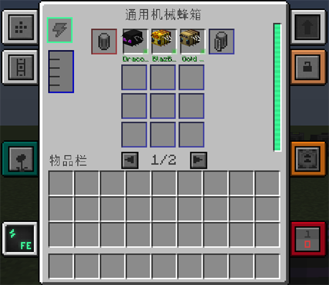
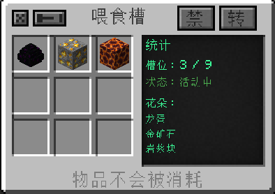

---
navigation:
  parent: machines/machines-index.md
  title: 机械蜂箱
  icon: "productivebeesgenesis:mek_apiary"
  position: 1
item_ids:
  - productivebeesgenesis:mek_apiary
  - productivebeesgenesis:basic_mek_apiary_factory
  - productivebeesgenesis:advanced_mek_apiary_factory
  - productivebeesgenesis:elite_mek_apiary_factory
  - productivebeesgenesis:ultimate_mek_apiary_factory
  - productivebeesgenesis:overclocked_mek_apiary_factory
  - productivebeesgenesis:quantum_mek_apiary_factory
  - productivebeesgenesis:dense_mek_apiary_factory
  - productivebeesgenesis:multiversal_mek_apiary_factory
  - productivebeesgenesis:creative_mek_apiary_factory
  - productivebeesgenesis:absolute_extra_mek_apiary_factory
  - productivebeesgenesis:supreme_extra_mek_apiary_factory
  - productivebeesgenesis:cosmic_extra_mek_apiary_factory
  - productivebeesgenesis:infinite_extra_mek_apiary_factory
  - productivebeesgenesis:absolute_overclocked_emextra_mek_apiary_factory
  - productivebeesgenesis:supreme_quantum_emextra_mek_apiary_factory
  - productivebeesgenesis:cosmic_dense_emextra_mek_apiary_factory
  - productivebeesgenesis:infinite_multiversal_emextra_mek_apiary_factory
---
# 机械蜂箱

<GameScene zoom="5" interactive={true} background="transparent" fullWidth={true}>
  <Block id="productivebeesgenesis:mek_apiary" x="0" y="0" z="0" p:facing="south" p:active="false" />
  <Block id="productivebeesgenesis:mek_apiary" x="2" y="0" z="0" p:facing="south" p:active="true" />
  <IsometricCamera yaw="0" pitch="25" />
</GameScene>

拖动场景可以检查机器其他面；初始视角朝向正面。机械蜂箱可以理解为"把蜜蜂和花朵放进机器里养"：不需要在世界里搭实体蜂巢，也不用等蜜蜂飞来飞去。

<RecipeFor id="productivebeesgenesis:mek_apiary" fallbackText="当前整合包替换或关闭了机械蜂箱配方，请在 JEI 中搜索机械蜂箱。" />

## 从放下到产出

1. 连接 FE，确认能量条有电。
2. 把蜜蜂或装有蜜蜂的笼子放进蜜蜂槽。
3. 打开**喂食槽**窗口，放入这只蜜蜂需要的花或花粉。需求可以在 JEI 或槽位提示中查看。
4. 等进度条走满，从输出区取走蜜脾和副产物。
5. 有流体产物时，从设置为流体输出的一面抽走。

## 等级与槽位

| 机器 | 蜜蜂槽 | 输出区 |
| --- | --- | --- |
| 机械蜂箱（基础） | 3（3×1） | 9 槽，单页 |
| 基础工厂 | 5 | 两页 |
| 高级工厂 | 10 | 两页 |
| 精英工厂 | 15 | 两页 |
| 终极工厂 | 20 | 两页 |
| 通用机械：扩展 绝对 / 至尊 / 寰宇 / 无限 | 26 / 30 / 36 / 42 | 两页 |
| 进化通用机械 超频 / 量子 / 致密 / 多元 / 创造 | 26 / 30 / 36 / 42 / 45 | 两页 |
| 进化通用机械：扩展 绝对超频 / 至尊量子 / 寰宇致密 / 无限多元 | 45 / 51 / 55 / 60 | 两页 |

**每个蜜蜂槽都是独立工位**：单独判断蜜蜂、花朵、配方、天气和行为条件，所以一只蜜蜂停工时其他槽照常产出。

<ItemGrid>
  <ItemIcon id="productivebeesgenesis:mek_apiary" />
  <ItemIcon id="productivebeesgenesis:basic_mek_apiary_factory" />
  <ItemIcon id="productivebeesgenesis:advanced_mek_apiary_factory" />
  <ItemIcon id="productivebeesgenesis:elite_mek_apiary_factory" />
  <ItemIcon id="productivebeesgenesis:ultimate_mek_apiary_factory" />
</ItemGrid>

<GameScene zoom="4" interactive={true} background="transparent" fullWidth={true}>
  <Block id="productivebeesgenesis:mek_apiary" x="0" y="0" z="0" p:facing="south" p:active="false" />
  <Block id="productivebeesgenesis:basic_mek_apiary_factory" x="1" y="0" z="0" p:facing="south" p:active="false" />
  <Block id="productivebeesgenesis:advanced_mek_apiary_factory" x="2" y="0" z="0" p:facing="south" p:active="false" />
  <Block id="productivebeesgenesis:elite_mek_apiary_factory" x="3" y="0" z="0" p:facing="south" p:active="false" />
  <Block id="productivebeesgenesis:ultimate_mek_apiary_factory" x="4" y="0" z="0" p:facing="south" p:active="false" />
  <IsometricCamera yaw="0" pitch="25" />
</GameScene>

每一级工厂都由前一级升级而来，并保留里面的蜜蜂与已装升级。不要只看机器速度：蜜脾堆得越快，后面的离心机、箱子和网络也要跟得上。

## 主界面

### 标签栏

左边贴着的是这台机器自己的入口，右边是通用入口：

- **侧面配置**（左上，方块/九宫格图标）：决定六个面各自进什么、出什么，详见[界面总览与公共操作](../gui.md)。
- **喂食槽**（深青绿色，花朵图标）：打开喂食槽窗口，见下文。
- **排序**（灰色，**仅工厂版**）：切换输出区自动排序。标签上直接显示 **开 / 关**。
- **PB 升级**（橙色）：打开本模组的 PB 升级窗口，见 [PB 升级窗口详解](../upgrades/pb-upgrades.md)。
- **MEK 升级**（向上箭头图标）：打开 Mekanism 自己的升级窗口，用来装**速度升级**（缩短每轮时间、提高耗电）、**能量升级**（扩大内部缓存）、**消音升级**（降低噪音）；装了通用机械：扩展后还会出现**创造升级**。
- **警告**（黄色叹号）：机器有问题时亮起，点开能看到具体缺什么。
- **红石控制 / 安全**：见[界面总览与公共操作](../gui.md)。
- **FE**：能量信息页。

> **PB 升级和 MEK 升级是两个不同的窗口**，装的是两套不同的物品，但可以同时装、效果叠加。分不清就悬停看标签名。

### 蜜蜂槽与蜂笼槽

- **蜂笼输入槽**（蜜蜂槽左侧，红色边框）：放空的或装有蜜蜂的蜂笼，用来把蜜蜂装进/取出机器。
- **蜜蜂槽**（中间一排或多排）：每格一只蜜蜂，放蜜蜂物品或蜂笼都可以。
- **蜂笼输出槽**（蜜蜂槽右侧，蓝色边框）：取走装好蜜蜂的蜂笼。
- 蜜蜂槽各自判断条件，**一只不干活不会拖累其他槽**。

### 蜜蜂的可视化与提示

- 槽位里会直接渲染蜜蜂模型，旁边有一盏**状态灯**：工作中和停工时颜色不同。
- **左键点一下蜜蜂槽 = 选中该槽**，选中的槽会有高亮边框，用于把操作只作用于这一只蜜蜂。
- **悬停蜜蜂槽**显示这只蜜蜂的详细信息：
  - 默认显示：名称、成年/幼年、生命值、进度（`进度：当前/总 tick（百分比）`）、状态、花蜜有无。
  - **按住 Shift** 追加：花朵需求、产量、耐力、性格、行为、天气耐受性。提示最后一行会写"按住 Shift 查看更多信息"。
- 蜂箱槽位较多时会切到**紧凑模式**：行高变小，槽位下方不再显示蜜蜂名字，只保留模型和状态灯。

### 输出区与翻页

- 输出区在蜜蜂区下方，是多行格子，用来堆蜜脾和副产物。
- 工厂版输出区分成**两页**，下方中间显示 **`◀ 1/2 ▶`**：
  - 点 `◀` / `▶` 翻页，按钮悬停分别显示"上一页输出""下一页输出"。
  - **翻页只改变你看到的那一页**，不会隐藏真实槽位：管道和 AE2 依然能看到并取走全部产物。
- 输出满了机器会**安全暂停**，进度不再前进，也不会悄悄吞掉输入。

### 能量条与流体罐

- 右侧竖条是能量条，左侧小罐是流体罐（蜂蜜等）。
- 想让流体出去，必须在侧面配置的**流体**页把对应面设成输出，再按需要打开**自动弹出**。

## 喂食槽窗口

点左侧的**喂食槽**标签打开。这个窗口决定"这台机器里所有蜜蜂能吃到什么花"。

### 标题栏上的按钮

从左到右依次是：

- **关闭**（窗口左上角的 ×）：关闭窗口，里面的物品不会丢。
- **图钉**（× 右侧的小图钉）：钉住窗口，主界面移动时不再跟随。
- **`◀` / `▶`**（灰色小按钮，悬停"上一页 / 下一页"）：翻页，**只有喂食槽总数超过 30 格时才出现**。
- **`转`**（灰底小按钮，**开启时字母变绿**；悬停"物品转化：开 / 关"）：开关"物品转化"。
- **`禁`**（灰底小按钮，**进入模式时字母变橙**；悬停"逐格禁用模式：开 / 关"）：切换逐格禁用编辑模式。

**`转` — 物品转化开关**（悬停原文）：

> 物品转化：开 —— 蜜蜂会把喂食槽内的可转化物品转化为产物并消耗它（如末影龙蜜蜂：黑曜石 → 哭泣的黑曜石）
>
> 物品转化：关（默认）—— 喂食槽内物品仅作花朵使用，不会被消耗；开启后蜜蜂才会执行物品/方块转化配方

默认是**关**：喂食槽里的东西只当"工作条件"，放进去就一直在，不会被吃掉。只有需要"用物品换产物"的蜜蜂（例如把黑曜石变成哭泣的黑曜石）才需要打开它。

**`禁` — 逐格禁用模式**（悬停原文）：

> **逐格禁用模式：开**
> 左键点击格子即停用/恢复该格物品对应的蜜蜂产出
> 此模式下左键不再拿取物品，再次点本按钮退出
> Shift + 点击本按钮：一次性全禁 / 全启
>
> **逐格禁用模式：关**
> 点击进入模式后，左键格子即停用/恢复该格
> 不进模式时按住 Alt + 左键同效；空格子无效
> Shift + 点击本按钮：一次性全禁 / 全启

要点：

- **不进模式时按住 Alt + 左键**点击格子，效果和"进入模式后左键点击"一样，是快捷方式。
- **Shift + 点击 `禁`** 是批量操作：只要还有生效格子就**全禁**，已经全禁则**全启**。
- 被禁用的格子会盖一层半透明深灰遮罩，悬停提示追加"该格已停用 / 此物品不参与蜜蜂产出（Alt + 左键恢复）"。
- 禁用只是让这一格不参与产出，**物品还留在里面**，随时可以恢复。
- 该模式是纯客户端的"点击解释开关"，不改服务端数据，退出再进不会残留。

### 槽位网格

- 左边是喂食槽网格。放进去的花或花粉就是蜜蜂的工作条件。
- **所有蜜蜂槽共用这一份喂食槽**，不需要每只蜜蜂旁边都放一朵花。
- 槽位数随蜂箱等级增加；**超过 30 格时分页**，每页固定 30 格：
  - 除了点 `◀` `▶`，**在窗口内滚动鼠标滚轮**也能翻页。
  - 翻页只改变显示，槽位索引不会错位，禁用状态跟着物品走。
- 左键拿取、右键分堆、鼠标滚轮等原版交互都不受影响（处于禁用编辑模式时除外）。

### 右侧统计面板

窗口右边那条深色面板是本机的喂食槽统计：

| 行 | 含义 |
| --- | --- |
| 统计 | 面板标题 |
| `槽位：已用 / 总数` | 放了多少格、一共多少格 |
| `状态：活动中` / `状态：空闲` | 至少有一格生效时显示"活动中"（绿色）；被禁用或全空时显示"空闲"（灰色） |
| `页 1/2` | 仅在需要翻页时出现 |
| `花朵：` | 下面列出已经放进来的花朵名称 |
| `花朵（禁 N）：` | 有格子被禁用时，标题附上被禁用的格数 |
| `+N 更多` | 花朵种类多于 6 种时，多出来的部分用这一行概括 |

### 底部提示

窗口最下面一行会随状态变化，是最直接的"我现在点下去会发生什么"：

- 默认：**物品不会被消耗**
- 打开转化后：**转化开启：原料会被消耗**
- 处于禁用编辑模式时：**点击格子切换禁用**（优先级最高）

## 蜂箱侧的 PB 升级

点右侧的 **PB 升级**标签打开。窗口结构、每个按钮的用法、以及**蜂箱与离心机支持哪些升级的对照表**，统一写在 [PB 升级窗口详解](../upgrades/pb-upgrades.md) 里。

蜂箱这一侧要记住三件事：

1. 蜂箱支持 **产量 α/β/γ/Ω、速度、速度+、基因采样器、蜜脾块、副产物销毁、精华转化**；
2. 蜂箱**不接受稳定性升级和粗矿熔炼升级**——这两个只对离心机生效，放进蜂箱会被拒绝；
3. 模拟升级是蜂箱**内置**的，不占槽位，在支持列表里显示为"模拟 ✓"。

## 直连离心机与产物去向

蜂箱有多种"产物去哪"的走法，全部由**侧面配置 → 物品页**里的那排小按钮控制（按钮外观与位置见[界面总览与公共操作](../gui.md)）：

| 设置 | 产物去哪 |
| --- | --- |
| 全部关闭 | 进本地输出区，等管道或你自己取 |
| 只开 `O` 产物直通相邻容器 | 直接写进设为"物品输出"的相邻容器，塞不下的回落输出槽 |
| 只开 `A` 输出到 AE | 送进 ME 网络 |
| 开 `A` + `M` 产物直入 AE | 新产物**跳过**本地输出槽，直接进网络 |
| 开 `D` 离心机特殊直连 | 产物直接塞进相邻离心机，不经输出槽 |
| 开 `P` 离心机优先 | 可处理的产物优先送离心机；离心机满时先暂存在蜂箱缓存里，超出上限才转给 AE |

推荐的最简自动化：**蜂箱贴着离心机放，打开 `P`（离心机优先）**。新蜜脾会先尝试直接进离心机，离心机满了也不会丢，会留在安全缓存里稍后重试。

场景示例（能量立方 → 蜂箱 → 离心机 → 木桶）：

<GameScene zoom="4" interactive={true} background="transparent" fullWidth={true} padding="5">
  <ImportStructure src="../assets/assemblies/first_line.snbt" />
  <IsometricCamera yaw="30" pitch="28" />
</GameScene>

## 停工时先看哪里

1. **没进度**：先看能量条是不是 0；再看蜜蜂槽悬停提示缺哪一项（花朵、天气、时间、花蜜）。
2. **有蜜蜂但不产**：打开喂食槽窗口，确认那一种花在格子里，而且**没有被禁用**（没有灰罩）。
3. **进度走到头不出货**：输出区或流体罐满了，机器会停下来等空间。
4. **只有部分蜜蜂不工作**：逐个悬停槽位看缺什么条件，不要先拆机器。
5. **升级装不上**：确认是不是装错了机器（稳定性、粗矿熔炼只认离心机），或者已经到上限。
6. **产物堆在输出区**：检查侧面配置的物品输出面与自动弹出，或者改用 `D` / `P` 直连。
