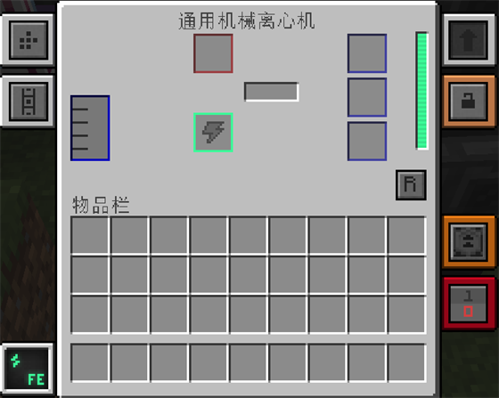
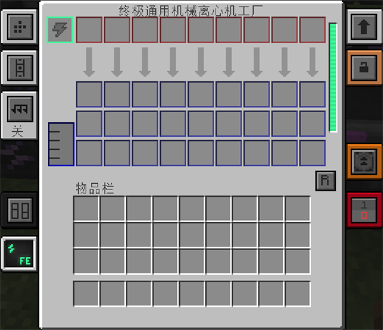
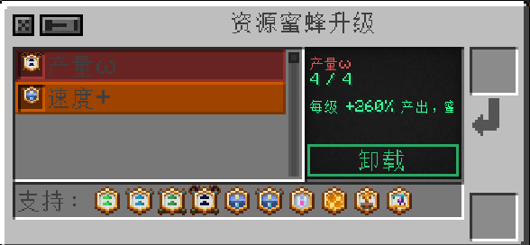

---
navigation:
  parent: machines/machines-index.md
  title: 通用机械离心机
  icon: "productivebeesgenesis:mek_centrifuge"
  position: 2
item_ids:
  - productivebeesgenesis:mek_centrifuge
  - productivebeesgenesis:basic_mek_centrifuge_factory
  - productivebeesgenesis:advanced_mek_centrifuge_factory
  - productivebeesgenesis:elite_mek_centrifuge_factory
  - productivebeesgenesis:ultimate_mek_centrifuge_factory
  - productivebeesgenesis:overclocked_mek_centrifuge_factory
  - productivebeesgenesis:quantum_mek_centrifuge_factory
  - productivebeesgenesis:dense_mek_centrifuge_factory
  - productivebeesgenesis:multiversal_mek_centrifuge_factory
  - productivebeesgenesis:creative_mek_centrifuge_factory
  - productivebeesgenesis:absolute_extra_mek_centrifuge_factory
  - productivebeesgenesis:supreme_extra_mek_centrifuge_factory
  - productivebeesgenesis:cosmic_extra_mek_centrifuge_factory
  - productivebeesgenesis:infinite_extra_mek_centrifuge_factory
  - productivebeesgenesis:absolute_overclocked_emextra_mek_centrifuge_factory
  - productivebeesgenesis:supreme_quantum_emextra_mek_centrifuge_factory
  - productivebeesgenesis:cosmic_dense_emextra_mek_centrifuge_factory
  - productivebeesgenesis:infinite_multiversal_emextra_mek_centrifuge_factory
---
# 通用机械离心机

<GameScene zoom="5" interactive={true} background="transparent" fullWidth={true}>
  <Block id="productivebeesgenesis:mek_centrifuge" x="0" y="0" z="0" p:facing="south" p:active="false" />
  <Block id="productivebeesgenesis:mek_centrifuge" x="2" y="0" z="0" p:facing="south" p:active="true" />
  <IsometricCamera yaw="0" pitch="25" />
</GameScene>

拖动场景可以检查机器其他面；初始视角朝向正面。离心机就是"蜜脾拆解机"：它读取蜜脾记住的蜜蜂类型，然后按 Productive Bees 的配方产出矿物、材料和蜂蜜等流体。

<RecipeFor id="productivebeesgenesis:mek_centrifuge" fallbackText="当前整合包替换或关闭了离心机配方，请在 JEI 中搜索通用机械离心机。" />

## 第一次使用

1. 接入 FE，并把接电的那一面设成能量输入。
2. 放入带有正确蜜蜂类型的蜜脾或蜜脾块。
3. 等待进度完成，从物品输出槽和流体罐取走产物。
4. 若要自动输出流体，请在侧面配置中打开**自动弹出**；只设置"输出面"还不会自动推送。

## 并行数与等级

普通离心机一次处理 1 份；工厂版按等级并行：

| 工厂等级 | 并行份数 |
| --- | --- |
| 基础 | 3 |
| 高级 | 5 |
| 精英 | 7 |
| 终极 | 9 |
| 通用机械：扩展 绝对 / 至尊 / 寰宇 / 无限 | 11 / 13 / 15 / 17 |
| 进化通用机械 超频 / 量子 / 致密 / 多元 / 创造 | 11 / 13 / 15 / 17 / 19 |
| 进化通用机械：扩展 绝对超频 / 至尊量子 / 寰宇致密 / 无限多元 | 12 / 14 / 16 / 18 |

机器会**先确认所有产物都有地方放才完成配方**，所以箱子满时会安全暂停，而不是把产物丢掉。

<ItemGrid>
  <ItemIcon id="productivebeesgenesis:mek_centrifuge" />
  <ItemIcon id="productivebeesgenesis:basic_mek_centrifuge_factory" />
  <ItemIcon id="productivebeesgenesis:advanced_mek_centrifuge_factory" />
  <ItemIcon id="productivebeesgenesis:elite_mek_centrifuge_factory" />
  <ItemIcon id="productivebeesgenesis:ultimate_mek_centrifuge_factory" />
</ItemGrid>

<GameScene zoom="4" interactive={true} background="transparent" fullWidth={true}>
  <Block id="productivebeesgenesis:mek_centrifuge" x="0" y="0" z="0" p:facing="south" p:active="false" />
  <Block id="productivebeesgenesis:basic_mek_centrifuge_factory" x="1" y="0" z="0" p:facing="south" p:active="false" />
  <Block id="productivebeesgenesis:advanced_mek_centrifuge_factory" x="2" y="0" z="0" p:facing="south" p:active="false" />
  <Block id="productivebeesgenesis:elite_mek_centrifuge_factory" x="3" y="0" z="0" p:facing="south" p:active="false" />
  <Block id="productivebeesgenesis:ultimate_mek_centrifuge_factory" x="4" y="0" z="0" p:facing="south" p:active="false" />
  <IsometricCamera yaw="0" pitch="25" />
</GameScene>

## 主界面

### 槽位与显示区

- **输入槽**（红色边框，左上方）：放蜜脾或蜜脾块。机器读取蜜脾里的蜜蜂类型，自动套用对应配方。
- **主输出槽 + 两个副输出槽**（蓝色边框，右侧竖排三个）：拆出来的矿物、锭等落在这里。
- **流体罐**（左下方的小罐）：有些配方会产出蜂蜜等液体，存这里，用管道或桶抽走。
- **进度条**（输入槽与输出槽之间）：显示本轮进度，悬停可以看到缺什么。
- **能量条**：右侧竖条，和其他机器一致。

### 标签栏

- **侧面配置**（左上）：六个面的输入输出设置，详见[界面总览与公共操作](../gui.md)。
- **多流体槽**（灰色，**仅离心机工厂且开启了多流体模式时出现**）：打开多流体槽窗口，见本页下文。
- **排序**（灰色，仅工厂版）：切换输出槽自动排序，标签上显示 **开 / 关**。
- **PB 升级**（橙色）：打开本模组的 PB 升级窗口，见[PB 升级窗口详解](../upgrades/pb-upgrades.md)。
- **MEK 升级**（向上箭头）：Mekanism 自己的升级窗口——**速度升级、能量升级、消音升级**，装了通用机械：扩展后还会出现**堆叠升级**（`2^N` 倍并行）和**创造升级**。
- **警告 / 红石控制 / 安全 / FE**：见[界面总览与公共操作](../gui.md)。

### 界面上的专属按钮

- **PB 配方**（进度条本身）：装了 JEI 时直接跳到当前蜜脾的离心配方页，看它能出什么。
- **`R` 输入返还**（输出槽下方靠右，14×14 灰色方块，悬停变绿；悬停提示"返还输入槽中的物品"）：把输入槽里还没处理的物品退回去。
- **`F` 兼容电力熔炼炉配方**（侧面配置窗口左列第 3 格；悬停"兼容电力熔炼炉配方：开 / 关"）：让这台离心机顺手处理可熔炼输入，例如粗矿直接变锭。
- **`A` AE2 输出**（侧面配置窗口左上；悬停"输出到 AE"）：开关向 ME 网络推送物品 / 流体。
- **`I` AE2 输入配置**（侧面配置窗口左列第 2 格）：打开 [AE2 输入窗口](../upgrades/ae2-input.md)，让离心机主动从网络拿料。
- **`A` 新产物直入 AE**（侧面配置窗口左列第 4 格；悬停"新产物直入 AE：开 / 关"）：新产物跳过本地缓存直接进网络，被拒收的部分回落本地输出。
- **`O` 产物直通相邻容器**（侧面配置窗口左列第 5 格；悬停"产物直通 MEK 物品输出面：开 / 关"）：新产物先模拟，再写进设为"物品输出"的相邻容器；塞不下的回落输出槽。

#### `R` 输入返还按钮的几种结果

点下 `R` 之后会按当前连接情况给出不同反馈，提示在聊天栏或屏幕上：

- **输入槽是空的** —— 离心机输入槽中没有待返还物品。
- **接着 AE2 且网络能收** —— 已返还 N 个物品到 AE2，M 个等待重试；输入槽剩余 K 个。
- **接着 AE2 但网络不收** —— AE2 网络在线，但当前没有空间或不接受这些物品；输入物品保持不变。
- **没接 AE2、设了物品输出面且旁边有容器** —— 已按 Mekanism 物品输出方向向相邻容器发送 N 个物品，输入槽剩余 K 个。
- **没接 AE2、也没设物品输出面** —— 未配置 Mekanism 物品输出方向；输入物品保持不变。
- **没接 AE2、输出面旁边没容器** —— 配置的物品输出方向没有可接收物品的相邻容器。
- **没接 AE2、旁边容器满了** —— 相邻容器已满或不接受这些物品，输入物品保持不变。

### 工厂版长什么样

工厂版把一整排并行槽位塞进同一台机器：

- **每个进程一组槽**：1 个红色输入槽 + 3 个蓝色输出槽（主输出 + 两个副输出），同一台机器里并排好几组。
- **每个进程上方各有一条进度条**，互不干扰；某一路堵住不会拖住其他路。
- **共享一个流体罐**，位置在输出槽旁边或物品栏附近，按等级不同。
- 工厂版还有**排序**标签，`R` 按钮也会移到输出区下方与物品栏之间的空白带，右对齐摆放。
- 等级越高并行越多，**供电和输出端也要跟上**，否则容易堆料。

## 多流体槽窗口

只有当离心机工作在**多流体模式**时，左侧才会出现**多流体槽**标签（灰色方块图标）。

点开后是一个**单行横排**的小窗口，每个格子是一种流体的储罐：

- 每个 gauge 显示该流体的**存量与容量**，悬停可看具体数值。
- **主槽不在这个窗口里**：窗口只显示除主罐以外的其余分槽（跳过索引 0），主罐在主界面上。
- 机器运行时如果动态分配了新的流体槽，窗口会**自动多出一个格子**，不需要重开。
- 窗口有关闭按钮和**图钉**；位置会记住，跑出屏幕时按[界面总览与公共操作](../gui.md)里的方法重置。

**为什么会堵**：不同蜜蜂可能产出不同流体。多流体模式会为新流体单独分配槽位，避免混装；但**所有可用槽位都满之后，新流体仍然进不来**，机器会停下来。这时打开多流体槽窗口，找出占满的那一格并抽走流体，而不是继续往里塞蜜脾。

## 关于蜜脾类型

万象创世蜜脾和 PB 的可配置蜜脾都靠内部的"蜜蜂类型"信息找配方。正常生产和机器搬运会保留它；如果命令、脚本或其他模组生成了一个没有类型信息的空白蜜脾，离心机就不知道该按哪只蜜蜂处理。

## 离心机侧的 PB 升级

点右侧的 **PB 升级**标签打开。窗口结构、每个按钮的用法，以及**蜂箱与离心机支持哪些升级的对照表**，统一写在 [PB 升级窗口详解](../upgrades/pb-upgrades.md) 里。

离心机这一侧要记住三件事：

1. 离心机支持 **产量 α/β/γ/Ω、速度、速度+、稳定性、副产物销毁、精华转化、粗矿熔炼**；
2. **稳定性升级只有离心机能用**（每级提高非保底产物的命中率），蜂箱会拒绝它；
3. 离心机**不支持基因采样器和蜜脾块升级**，这两个是蜂箱专用。

## AE2 输入：让离心机自己拿料

离心机是整套流程里唯一能**主动从 ME 网络取料**的机器。入口在侧面配置窗口左列第 2 格的 `I` 按钮。

完整说明（窗口布局、逐个按钮、数量与保留量、标签表达式、按键表、注意事项）单独写成一页：[AE2 输入窗口详解](../upgrades/ae2-input.md)。

最短上手路径：

1. 确认 ME 网络有电、有空闲频道、有存储空间。
2. 先只放一种蜜脾到过滤格子里。
3. **每次拉取量设小**（例如 1~4 个），避免瞬间灌满输入槽。
4. 设置**网络保留量**，别把网络里最后一份应急库存也抽走。
5. 观察几轮，稳定后再加条目。

## 停工时先看哪里

1. **没进度**：能量是否为 0；输入是不是有效蜜脾（不是蜂蜜瓶）；红石控制是否被设成需要信号。
2. **进度走完不出货**：输出槽或流体罐满了。工厂版要看**每一个进程**的槽位。
3. **只有某一路不动**：该进程的输入槽空了，或者它的输出槽满了，其余路照常工作。
4. **流体排不出去**：侧面配置的流体页没设输出，或者没打开自动弹出；多流体模式还要看对应分槽是不是满了。
5. **粗矿没变成锭**：`F` 熔炼兼容没开、没装粗矿熔炼升级，或者服务器总开关没开。
6. **AE2 拿料不生效**：`I` 窗口里的拉取开关没开、条目没配、过滤模式是禁用、或者网络里根本没有这种蜜脾。
