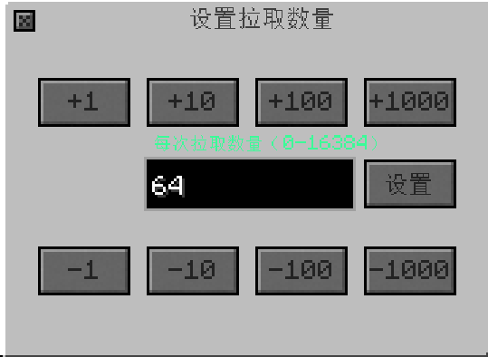
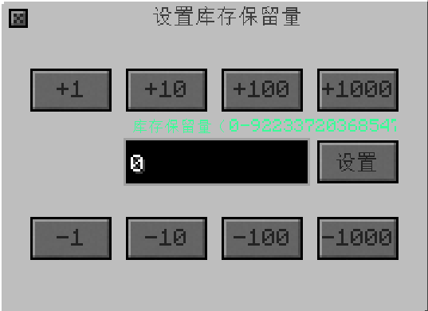
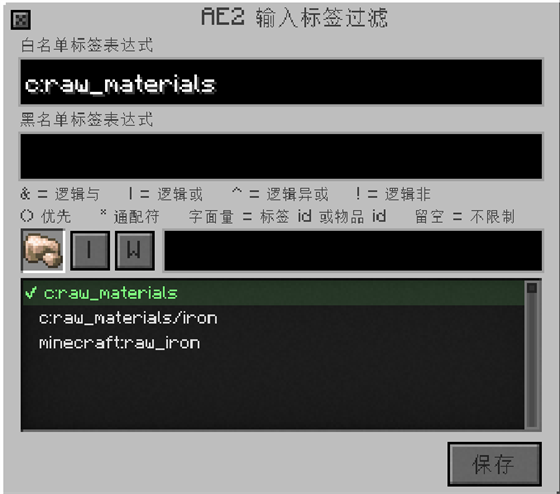

---
navigation:
  parent: upgrades/upgrades-index.md
  title: AE2 输入窗口详解
  icon: "ae2:interface"
  position: 3
item_ids:
  - ae2:interface
  - ae2:pattern_provider
  - ae2:item_storage_cell_1k
---
# AE2 输入窗口详解

**AE2 输入窗口**让通用机械离心机**主动从 ME 网络里拿料**。它是整套自动化里按钮最多的一个窗口，所以单独占一页。

> 前置条件：装了 AE2；机器接着一台**有电、有空闲频道、有存储空间**的 ME 网络；并且服务器配置里**全局 AE2 输入拉取**已开启。

## 怎么打开

1. 打开离心机的主界面。
2. 点左侧标签栏最上方的**侧面配置**。
3. 切到**物品**页（这个按钮只在物品页出现）。
4. 点左列第 2 格的 **`I`** 按钮（悬停显示"AE2 输入配置"）。

窗口会作为浮层盖在机器界面上弹出，标题写着 **"AE2 输入拉取配置"**。

**关闭方式**：点左上角的 **×**；或者按 **Esc**——按 Esc 会关掉最上层的窗口，但**被图钉钉住的窗口 Esc 关不掉**，要先点掉图钉。

## 窗口布局

窗口从上到下分成四块：**标题栏**（关闭按钮、图钉、可拖动的标题）、一整行**控制行**（左侧七个功能按钮，右侧翻页与清空）、中间的**过滤格**、右侧一条窄的**状态面板**。

窗口固定 260×200，一共 **2 组、每组 9 格 = 每页 18 格**。每格从下往上依次是：

- **齿轮**（16×16）：这一格的拉取数量与库存策略。
- **标记格**（18×18）：你要拉取的物品"样板"，不消耗真实物品。
- **网络输出格**（18×18）：直接操作 ME 网络里这种物品的库存。

## 控制行：左边的七个按钮

控制行上的按钮都是**灰色底 + 单字符**，点一下发一次请求到服务端。

### `I` — 拉取总开关

- 按钮上的字会在 **`入:开`** 和 **`入:关`** 之间切换。
- 悬停提示：**拉取切换：启用/禁用 AE2 输入拉取**
- 关掉之后，无论名单里配了什么，离心机都不会再从网络拿料。

### `N` — NBT 忽略

- 按钮上的字会在 **`N:开`** 和 **`N:关`** 之间切换。
- 悬停提示：**NBT 忽略：忽略/匹配物品 NBT 数据**
- **`N:关`（匹配）**：把 NBT 不同的物品当成不同条目。可配置蜜脾的蜜蜂类型就存在数据里，所以处理资源蜜蜂时**建议保持匹配**。
- **`N:开`（忽略）**：只看物品本体，不看数据。只有在你确定数据不影响配方时才用。

### `F` — 过滤模式

- 按钮上的字在 **`滤:关` / `滤:白` / `滤:黑`** 之间循环。
- 悬停提示：**过滤模式：循环切换白名单/黑名单/禁用**

| 模式 | 显示 | 含义 |
| --- | --- | --- |
| 禁用 | `滤:关` | 不看名单，所有符合条件的候选都可以被拉取 |
| 白名单 | `滤:白` | **只**拉取名单上的条目 |
| 黑名单 | `滤:黑` | 名单上的条目**不**拉取，其余照常 |

> **空白名单的陷阱**：白名单模式下名单为空 = **什么都拉不到**；黑名单模式下名单为空 = **什么都拉**。配不出效果时先看这里。

### `P` — 精确模式

- 按钮上的字在 **`精:开` / `精:关`** 之间切换。
- 悬停提示：**精确模式：开时区分蜜脾与蜜脾块（仅拉取标记物品）；关时共享过滤（蜜脾/蜜脾块一起拉取）**
- **`精:开`**：蜜脾和蜜脾块分开算，只拉你标记的那种形态。
- **`精:关`**：蜜脾与蜜脾块**共用一份配额**，按蜜蜂类型分组匹配，标了蜜脾也会一起拉蜜脾块。

> 注意：**逐格齿轮、库存保留、无限拉取、下方网络输出行只对"精确指纹条目"渲染。** 如果你只看到了灰色的空格子而没有齿轮，说明这一格没有成功的指纹条目——重新拖一次物品即可。

### `⚙` — 全局齿轮

- 悬停提示：**点击：设置全部直连条目的每次拉取数量 / Shift+点击：切换过滤后所有蜜脾的全量无限拉取**
- **左键**：打开"设置全部拉取数量"窗口，一次改掉所有条目。
- **Shift + 左键**：切换 **全量无限**（面板上"全量无限"那一行会变绿显示"开"）。
- 图标平时是暗色齿轮，鼠标悬停或该功能开启时变亮；开启全量无限时齿轮上会出现绿色的 **∞**。
- 这个按钮**不需要先放标记物品**就能点。

### `库存` — 全局库存模式

- 悬停提示：**左键：设置默认保留量 / 右键：切换全局库存模式 / 绿色=开启，灰色=关闭；直连条目可单独覆盖**
- **左键**：打开"设置库存保留量"窗口，改全局默认保留量。
- **右键**：开关**全局库存模式**。按钮底部的小横条**绿色 = 开启，灰色 = 关闭**。
- 开启后，所有没有单独设置保留量的条目都会**沿用这个全局保留量**。

### `T` — 标签过滤

- 悬停提示：**标签过滤：按标签表达式筛选 AE2 输入候选；F 模式只控制已标记物品的白/黑名单。支持 `&|^!()` 与 `*` 通配，可直接写物品 id**
- 左键打开标签表达式窗口，见本页下文。

## 控制行：右边的翻页与清空

- **`◀` 上一页**：上一页过滤格。翻页是**循环**的，第一页再往前会跳到最后一页。
- **`C` 清空所有过滤条目**：一次清空全部条目、无限标记与保留量，并把视图退回第 1 页。**没有二次确认，慎点**。
- **`▶` 下一页**：下一页过滤格。

> 格子采用**位置固定**模式：第 N 页第 M 格永远对应同一个索引。翻页**不会**把条目重新排序，所以你可以把不同种类故意摆在固定位置。

## 每一格怎么用

### 标记格（中间那行）

| 操作 | 效果 |
| --- | --- |
| 鼠标带着物品时**左键**点击空格 | 把该物品标记进这一格 |
| 鼠标带着物品时**右键**点击空格 | 同上（左右键都能标记） |
| **空手左键或右键**点击已填充的格子 | 移除这一格的条目 |
| 从 **JEI** 把物品**拖进来** | 标记进鼠标所在的那一格 |
| 悬停 | 显示这一格的物品名称 |

**能标记什么**：蜜脾类物品（含可配置蜜脾、蜜脾块）；此外，**客户端存在 Mekanism 熔炼配方**的普通物品也可以标记（配合熔炼兼容使用）。

**灰色的格子是什么意思**：如果这一格的物品**这台离心机没有配方**（例如某种要用别的模组机器处理的蜜脾，像化学氧化机、分解机、电解机的那类），格子图标上会盖一层**半透明深灰罩**，悬停时物品名下面追加一段红字：

> **§c本离心机没有它的配方§r**
> 这种蜜脾要用别的模组的机器处理（化学氧化机、分解机、电解机等）。
> 本机会主动跳过它，所以这条配置不会生效 —— 拉进来只会白耗性能。

看到这段提示说明**你的配置没错，是这台机器处理不了**——换一台机器或者换个条目，不要反复调参数。

### 齿轮（上面那行）

齿轮只在条目是**精确指纹条目**时出现。悬停提示（原文）：

> **实际库存模式：开/关**
> **无限拉取：开/关**
> **左键：设置每次拉取数量**
> **右键：切换该项模式**
> **Shift+左键：切换无限拉取**
> **Shift+右键：设置该项保留量**
> **拉取:X 库存:Y 保留:Z**

| 点击方式 | 作用 |
| --- | --- |
| **左键** | 打开这一条的"设置拉取数量"窗口 |
| **右键** | 切换这一条的**库存模式**（是否受保留量限制） |
| **Shift + 左键** | 切换这一条的**无限拉取** |
| **Shift + 右键** | 打开这一条的"设置库存保留量"窗口 |

齿轮的外观会跟着状态变：

- 平时是**暗色齿轮**，鼠标悬停或该条目开了库存模式/无限拉取时变成**亮色齿轮**。
- 开启**无限拉取**时，齿轮右下角叠一个**绿色的 ∞**。
- 开启**库存模式**时，齿轮下方出现一条**黄色小横条**。

### 网络输出格（下面那行）

这一格直接代理 ME 网络里这种物品的库存，悬停提示（原文）：

> **网络输出：X**
> **左键：取出到光标/放入全部**
> **右键：取出半数/放入 1 个**
> **Shift+左键：取出到背包**

数量会以紧凑格式（K/M/G/T）画在格子上。用这一行可以直接从网络里"借"东西出来做测试，也可以把多余的东西塞回网络。

> 窗口打开时，如果配置里存在精确条目，客户端会**每 20 刻（约 1 秒）**向服务端请求一次最新库存，用来刷新这一行的数字。网络特别大时这部分有少量开销。

## 右侧信息面板

右边那条深色面板把一个一个状态列出来，从上到下依次是：

| 行 | 取值 | 含义 |
| --- | --- | --- |
| 模式 | 禁用 / 白名单 / 黑名单 | 当前过滤模式 |
| 输入：开 / 输入：关 | — | 拉取总开关状态 |
| NBT：忽略 / NBT：匹配 | — | NBT 是否参与匹配 |
| 精确：开 / 精确：关 | — | 精确模式状态 |
| 页 1/2 | — | 当前页 / 总页数（总页数受服务器配置的最小页数影响） |
| 条目 N | — | 当前有效条目数量 |
| 速率: N/刻 | — | 服务器配置的单刻拉取速率 |
| 间隔: N刻 | — | 服务器配置的拉取间隔 |
| 冷却: N刻 | — | **当前自适应冷却**，见下 |
| 无限: N | — | 开了无限拉取的条目数 |
| 全量无限: 开 / 关 | 开启时**绿色** | 全局齿轮切换的那一项 |
| 全局库存：开/关，保留：N | 开启时**绿色** | 全局库存模式与全局保留量 |
| 标签过滤：开 / 关 | 开启时**绿色**，**表达式写错时红色** | 标签表达式是否生效 |

### "冷却"为什么会变

拉取采用的是**自适应冷却**，不是每刻都硬拉：

- 拉到东西了：非无限条目冷却回到 **5 刻**，无限条目只要 **1 刻**。
- 这一轮**没拉满配额**（网络补货慢）：冷却退到 **10 刻**，减少无用的扫描。
- 什么都没拉到：无限模式逐次 **+1 刻**，最多退到 **40 刻**；普通模式保持在 **5 刻**以上。

所以"冷却: 40刻"通常表示**网络里没有可拉的东西**，不是机器坏了。先查网络里到底有没有那种蜜脾、保留量是不是压得太高。

## 拉取数量与库存保留

### 设置拉取数量（`⚙` 左键 / 齿轮左键）

窗口标题是 **设置拉取数量**（点全局齿轮时是 **设置全部拉取数量**），副标题写明合法范围 **每次拉取数量（0-N）**。

| 元素 | 操作 |
| --- | --- |
| 8 个阶梯按钮 | 上面一排 `+1 +10 +100 +1000`，下面一排 `-1 -10 -100 -1000` |
| **按住 Shift 或 Ctrl** | 阶梯切换成 `+1 +16 +32 +64` / `-1 -16 -32 -64`（二进制步进，适合大数值） |
| 输入框 | 可以直接键入数字，也支持**表达式**：`+ - * / ^ ( ) .` 与空格 |
| 输入框内滚轮 | 每格 ±1 |
| 左侧物品图标 | 显示这条对应的物品（全局模式不显示） |
| **设置** 按钮 / 回车 | 应用并关闭窗口 |

**输入非法时**输入框文字会**变红**，把鼠标停上去能看到原因：

- 数量表达式无效
- 数量必须是整数
- 数量不能小于 0
- 数量不能超过 N

数量范围是 **0 ~ 服务器上限**。`0` 表示这一条不拉（但条目还在）。

### 设置库存保留量（`库存` 左键 / Shift+右键齿轮）

窗口标题是 **设置库存保留量**（全局时为 **设置全部库存保留量**），副标题是 **库存保留量（0-N）**。

**保留量的意思**：网络里这种物品**至少留下多少个**，离心机不会把网络抽干。实际可拉取量 = 网络存量 − 保留量。

- 保留量设成 64、网络里有 100 个 → 最多只能拉 36 个。
- 保留量设成 64、网络里只有 30 个 → **一个都拉不到**。
- 所以"机器不拿料"的常见原因之一就是：**保留量比网络存量还高**。

建议至少保留几份，别把最后一份应急库存或合成模板也抽走。

## 标签表达式窗口（`T`）

标题 **AE2 输入标签过滤**。它用来给**所有输入候选**再加一道基于标签/物品 id 的筛子，跟前面的白/黑名单是**叠加**关系。

### 窗口内容

- **白名单标签表达式 / 黑名单标签表达式**：两行输入框。哪一行生效、以什么身份生效，看右边的"目标"开关。
- **图例**：`&` 逻辑与、`|` 逻辑或、`^` 逻辑异或、`!` 逻辑非；`()` 优先、`*` 通配符；字面量可写标签 id 或物品 id；**留空 = 不限制**。
- **标签样品槽**：从背包 / JEI 拿物品点进去，或**空手点击**取主手物品；再次空手点击清空。
- **搜索框**：输入子串即时过滤下方标签列表（**只影响显示，不改表达式**）。
- **标签列表**：显示样品槽物品身上的标签。**单击一行 = 在当前目标侧加入 / 移出**；**滚轮 = 滚动列表**。
- **目标切换**：`目标：白名单表达式` ↔ `目标：黑名单表达式`，单击切换。
- **连接方式切换**：`匹配任意标签（用 | 连接）` ↔ `匹配所有标签（用 & 连接）`，单击切换。
- **保存**：写入并生效。

- 样品槽没放东西时列表提示"在槽内放入物品以列出其标签"；物品没有标签时提示"该物品没有任何标签"；搜索没命中时提示"没有匹配的标签"。

### 表达式语法

- `&` 同时满足、`|` 满足任意一个、`^` 异或、`!` 排除。
- `()` 控制先后顺序，`*` 匹配任意一段名称。
- 可以直接写**物品 id**（如 `minecraft:iron_ore`）或**标签 id**（如 `#c:ores`）。
- 例子：`#c:ores & !#c:ores/iron` = "是矿石标签，但不是铁矿石"。
- **表达式留空 = 不限制**。

### 写错会怎样

表达式出错时**只会让该侧失效**，其他条目照常工作；面板上"标签过滤"那一行会**变红**。可能的错误提示：

| 提示 | 含义 |
| --- | --- |
| 表达式过长 | 上限 512 字符 |
| 表达式过于复杂 | 节点上限 64 |
| 括号嵌套过深 | 上限 16 层 |
| 括号未闭合 | 少了一个 `)` |
| 表达式意外结束 | 运算符后面没有内容 |
| 存在无法识别的符号 | 有非法字符 |
| 标签/物品 id 不合法 | id 格式不对，或通配符用得过多 |

> **`F` 过滤模式只管"已标记物品"的白/黑名单；`T` 标签表达式约束的是"全部输入候选"。** 两者作用范围不同，不要混为一谈。

## 完整操作速查

| 位置 | 操作 | 效果 |
| --- | --- | --- |
| 任意位置 | **Esc** | 关闭最上层窗口（被钉住的窗口无效） |
| 标题栏 | 拖动 | 移动窗口，位置会被记住 |
| 标题栏图钉 | 左键 | 钉住 / 取消钉住 |
| 控制行 `I` | 左键 | 拉取总开关 |
| 控制行 `N` | 左键 | NBT 忽略 / 匹配 |
| 控制行 `F` | 左键 | 过滤模式循环 |
| 控制行 `P` | 左键 | 精确模式开关 |
| 控制行 `⚙` | 左键 / Shift+左键 | 设置全部拉取数量 / 切换全量无限 |
| 控制行 `库存` | 左键 / 右键 | 设置全局保留量 / 切换全局库存模式 |
| 控制行 `T` | 左键 | 打开标签表达式窗口 |
| 控制行 `◀` `C` `▶` | 左键 | 上一页 / 清空全部 / 下一页 |
| 标记格 | 带物品左键或右键 | 标记条目 |
| 标记格 | 空手左键或右键 | 移除条目 |
| 标记格 | JEI 拖拽 | 标记条目 |
| 齿轮 | 左键 | 设置该条每次拉取数量 |
| 齿轮 | 右键 | 切换该条库存模式 |
| 齿轮 | Shift+左键 | 切换该条无限拉取 |
| 齿轮 | Shift+右键 | 设置该条保留量 |
| 网络输出格 | 左键 / 右键 / Shift+左键 | 取出到光标（放入全部）/ 取半数（放 1 个）/ 取出到背包 |
| 数量窗口 | 阶梯按钮 / Shift+阶梯 / 滚轮 / 回车 | 加减数量（Shift 或 Ctrl 换成 16/32/64 步进）/ ±1 / 应用 |

## 注意事项与常见问题

### 按钮根本找不到

| 现象 | 原因 |
| --- | --- |
| 侧面配置里没有 `I` 按钮 | 没装 AE2（按钮不会被创建），或者当前不在**物品**页 |
| `I` 按钮是灰的，悬停写着"需在配置中启用全局 AE2 输入拉取才能使用此功能" | 服务器配置里总开关没开 |
| 侧边配置窗口里连 `A` 输出按钮都没有 | 同样是没有 AE2 |

### 配好了却不拉料

按这个顺序查：

1. **`I` 是不是 `入:关`** —— 总开关没开。
2. **网络里到底有没有这种蜜脾** —— 打开网络终端看一眼。
3. **保留量是不是高于网络存量** —— 这是最隐蔽的一条，见上文。
4. **过滤模式与名单** —— 白名单为空、或者黑名单把你要的东西挡住了。
5. **`P` 精确模式与标记形态** —— 你标的是蜜脾块却只产出蜜脾（或反过来）。
6. **格子是不是灰的** —— 这台机器没有该蜜脾的配方，机器会主动跳过。
7. **冷却是不是停在 40 刻** —— 表示最近一直没拉到东西，先解决上面几条。

### 拉太多把机器灌爆

- 把**每次拉取量调小**（新手建议 1~4），或者干脆用默认。
- **无限拉取**会尽量把机器补满，**大型网络慎用**；`Shift+左键` 的"全量无限"更激进。
- 网络开始卡顿时，优先**降低拉取量**或**延长拉取间隔**，最后才考虑加并行。

### 网络侧的注意事项

- 机器要接在**有电、有空闲频道、有存储空间**的网络上；网络掉线时机器会安全暂停并保留内容。
- 机器会往网络**推送产物**，所以输出端也要留空间，否则产物回落本地输出槽并可能堵住。
- 可配置蜜脾的蜜蜂类型会决定配方，**通常不要开 `N:开`（忽略 NBT）**。

### 窗口不见了

改分辨率或 GUI 缩放后窗口可能跑到屏幕外：模组配置 → **客户端设置 → 自定义窗口位置** → 重置 `window_ae_input`。详见[界面总览与公共操作](../gui.md)。

## 相关页面

- 离心机主界面与 `I` 按钮的位置：[通用机械离心机](../machines/centrifuge.md)
- 黑名单 / 白名单的基本概念与万象创世过滤：[过滤器](../filter.md)
- 一次性配好建议与 AE2 起步：[升级与自动化详解](automation.md)
- 速率、间隔、最小页数等服务器参数：[配置](../configuration.md)
