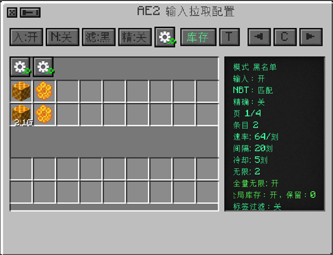

---
navigation:
  parent: upgrades/upgrades-index.md
  title: 升级与自动化详解
  icon: "productivebeesgenesis:essence_conversion_upgrade"
  position: 1
item_ids:
  - productivebeesgenesis:raw_ore_smelting_upgrade
  - productivebeesgenesis:essence_conversion_upgrade
  - productivebeesgenesis:byproduct_destruction_upgrade
  - productivebeesgenesis:gene_type_only_upgrade
  - productivebeesgenesis:gene_full_purity_upgrade
---
# 升级与自动化详解

## PB 升级怎么选

<ItemGrid>
  <ItemIcon id="productivelib:upgrade_productivity" />
  <ItemIcon id="productivelib:upgrade_time" />
  <ItemIcon id="productivelib:upgrade_gene_sampler" />
  <ItemIcon id="productivelib:upgrade_block" />
  <ItemIcon id="productivelib:upgrade_stability" />
</ItemGrid>

- **生产力**：提高每轮产量。先确认输出槽、箱子和流体罐装得下。
- **时间**：缩短一轮等待时间，同时会让耗电和物流压力更集中。
- **基因采样**：蜂箱专用，按 PB 规则获取基因样本。
- **蜜脾块**：蜂箱专用，尽量输出块状蜜脾，适合高产线省槽位。
- **稳定性**：离心机专用，提高非必得副产物的命中率。

“基础”平衡模式会限制同类不同等级混装；“悖论无限”允许更自由的组合；“自定义”由整合包作者决定。切换模式不会删掉已装升级，但可能阻止继续装入不合规则的新升级。

## 本模组的五个功能升级

### 粗矿熔炼

<ItemImage id="productivebeesgenesis:raw_ore_smelting_upgrade" scale="2" />

让离心机把资源蜜蜂产出的粗矿继续处理成金属锭。它只处理能找到可靠熔炼结果、而且产物确实属于金属锭的内容，不会随便把所有物品丢进熔炉逻辑。

<RecipeFor id="productivebeesgenesis:raw_ore_smelting_upgrade" fallbackText="当前整合包替换或关闭了粗矿熔炼升级配方，请在 JEI 中搜索。" />

### 精华转化

<ItemImage id="productivebeesgenesis:essence_conversion_upgrade" scale="2" />

把能通过明确、单一材料配方合成的低级产物自动压缩成更方便存放的形态。混合材料配方、普通存储块和不明确的配方会跳过，避免误吃珍贵材料。

<RecipeFor id="productivebeesgenesis:essence_conversion_upgrade" fallbackText="当前整合包替换或关闭了精华转化升级配方，请在 JEI 中搜索。" />

### 副产物销毁

<ItemImage id="productivebeesgenesis:byproduct_destruction_upgrade" scale="2" />

适合已经不需要蜂蜜或蜜蜡的后期生产线。蜂箱中会清理指定蜂蜜类副产物；离心机中会清理 PB 蜂蜜流体和蜜蜡，其他主要产物继续保留。安装前先确认这些副产物真的没有用途。

<RecipeFor id="productivebeesgenesis:byproduct_destruction_upgrade" fallbackText="当前整合包替换或关闭了副产物销毁升级配方，请在 JEI 中搜索。" />

### 基因种类筛选

<ItemImage id="productivebeesgenesis:gene_type_only_upgrade" scale="2" />

与基因采样器配合时，只产出蜜蜂种类（TYPE）基因。每台蜂箱最多安装一个；没有基因采样器时不会单独产出基因。

<RecipeFor id="productivebeesgenesis:gene_type_only_upgrade" fallbackText="当前整合包替换或关闭了基因种类筛选升级配方，请在 JEI 中搜索。" />

### 基因满纯度

<ItemImage id="productivebeesgenesis:gene_full_purity_upgrade" scale="2" />

让基因采样器产出的每份基因直接达到 100% 纯度。它可以与基因种类筛选同时安装，组合后只产出 100% 纯度的蜜蜂种类基因。

<RecipeFor id="productivebeesgenesis:gene_full_purity_upgrade" fallbackText="当前整合包替换或关闭了基因满纯度升级配方，请在 JEI 中搜索。" />

## 工厂与 Mekanism 升级

工厂等级增加同时工作的槽位；速度和能量升级调整单台机器的运行节奏。PB 升级与 Mekanism 升级使用不同系统，可以一起装。可选扩展模组会增加更高工厂等级或堆叠升级；对应模组没装时，这些物品不会出现。

建议扩建顺序：

1. 给输出接足够大的箱子或网络。
2. 升到下一档工厂，观察是否堵塞。
3. 加能量升级，确保供电余量。
4. 最后再加速度、生产力或堆叠升级。

## 蜂箱直连离心机

<GameScene zoom="4" interactive={true} background="transparent" fullWidth={true} padding="5">
  <ImportStructure src="../assets/assemblies/first_line.snbt" />
  <IsometricCamera yaw="30" pitch="28" />
</GameScene>

场景从左到右展示能量立方、第一段线缆、蜂箱、第二段线缆、离心机和木桶；第一段线缆连接能量立方与蜂箱，第二段线缆连接蜂箱与离心机。打开**离心机优先**后，蜂箱会先尝试把蜜脾交给离心机；离心机暂时满了不会丢物品，系统会保留并稍后重试。木桶只接物品，蜂蜜等流体仍要另接流体储罐或 ME 网络。

## AE2：先做最小可用连接

<ItemGrid>
  <ItemIcon id="ae2:controller" />
  <ItemIcon id="ae2:fluix_smart_cable" />
  <ItemIcon id="ae2:drive" />
  <ItemIcon id="ae2:storage_bus" />
</ItemGrid>

1. 先确认 ME 网络本身有电、有频道、有可用存储空间。
2. 用线缆连接机器。机器接入有效网络后，AE2 相关按钮才有意义。
3. 在机器里打开物品输出；需要蜂蜜等流体时，再打开流体输出。
4. 离心机需要主动取料时，打开 AE2 输入窗口，先只添加一种蜜脾测试。
5. 设置“网络保留量”，避免离心机把最后一份模板或应急库存也拿走。

### Applied Flux 供电

装有 Applied Flux 时，机器可以使用 ME 网络里存着的 FE。配置界面的**优先使用 Applied Flux**默认开启；如果只想用网络中的 FE，不想动 AE2 自己的能量，再关闭**允许使用 AE2 原生能量**。网络掉线时机器会暂停并保留内容，恢复后继续。

### AE2 输入窗口（速览）

在离心机界面点侧面配置里的 **`I`（AE2 输入配置）**按钮打开。它决定离心机从 ME 网络里"主动拿什么、拿多少、给网络留多少"。

最短上手路径：

1. **过滤模式**先保持默认，标记格里只放**一种**蜜脾。
2. **精确模式**按需要选：开启时蜜脾与蜜脾块分开匹配，关闭时两者共用一份配额。
3. **每次拉取量**设小一点（1~4 个），别瞬间灌满输入槽。
4. **网络保留量**至少留几份，防止把最后一份应急库存或合成模板也抽走。
5. 跑通几轮之后再增加条目、再考虑**无限拉取**或**标签表达式**。

> 这个窗口有 20 多个可点元素（拉取开关、NBT、过滤模式、精确模式、全局齿轮、库存、标签过滤、逐格齿轮的四种点击组合、网络输出格的三种取放方式……），
> 完整说明、点击对照表、表达式语法、状态面板每一行和全部排错方法都在单独一页：[AE2 输入窗口详解](ae2-input.md)。

## 性能与现场安全

- 不要把无限制速度当成默认方案；先看服务器 MSPT 和机器是否频繁堵塞。
- 大型基地分区供电、分区存储，故障时更容易定位。
- 拆除满载机器前先停电并清空内容，避免物品散落或流体去向不明。
- 使用 Jade 悬停机器可以快速查看能量、进度、槽位、流体和 AE2 在线状态。
